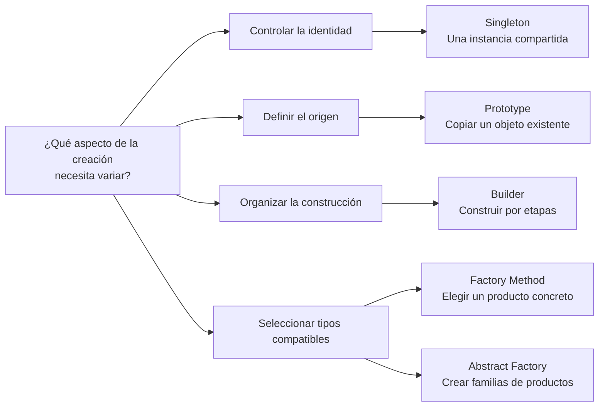

<nav class="chapter-nav" aria-label="Navegación superior entre capítulos"><a href="../capitulo-4/">← Capítulo 4</a><a class="chapter-nav__index" href="../">Recorrido</a><a class="chapter-nav__next" href="../capitulo-6/">Capítulo 6 →</a></nav>

# Capítulo 5 · Patrones creacionales

Páginas 171–208

Los patrones creacionales aíslan decisiones de instanciación y construcción. El capítulo explica cómo controlar la identidad, clonar objetos, construir por etapas, seleccionar productos y mantener compatibles varias familias.

## Visión general de los patrones

El siguiente mapa resume la decisión de creación que asume cada patrón.

<section class="chapter-sections" aria-labelledby="chapter-sections-title">
<h2 id="chapter-sections-title">Secciones del capítulo</h2>
<ul class="chapter-section-list">
<li><a href="singleton/"><strong>Singleton</strong></a></li>
<li><a href="prototype/"><strong>Prototype</strong></a></li>
<li><a href="builder/"><strong>Builder</strong></a></li>
<li><a href="factory/"><strong>Factory Method</strong></a></li>
<li><a href="abstract_factory/"><strong>Abstract Factory</strong></a></li>
</ul>
</section>

Al terminar los patrones, consulta las [consideraciones finales](capitulo-5/consideraciones-finales.md) para compararlos y revisar cómo pueden colaborar.

<nav class="chapter-nav chapter-nav--bottom" aria-label="Navegación inferior entre capítulos"><a href="../capitulo-4/">← Capítulo 4</a><a class="chapter-nav__index" href="../">Recorrido</a><a class="chapter-nav__next" href="../capitulo-6/">Capítulo 6 →</a></nav>
