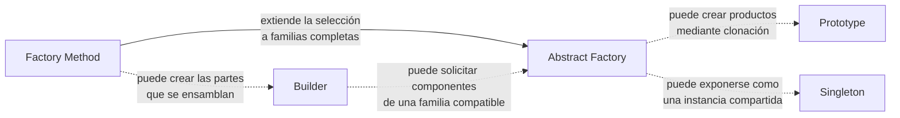

# Consideraciones finales

Los patrones creacionales no compiten por resolver exactamente el mismo problema. La elección comienza por identificar qué debe quedar oculto: la existencia de una única instancia, el origen de un objeto, su proceso de construcción, la selección de una clase concreta o la compatibilidad de una familia completa de productos.

Antes de aplicar uno de estos patrones conviene comprobar que la variación de la creación es real. Introducir fábricas, constructores o prototipos sin esa necesidad añade niveles de indirección; cuando la variación existe, esa misma indirección evita que el cliente dependa de clases concretas y concentra las reglas de construcción.

## Cómo se relacionan

Las líneas continuas muestran una evolución o colaboración directa; las discontinuas señalan formas habituales de combinar los patrones.

La relación no implica que deban usarse juntos. **Factory Method** y **Abstract Factory** se centran en qué producto se crea; **Builder**, en cómo se ensambla; **Prototype**, en de dónde se obtiene la nueva instancia; y **Singleton**, en cuántas instancias pueden existir. Un diseño debe combinar solo los patrones que correspondan a variaciones independientes del problema.

!!! tip "Criterio de cierre"
    Selecciona el patrón a partir de la decisión de creación que deseas aislar, no por la cantidad de clases que aparecen en su estructura.
