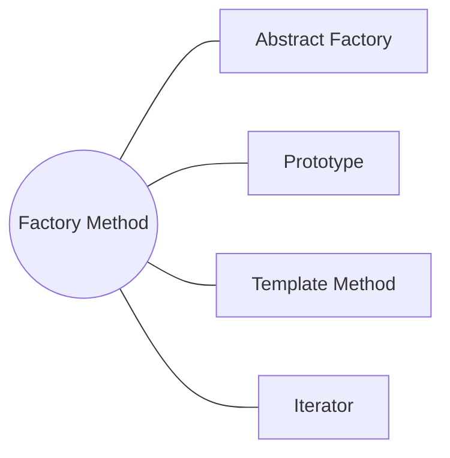

<h1 style="text-align:center;"><strong> Factory (Fábrica)</strong></h1>

<h4 style="text-align:center;"><em>“Define una interfaz para crear objetos sin especificar su clase concreta.”</em></h4>


## Definición

<p style="text-align: justify;">
El <b>patrón Factory</b> tiene como propósito <b>centralizar la lógica de creación de objetos</b> pertenecientes a una jerarquía de clases,
sin que el cliente deba conocer la clase concreta que está instanciando.
Este enfoque favorece el <b>principio de inversión de dependencias</b> al desacoplar el código que crea los objetos del que los utiliza.
</p>

<hr/>

## Motivación

<p style="text-align: justify;">
En los lenguajes orientados a objetos, la creación de instancias mediante <code>new</code> suele implicar un conocimiento directo de la clase concreta.
Esto genera un acoplamiento rígido entre el cliente y las implementaciones, dificultando la extensibilidad.
El patrón Factory resuelve este problema delegando la responsabilidad de instanciación a una clase especializada —la <b>fábrica</b>— que decide qué subclase concreta se debe crear según las condiciones de ejecución.
</p>

<p style="text-align: justify;">
De esta manera, el cliente interactúa únicamente con una <b>interfaz o clase abstracta</b>,
sin preocuparse por los detalles de construcción del objeto, lo que hace que el sistema sea más flexible y fácil de mantener.
</p>

<hr/>

## Modelo UML

<p style="text-align: justify;">
El cliente solicita un <b>ProductoConcreto</b> a través de la interfaz <b>IProductoCreador</b>,
la cual delega la creación a una clase <b>ProductoCreador</b> concreta.
Esto permite que la fábrica decida cuál instancia específica devolver sin exponer los detalles al cliente.
</p>

<p style="text-align:center;">
  
</p>
<p style="text-align:center;"><b>Figura 1.</b> Diagrama UML del patrón <i>Factory</i>.</p>

<hr/>

## Implementación genérica de la estructura

Las clases e interfaces conservan los nombres de los participantes del modelo UML anterior. Así puede seguirse cada relación del diagrama directamente en el código. Java se muestra por defecto; las otras pestañas expresan la misma colaboración sin cambiar su intención.

=== "Java"

    ```java
    interface IProducto {
        void operacion();
    }
    
    final class ProductoConcreto implements IProducto {
        public void operacion() { System.out.println("Producto concreto"); }
    }
    
    interface IProductoCreador {
        IProducto crearProducto();
    }
    
    final class ProductoCreador implements IProductoCreador {
        public IProducto crearProducto() {
            return new ProductoConcreto();
        }
    }
    ```

=== "Python"

    ```python
    class IProducto:
        def operacion(self): raise NotImplementedError
    
    class ProductoConcreto(IProducto):
        def operacion(self): return "producto"
    
    class IProductoCreador:
        def crear_producto(self): raise NotImplementedError
    
    class ProductoCreador(IProductoCreador):
        def crear_producto(self): return ProductoConcreto()
    ```

=== "C#"

    ```csharp
    interface IProducto { void Operacion(); }
    
    class ProductoConcreto : IProducto { public void Operacion() { } }
    
    interface IProductoCreador { IProducto CrearProducto(); }
    
    class ProductoCreador : IProductoCreador {
        public IProducto CrearProducto() => new ProductoConcreto();
    }
    ```

=== "Pseudocódigo"

    ```text
    INTERFAZ IProducto: operacion()
    CLASE ProductoConcreto IMPLEMENTA IProducto
    INTERFAZ IProductoCreador: crearProducto()
    CLASE ProductoCreador IMPLEMENTA IProductoCreador
        crearProducto(): RETORNAR NUEVO ProductoConcreto
    ```

## Participantes

<table>
  <thead>
    <tr>
      <th style="text-align:center;">Elemento</th>
      <th style="text-align:justify;">Descripción</th>
    </tr>
  </thead>
  <tbody>
    <tr>
      <td style="text-align:center;"><b>Producto</b></td>
      <td style="text-align:justify;">Interfaz o clase abstracta que define las operaciones comunes a todos los productos que la fábrica puede crear.</td>
    </tr>
    <tr>
      <td style="text-align:center;"><b>ProductoConcreto</b></td>
      <td style="text-align:justify;">Implementación específica de <i>Producto</i> que define el comportamiento particular del objeto instanciado.</td>
    </tr>
    <tr>
      <td style="text-align:center;"><b>IProductoCreador</b></td>
      <td style="text-align:justify;">Contrato que declara el método de creación que debe implementar la fábrica concreta.</td>
    </tr>
    <tr>
      <td style="text-align:center;"><b>ProductoCreador</b></td>
      <td style="text-align:justify;">Clase que implementa la interfaz y define la lógica que decide qué producto concreto se debe crear.</td>
    </tr>
  </tbody>
</table>

<hr/>

## Enunciado del problema

Una empresa de seguridad provee servicios enfocados en crear algoritmos de cifrado. Actualmente, la empresa cifra su información utilizando los algoritmos PS256, PS512 y RS256. Sin embargo, un nuevo cliente considera que los algoritmos que provee la empresa son obsoletos y solicitó incluir un servicio que cifre y descifre información utilizando el algoritmo RS512. En este sentido, se solicita definir una estructura genérica que permita a un cliente solicitar diferentes algoritmos de cifrado de manera dinámica.

## Solución en código

El ejemplo deja visible el punto de entrada `main`; las clases que colaboran con él se explican en las secciones anteriores.

=== "Java"

    ```java
    package capitulo5.factory;
    
    import capitulo5.factory.con_patron.creador.ICifradoCreador;
    import capitulo5.factory.con_patron.creador.implementacion.PS256Creador;
    import capitulo5.factory.con_patron.creador.implementacion.PS512Creador;
    import capitulo5.factory.con_patron.creador.implementacion.RS256Creador;
    import capitulo5.factory.con_patron.creador.implementacion.RS512Creador;
    import capitulo5.factory.con_patron.dominio.IAlgoritmoCifrado;
    import capitulo5.factory.sin_patron.Algoritmo;
    import capitulo5.factory.sin_patron.FabricaCifrado;
    
    public class Cliente {
        public static void main(String[] args) {
            factory_sin_patron();
            factory_patron();
        }
    
        public static void factory_sin_patron() {
            System.out.println("Factory sin patrón");
            final FabricaCifrado fabrica = new FabricaCifrado();
    
            final IAlgoritmoCifrado ps256 = fabrica.getAlgoritmo(Algoritmo.PS256);
            final IAlgoritmoCifrado rs256 = fabrica.getAlgoritmo(Algoritmo.RS256);
            final IAlgoritmoCifrado ps512 = fabrica.getAlgoritmo(Algoritmo.PS512);
    
            ps256.cifrar("datos");
            ps256.descifrar("datos cifrados");
            rs256.cifrar("datos");
            rs256.descifrar("datos cifrados");
            ps512.cifrar("datos");
            ps512.descifrar("datos cifrados");
        }
    
        public static void factory_patron() {
    
            System.out.println("Factory con patron");
    
            final ICifradoCreador ps256Creador = new PS256Creador();
            final IAlgoritmoCifrado ps256 = ps256Creador.getAlgoritmo();
            ps256.cifrar("datos");
            ps256.descifrar("datos cifrados");
    
            final ICifradoCreador ps512Creador = new PS512Creador();
            final IAlgoritmoCifrado ps512 = ps512Creador.getAlgoritmo();
            ps512.cifrar("datos");
            ps512.descifrar("datos cifrados");
    
            final ICifradoCreador rs256Creador = new RS256Creador();
            final IAlgoritmoCifrado rs256 = rs256Creador.getAlgoritmo();
            rs256.cifrar("datos");
            rs256.descifrar("datos cifrados");
    
            // Nuevo algoritmo
            final ICifradoCreador rs512Creador = new RS512Creador();
            final IAlgoritmoCifrado rs512 = rs512Creador.getAlgoritmo();
            rs512.cifrar("datos");
            rs512.descifrar("datos cifrados");
        }
    }
    ```

## Aplicabilidad

Utiliza Factory Method cuando:

- El código cliente deba trabajar con productos sin conocer sus clases concretas.
- La clase exacta del producto dependa de una configuración, un contexto o una decisión tomada en tiempo de ejecución.
- Un framework necesite ofrecer puntos de extensión para que sus usuarios incorporen productos propios.
- Quieras concentrar la creación, reutilización o selección de productos compatibles en un solo lugar.
- Nuevos algoritmos, como el cifrado RS512 del ejemplo, deban añadirse sin modificar a los consumidores existentes.

## Cómo implementar

1. Define una interfaz común para todos los productos que utilizará el cliente.
2. Declara el método fábrica con esa interfaz como tipo de retorno.
3. Traslada al método fábrica las llamadas a constructores concretos.
4. Crea un creador concreto por cada variante o utiliza un parámetro cuando la jerarquía no aporte valor.
5. Haz que el cliente dependa del creador y del producto abstractos.
6. Verifica que incorporar un producto nuevo no obligue a modificar el flujo principal del cliente.

## Ventajas y desventajas

### Ventajas

- Reduce el acoplamiento entre el consumidor y los productos concretos.
- Centraliza la responsabilidad de creación y facilita añadir variantes.
- Permite sustituir la creación por reutilización, caché o selección dinámica.

### Desventajas

- Puede aumentar el número de clases creadoras.
- Una jerarquía de creadores resulta innecesaria si el tipo de producto nunca cambia.
- La lógica de selección puede concentrar condicionales si no se distribuye adecuadamente.

## Relación con otros patrones



- [Abstract Factory](abstract_factory.md) coordina varios métodos de fábrica para producir familias completas y compatibles.
- [Prototype](prototype.md) ofrece una alternativa basada en clonación cuando crear subclases no resulta conveniente.
- Factory Method puede actuar como uno de los pasos variables de [Template Method](../capitulo-7/template.md).
- Puede combinarse con [Iterator](../capitulo-7/iterator.md) para que distintas colecciones creen iteradores compatibles.
