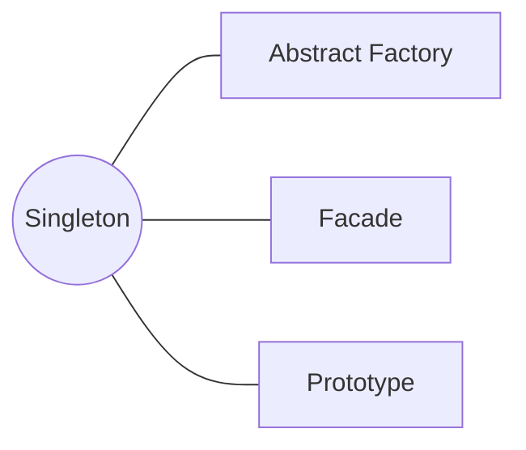

<h1 style="text-align:center;"><strong> Singleton (Instancia Única)</strong></h1>

<h4 style="text-align:center;"><em>“Asegura que una clase tenga una única instancia y proporcione un punto de acceso global a ella.”</em></h4>


## Definición

<p style="text-align: justify;">
El <b>patrón Singleton</b> tiene como propósito <b>restringir la creación de objetos</b> de una clase a una única instancia.
De esta manera, garantiza que todos los componentes del sistema utilicen el mismo objeto compartido, controlando el acceso global a recursos comunes y evitando la duplicación innecesaria de instancias.
</p>

<hr/>

## Motivación
<p style="text-align: justify;">
Existen situaciones en las que solo debe existir una instancia de una clase para garantizar la coherencia del sistema.
Por ejemplo, cuando se gestiona una <b>conexión de base de datos</b>, un <b>servicio de configuración global</b>, un <b>sistema de registro (logger)</b> o una <b>caché compartida</b>.
En estos casos, permitir múltiples instancias podría provocar conflictos, uso ineficiente de recursos o comportamientos inconsistentes.
</p>
<p style="text-align: justify;">
El patrón Singleton propone una solución simple y controlada: encapsular la creación del objeto dentro de la propia clase, de forma que solo exista una instancia accesible a través de un método estático.
</p>

<hr/>

## Modelo UML
<p style="text-align: justify;">
De acuerdo con el modelo UML, la clase <b>Singleton</b> se asocia a sí misma mediante una relación reflexiva.
El constructor privado (<code>private</code>) impide la creación directa de instancias externas, mientras que el método estático <code>getInstance()</code> controla y devuelve siempre la misma referencia al objeto único.
</p>
<p style="text-align:center;">
  
</p>
<p style="text-align:center;"><b>Figura 1.</b> Diagrama UML del patrón <i>Singleton</i>.</p>

<hr/>

## Implementación genérica de la estructura

Las clases e interfaces conservan los nombres de los participantes del modelo UML anterior. Así puede seguirse cada relación del diagrama directamente en el código. Java se muestra por defecto; las otras pestañas expresan la misma colaboración sin cambiar su intención.

=== "Java"

    ```java
    final class Singleton {
        private static Singleton instancia;
    
        private Singleton() { }
    
        public static synchronized Singleton obtenerInstancia() {
            if (instancia == null) instancia = new Singleton();
            return instancia;
        }
    }
    ```

=== "Python"

    ```python
    class Singleton:
        _instancia = None
    
        def __new__(cls):
            if cls._instancia is None:
                cls._instancia = super().__new__(cls)
            return cls._instancia
    ```

=== "C#"

    ```csharp
    sealed class Singleton {
        private static readonly Singleton instancia = new Singleton();
        private Singleton() { }
        public static Singleton ObtenerInstancia() => instancia;
    }
    ```

=== "Pseudocódigo"

    ```text
    CLASE Singleton
        instancia ← NULO
        MÉTODO obtenerInstancia()
            SI instancia ES NULO ENTONCES instancia ← NUEVO Singleton
            RETORNAR instancia
    ```

## Participantes
<table>
  <thead>
    <tr>
      <th style="text-align:center;">Elemento</th>
      <th style="text-align:justify;">Descripción</th>
    </tr>
  </thead>
  <tbody>
    <tr>
      <td style="text-align:center;"><b>Singleton</b></td>
      <td style="text-align:justify;">Clase que define un método estático (<code>getInstance()</code>) responsable de crear o devolver la única instancia existente. El constructor es privado para evitar instanciaciones externas.</td>
    </tr>
  </tbody>
</table>

<hr/>

## Enunciado del problema

De acuerdo con algunas teorías cosmológicas, nuestro Universo es el único que existe. Se solicita analizar cuál podría ser la lógica necesaria para «simular» la creación de nuestro Universo utilizando teoría de diseño orientado a objetos.

## Solución en código

El ejemplo deja visible el punto de entrada `main`; las clases que colaboran con él se explican en las secciones anteriores.

=== "Java"

    ```java
    package capitulo5.singleton;
    
    import capitulo5.singleton.dominio.SingletonUniverso;
    
    public class Cliente {
    
        public static void main(String[] args) {
    
            System.out.println();
            singleton();
    
            System.out.println();
            singleton_break();
    
            singleton_error();
        }
    
        public static void singleton_error() {
            // final SingletonUniverso singletonUniverso = new SingletonUniverso();
        }
    
        public static void singleton() {
            SingletonUniverso universo = SingletonUniverso.getInstancia(1L);
            SingletonUniverso universo2 = SingletonUniverso.getInstancia(2L);
    
            System.out.println("Referencia Universo: " + universo.hashCode());
            System.out.println("Referencia Universo2: " + universo2.hashCode());
            System.out.println("Referencias iguales: " + (universo.hashCode() == universo2.hashCode()));
        }
    
        public static void singleton_break() {
            try {
                SingletonUniverso universo = SingletonUniverso.getInstancia(1);
                SingletonUniverso universo2 = (SingletonUniverso) universo.clone();
    
                System.out.println("Referencia Universo: " + universo.hashCode());
                System.out.println("Referencia otro Universo: " + universo2.hashCode());
                System.out.println("Referencias iguales: " + (universo.hashCode() == universo2.hashCode()));
    
            } catch (CloneNotSupportedException e) {
                e.printStackTrace();
            }
        }
    }
    ```

## Aplicabilidad

Utiliza Singleton cuando:

- Deba existir una sola instancia de un recurso coordinador, como un registro de configuración, un planificador o un catálogo compartido.
- Sea necesario controlar desde un único punto la creación y el acceso a esa instancia.
- La instancia pueda crearse de forma diferida y reutilizarse durante todo el ciclo de vida de la aplicación.
- La identidad única sea una regla del dominio, como ocurre con el universo del ejemplo, y no solo una forma cómoda de acceder a un objeto.

## Cómo implementar

1. Declara un constructor privado para impedir la creación directa desde otras clases.
2. Añade un atributo estático privado del mismo tipo de la clase para conservar la instancia única.
3. Expón un método estático que cree la instancia la primera vez y la devuelva en las llamadas posteriores.
4. Protege la inicialización si varios hilos pueden solicitar la instancia al mismo tiempo.
5. Impide mecanismos alternativos de duplicación, como clonación, serialización o reflexión, cuando el entorno los permita.
6. Haz que los clientes soliciten la instancia mediante el punto de acceso definido.

## Ventajas y desventajas

### Ventajas

- Garantiza una identidad compartida y controla su inicialización.
- Evita crear repetidamente recursos cuyo estado debe ser común.
- Permite aplazar la creación hasta que la instancia sea necesaria.

### Desventajas

- Introduce un estado global que puede ocultar dependencias entre componentes.
- Dificulta las pruebas aisladas y el reemplazo de la instancia por dobles de prueba.
- Requiere atención especial en escenarios concurrentes y distribuidos.
- Puede acumular responsabilidades ajenas a su propósito si se convierte en un contenedor global.

## Relación con otros patrones



- Una [Abstract Factory](abstract_factory.md) puede implementarse como Singleton cuando toda la aplicación utiliza una sola familia de productos.
- [Facade](../capitulo-6/facade.md) suele combinarse con Singleton cuando se necesita un único punto de entrada a un subsistema.
- Singleton controla cuántas instancias existen; [Prototype](prototype.md) persigue lo contrario al facilitar la creación de copias independientes.
