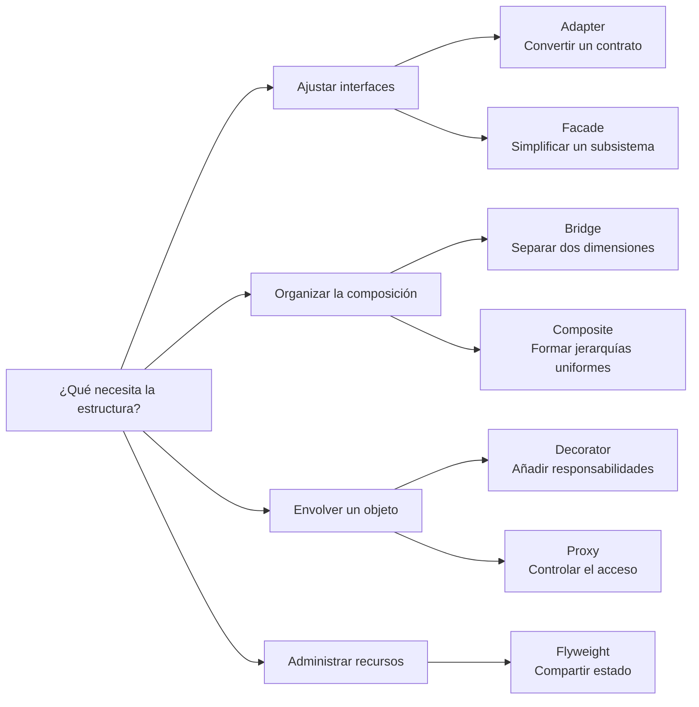

<nav class="chapter-nav" aria-label="Navegación superior entre capítulos"><a href="../capitulo-5/">← Capítulo 5</a><a class="chapter-nav__index" href="../">Recorrido</a><a class="chapter-nav__next" href="../capitulo-7/">Capítulo 7 →</a></nav>

# Capítulo 6 · Patrones estructurales

Páginas 209–248

Los patrones estructurales organizan la composición de clases y objetos para adaptar contratos, separar dimensiones de cambio, formar árboles, añadir responsabilidades, simplificar subsistemas, compartir estado y controlar accesos.

## Visión general de los patrones

El mapa agrupa los patrones según la transformación estructural que realizan.

<section class="chapter-sections" aria-labelledby="chapter-sections-title">
<h2 id="chapter-sections-title">Secciones del capítulo</h2>
<ul class="chapter-section-list">
<li><a href="adapter/"><strong>Adapter</strong></a></li>
<li><a href="bridge/"><strong>Bridge</strong></a></li>
<li><a href="composite/"><strong>Composite</strong></a></li>
<li><a href="decorator/"><strong>Decorator</strong></a></li>
<li><a href="facade/"><strong>Facade</strong></a></li>
<li><a href="flyweight/"><strong>Flyweight</strong></a></li>
<li><a href="proxy/"><strong>Proxy</strong></a></li>
</ul>
</section>

Al terminar los patrones, consulta las [consideraciones finales](capitulo-6/consideraciones-finales.md) para contrastar sus estructuras y relaciones.

<nav class="chapter-nav chapter-nav--bottom" aria-label="Navegación inferior entre capítulos"><a href="../capitulo-5/">← Capítulo 5</a><a class="chapter-nav__index" href="../">Recorrido</a><a class="chapter-nav__next" href="../capitulo-7/">Capítulo 7 →</a></nav>
