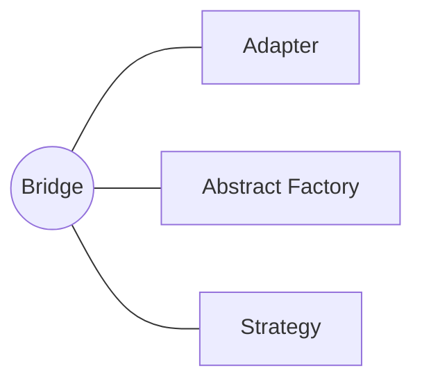

<h1 style="text-align:center;"><strong> Bridge (Puente)</strong></h1>

<h4 style="text-align:center;"><em>“Separa una abstracción de su implementación, permitiendo que ambas evolucionen de forma independiente.”</em></h4>


## Definición

<p style="text-align:justify;">
El patrón <b>Bridge</b> tiene como propósito evitar jerarquías de clases demasiado profundas, promoviendo el principio de <b>composición sobre herencia</b>.
Este patrón desacopla una abstracción de su implementación, de modo que ambas puedan modificarse sin afectarse mutuamente.
</p>

<hr/>

## Motivación

<p style="text-align:justify;">
En el diseño orientado a objetos, las jerarquías con múltiples niveles de herencia tienden a generar una explosión combinatoria de clases cuando se agregan nuevas funcionalidades o variantes.
Por ejemplo, si tenemos una jerarquía que representa <i>Formas</i> (Círculo, Cuadrado) y otra que representa <i>Colores</i> (Rojo, Azul), podríamos terminar creando subclases para cada combinación (<code>CírculoRojo</code>, <code>CírculoAzul</code>, <code>CuadradoRojo</code>, etc.).
El patrón <b>Bridge</b> soluciona este problema separando las dos jerarquías, uniendo la abstracción (<i>Forma</i>) y la implementación (<i>Color</i>) mediante composición.
</p>

<hr/>

## Modelo UML

<p style="text-align:justify;">
La clase <b>Abstraccion</b> define la interfaz de alto nivel consumida por el cliente.
Las clases <b>AbstraccionRefinada</b> implementan o amplían esta abstracción.
Por su parte, <b>Implementacion</b> define las operaciones primitivas que deben realizar las subclases concretas, como <b>ImplementacionConcreta</b>.
Así, la <b>Abstraccion</b> mantiene una referencia a una instancia de <b>Implementacion</b>, estableciendo un puente entre ambas jerarquías.
</p>

<p style="text-align:center;">
  
</p>

<p style="text-align:center;"><b>Figura 1.</b> Diagrama UML del patrón <i>Bridge</i>.</p>

<hr/>

## Implementación genérica de la estructura

Las clases e interfaces conservan los nombres de los participantes del modelo UML anterior. Así puede seguirse cada relación del diagrama directamente en el código. Java se muestra por defecto; las otras pestañas expresan la misma colaboración sin cambiar su intención.

=== "Java"

    ```java
    interface Implementacion {
        void operacionImplementada();
    }
    
    final class ImplementacionConcretaA implements Implementacion {
        public void operacionImplementada() { System.out.println("Implementación A"); }
    }
    
    final class ImplementacionConcretaB implements Implementacion {
        public void operacionImplementada() { System.out.println("Implementación B"); }
    }
    
    abstract class Abstraccion {
        protected final Implementacion implementacion;
    
        protected Abstraccion(Implementacion implementacion) {
            this.implementacion = implementacion;
        }
    
        abstract void operacion();
    }
    
    final class AbstraccionRefinada extends Abstraccion {
        AbstraccionRefinada(Implementacion implementacion) { super(implementacion); }
        void operacion() { implementacion.operacionImplementada(); }
    }
    ```

=== "Python"

    ```python
    class Implementacion:
        def operacion_implementada(self): raise NotImplementedError
    
    class ImplementacionConcreta(Implementacion):
        def operacion_implementada(self): return "implementada"
    
    class Abstraccion:
        def __init__(self, implementacion): self.implementacion = implementacion
    
    class AbstraccionRefinada(Abstraccion):
        def operacion(self): return self.implementacion.operacion_implementada()
    ```

=== "C#"

    ```csharp
    interface Implementacion { void OperacionImplementada(); }
    
    class ImplementacionConcreta : Implementacion { public void OperacionImplementada() { } }
    
    abstract class Abstraccion {
        protected Implementacion implementacion;
        protected Abstraccion(Implementacion i) => implementacion = i;
    }
    
    class AbstraccionRefinada : Abstraccion {
        public AbstraccionRefinada(Implementacion i) : base(i) { }
        public void Operacion() => implementacion.OperacionImplementada();
    }
    ```

=== "Pseudocódigo"

    ```text
    INTERFAZ Implementacion: operacionImplementada()
    CLASE ImplementacionConcreta IMPLEMENTA Implementacion
    CLASE Abstraccion: contiene Implementacion
    CLASE AbstraccionRefinada EXTIENDE Abstraccion
        operacion(): delegar en implementacion.operacionImplementada()
    ```

## Participantes

<table>
  <thead>
    <tr>
      <th style="text-align:center;">Elemento</th>
      <th style="text-align:justify;">Descripción</th>
    </tr>
  </thead>
  <tbody>
    <tr>
      <td style="text-align:center;"><b>Abstraccion</b></td>
      <td style="text-align:justify;">Define la interfaz de alto nivel utilizada por el cliente y mantiene una referencia a un objeto de tipo Implementacion.</td>
    </tr>
    <tr>
      <td style="text-align:center;"><b>AbstraccionRefinada</b></td>
      <td style="text-align:justify;">Extiende la abstracción, agregando funcionalidades específicas.</td>
    </tr>
    <tr>
      <td style="text-align:center;"><b>Implementacion</b></td>
      <td style="text-align:justify;">Define la interfaz para las operaciones básicas que las implementaciones concretas deben realizar.</td>
    </tr>
    <tr>
      <td style="text-align:center;"><b>ImplementacionConcreta</b></td>
      <td style="text-align:justify;">Proporciona una implementación concreta de las operaciones definidas por la interfaz Implementacion.</td>
    </tr>
    <tr>
      <td style="text-align:center;"><b>Cliente</b></td>
      <td style="text-align:justify;">Interactúa con la Abstraccion sin conocer los detalles de la Implementacion concreta.</td>
    </tr>
  </tbody>
</table>

<hr/>

## Enunciado del problema

Se solicita identificar y corregir posibles indicios de deuda técnica en el proyecto de una empresa que gestiona la información de diferentes sistemas operativos. Al ingresar al proyecto se observa que la solución tiene la estructura presentada en el modelo original del caso.

## Solución en código

El ejemplo deja visible el punto de entrada `main`; las clases que colaboran con él se explican en las secciones anteriores.

=== "Java"

    ```java
    package capitulo6.bridge;
    
    import capitulo6.bridge.arquitectura.Arquitectura;
    import capitulo6.bridge.arquitectura.ArquitecturaX32;
    import capitulo6.bridge.arquitectura.ArquitecturaX64;
    import capitulo6.bridge.sistema_operativo.Linux;
    import capitulo6.bridge.sistema_operativo.SistemaOperativo;
    import capitulo6.bridge.sistema_operativo.Windows;
    
    public class Cliente {
        public static void main(String[] args) {
    
            final Arquitectura x32 = new ArquitecturaX32("x32", "Arquitectura de 32-bits");
            final Arquitectura x64 = new ArquitecturaX64("x64", "Arquitectura de 64-bits");
    
            final SistemaOperativo windows7 = new Windows("Windows 7", "1", x32);
            final SistemaOperativo windows10 = new Linux("Windows 10", "1", x64);
            final SistemaOperativo ubuntu = new Linux("Ubuntu 22.04", "rls", x32);
            final SistemaOperativo mint = new Linux("Mint", "latest-version", x64);
    
            System.out.println(windows7 + "\n" + windows10);
            System.out.println(ubuntu + "\n" + mint);
        }
    }
    ```

## Aplicabilidad

Utiliza Bridge cuando:

- Una abstracción y su implementación deban evolucionar de forma independiente.
- La combinación de dos dimensiones variables produzca una explosión de subclases.
- Quieras seleccionar o sustituir la implementación en tiempo de ejecución.
- Los detalles de plataforma deban permanecer ocultos para el cliente.
- Jerarquías como sistema operativo y arquitectura puedan combinarse sin crear una clase por cada pareja posible.

## Cómo implementar

1. Identifica las dos dimensiones que cambian de manera independiente.
2. Extrae una interfaz para la dimensión de implementación.
3. Haz que la abstracción mantenga una referencia a esa interfaz y delegue en ella las operaciones específicas.
4. Crea implementaciones concretas para cada variante de bajo nivel.
5. Extiende la abstracción solo para las variantes de alto nivel que aporten comportamiento propio.
6. Configura las combinaciones mediante constructores, fábricas o inyección de dependencias.

## Ventajas y desventajas

### Ventajas

- Evita multiplicar subclases por cada combinación de variantes.
- Permite cambiar abstracciones e implementaciones de forma independiente.
- Favorece composición, sustitución y pruebas aisladas.

### Desventajas

- Introduce indirección y puede dificultar la lectura de un dominio sencillo.
- Exige identificar correctamente las dimensiones de cambio desde el diseño.
- La configuración de las combinaciones puede trasladar complejidad al ensamblaje de objetos.

## Relación con otros patrones



- [Adapter](adapter.md) suele incorporarse después de detectar una incompatibilidad; Bridge se diseña anticipando variaciones independientes.
- [Abstract Factory](../capitulo-5/abstract_factory.md) puede crear combinaciones compatibles de abstracciones e implementaciones.
- [Strategy](../capitulo-7/strategy.md) también delega comportamiento por composición, aunque se concentra en algoritmos intercambiables.
