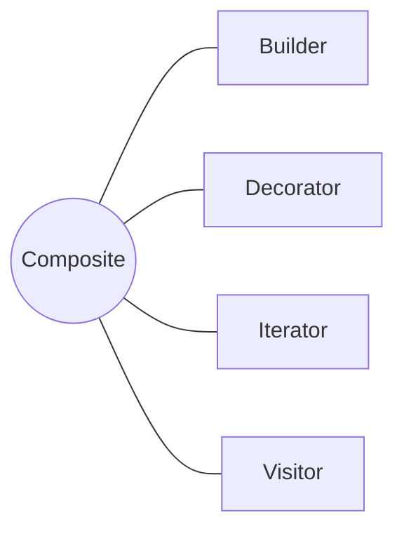

<h1 style="text-align:center;"><strong> Composite (Compuesto)</strong></h1>

<h4 style="text-align:center;"><em>“Compone objetos en estructuras de árbol para representar jerarquías
todo-parte.”</em></h4>


## Definición

<p style="text-align:justify;">
El patrón <b>Composite</b> tiene como propósito unificar el tratamiento de los objetos individuales y de las composiciones de objetos.
Permite construir estructuras jerárquicas donde cada elemento del árbol puede comportarse como una unidad individual (<i>hoja</i>) o como un contenedor de otros elementos (<i>compuesto</i>).
</p>

<hr/>

## Motivación

<p style="text-align:justify;">
En muchos sistemas, es común que los objetos individuales y las colecciones de objetos se traten de manera diferente, lo que genera complejidad adicional en el código.
El patrón <b>Composite</b> permite tratar de forma uniforme a ambos, gracias a una interfaz común que representa tanto a las <i>hojas</i> (elementos simples) como a los <i>compuestos</i> (colecciones de elementos).
Este modelo es ideal para representar estructuras jerárquicas “todo-parte”, como sistemas de archivos, interfaces gráficas o árboles sintácticos.
</p>

<hr/>

## Modelo UML

<p style="text-align:justify;">
La clase <b>Componente</b> define la interfaz común para todos los objetos del árbol, ya sean simples o compuestos.
La clase <b>Compuesto</b> mantiene una lista de objetos <b>Componente</b> y delega las operaciones a sus hijos.
Finalmente, la clase <b>Hoja</b> representa los objetos indivisibles que no contienen otros componentes.
</p>

<p style="text-align:center;">
  
</p>

<p style="text-align:center;"><b>Figura 1.</b> Diagrama UML del patrón <i>Composite</i>.</p>

<hr/>

## Implementación genérica de la estructura

Las clases e interfaces conservan los nombres de los participantes del modelo UML anterior. Así puede seguirse cada relación del diagrama directamente en el código. Java se muestra por defecto; las otras pestañas expresan la misma colaboración sin cambiar su intención.

=== "Java"

    ```java
    interface Componente {
        void operacion();
    }
    
    final class Hoja implements Componente {
        public void operacion() { System.out.println("Hoja"); }
    }
    
    final class Compuesto implements Componente {
        private final java.util.List<Componente> hijos = new java.util.ArrayList<>();
        void agregar(Componente componente) { hijos.add(componente); }
        void eliminar(Componente componente) { hijos.remove(componente); }
        public void operacion() { hijos.forEach(Componente::operacion); }
    }
    ```

=== "Python"

    ```python
    class Componente:
        def operacion(self): raise NotImplementedError
    
    class Hoja(Componente):
        def operacion(self): return "hoja"
    
    class Compuesto(Componente):
        def __init__(self): self.hijos = []
        def agregar(self, componente): self.hijos.append(componente)
        def operacion(self): return [hijo.operacion() for hijo in self.hijos]
    ```

=== "C#"

    ```csharp
    interface Componente { void Operacion(); }
    
    class Hoja : Componente { public void Operacion() { } }
    
    class Compuesto : Componente {
        private readonly System.Collections.Generic.List<Componente> hijos = new();
        public void Agregar(Componente c) => hijos.Add(c);
        public void Operacion() { foreach (var hijo in hijos) hijo.Operacion(); }
    }
    ```

=== "Pseudocódigo"

    ```text
    INTERFAZ Componente: operacion()
    CLASE Hoja IMPLEMENTA Componente
    CLASE Compuesto IMPLEMENTA Componente
        hijos ← lista de Componente
        operacion(): PARA CADA hijo HACER hijo.operacion()
    ```

## Participantes

<table>
  <thead>
    <tr>
      <th style="text-align:center;">Elemento</th>
      <th style="text-align:justify;">Descripción</th>
    </tr>
  </thead>
  <tbody>
    <tr>
      <td style="text-align:center;"><b>Componente</b></td>
      <td style="text-align:justify;">Declara la interfaz común para los objetos simples y compuestos, permitiendo el tratamiento uniforme de ambos.</td>
    </tr>
    <tr>
      <td style="text-align:center;"><b>Compuesto</b></td>
      <td style="text-align:justify;">Define el comportamiento de los objetos que pueden tener hijos y almacena una colección de componentes.</td>
    </tr>
    <tr>
      <td style="text-align:center;"><b>Hoja</b></td>
      <td style="text-align:justify;">Representa los objetos terminales de la jerarquía, que no tienen hijos.</td>
    </tr>
    <tr>
      <td style="text-align:center;"><b>Cliente</b></td>
      <td style="text-align:justify;">Manipula objetos a través de la interfaz <b>Componente</b> sin distinguir entre hojas y compuestos.</td>
    </tr>
  </tbody>
</table>

<hr/>

## Enunciado del problema

Se solicita explicar el patrón Composite de forma intuitiva. Una de las estructuras más sencillas que se puede representar como un árbol es una ruta de directorios.

## Solución en código

El ejemplo deja visible el punto de entrada `main`; las clases que colaboran con él se explican en las secciones anteriores.

=== "Java"

    ```java
    package capitulo6.composite;
    
    import capitulo6.composite.archivo.ArchivoSimple;
    import capitulo6.composite.archivo.Carpeta;
    
    public class Cliente {
    
        public static void main(String[] args) {
            final Carpeta root = new Carpeta("root");
    
            final Carpeta imagenes = new Carpeta("imagenes");
            imagenes.add(new ArchivoSimple("paisaje", "png"));
            imagenes.add(new ArchivoSimple("wallpaper", "jpg"));
    
            final Carpeta documentos = new Carpeta("documentos");
            final Carpeta otros = new Carpeta("otros");
    
            root.add(new ArchivoSimple("README", "md"));
    
            root.add(imagenes);
            root.add(documentos);
            root.add(otros);
    
            System.out.println(root.info());
        }
    }
    ```

## Aplicabilidad

Utiliza Composite cuando:

- El dominio tenga una estructura jerárquica de parte y todo, como directorios, menús u organizaciones.
- El cliente deba tratar de manera uniforme elementos individuales y grupos de elementos.
- Las operaciones deban propagarse recursivamente a través de un árbol.
- Se espere incorporar nuevos tipos de hojas o contenedores sin cambiar el recorrido del cliente.
- La estructura pueda representarse sin ambigüedad mediante nodos que comparten un contrato común.

## Cómo implementar

1. Define una interfaz componente con las operaciones comunes para hojas y compuestos.
2. Implementa las hojas con el comportamiento terminal de la jerarquía.
3. Implementa el compuesto con una colección de componentes hijos.
4. Decide si las operaciones para añadir y retirar hijos pertenecen a la interfaz común o solo al compuesto.
5. Haz que las operaciones del compuesto deleguen o agreguen recursivamente los resultados de sus hijos.
6. Establece reglas para evitar ciclos y mantener correctamente la relación con el padre si es necesaria.

## Ventajas y desventajas

### Ventajas

- Permite que el cliente trabaje de forma uniforme con objetos simples y estructuras completas.
- Facilita añadir nuevos tipos de componentes.
- Encapsula el recorrido recursivo dentro de la propia estructura.

### Desventajas

- Una interfaz demasiado general puede incluir operaciones sin sentido para algunas hojas.
- Resulta difícil restringir qué tipos de componentes puede contener cada compuesto.
- Los árboles muy profundos requieren controlar ciclos, rendimiento y desbordamiento de la pila.

## Relación con otros patrones



- [Builder](../capitulo-5/builder.md) puede construir árboles Composite complejos paso a paso.
- [Decorator](decorator.md) comparte la interfaz del componente y puede envolver nodos de la estructura.
- [Iterator](../capitulo-7/iterator.md) permite recorrer el árbol sin exponer su representación.
- [Visitor](../capitulo-7/visitor.md) agrega operaciones sobre sus distintos tipos de nodos.
