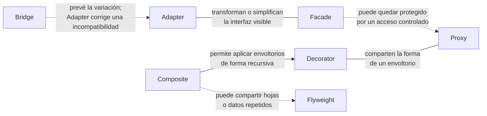

# Consideraciones finales

Los patrones estructurales actúan sobre relaciones ya existentes entre clases y objetos. Algunos cambian la forma en que el cliente percibe una interfaz; otros organizan composiciones, agregan una capa alrededor de un objeto o reducen el costo de mantener muchas instancias.

La similitud de una estructura no garantiza que dos patrones tengan la misma intención. **Decorator** y **Proxy**, por ejemplo, envuelven un objeto mediante una interfaz compatible, pero el primero añade responsabilidades y el segundo controla el acceso. Distinguir la intención evita seleccionar un patrón solo por el aspecto de su diagrama de clases.

## Cómo se relacionan

El diagrama reúne las relaciones estructurales y las combinaciones más habituales entre los patrones del capítulo.

**Adapter** y **Facade** modifican la experiencia del cliente, aunque solo Adapter traduce un contrato incompatible. **Bridge** separa dimensiones que se espera que evolucionen de manera independiente. **Composite** organiza jerarquías; **Decorator** y **Proxy** interponen objetos compatibles; **Flyweight** reduce el estado duplicado. Estas decisiones pueden coexistir cuando responden a fuerzas distintas.

!!! tip "Criterio de cierre"
    Compara primero la intención —adaptar, separar, componer, ampliar, simplificar, compartir o controlar— y después valida que la estructura elegida conserve el contrato que necesita el cliente.
