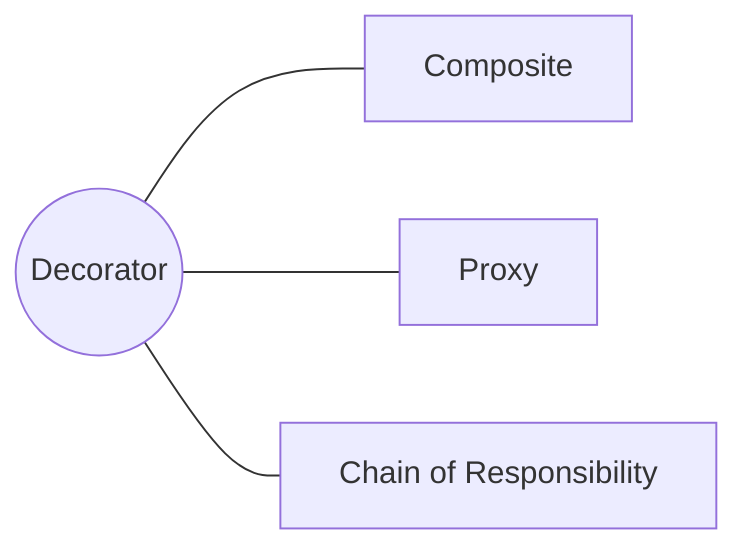

<h1 style="text-align:center;"><strong> Decorator (Decorador)</strong></h1>

<h4 style="text-align:center;"><em>“Permite añadir responsabilidades adicionales a un objeto de forma dinámica sin modificar su estructura.”</em></h4>


## Definición

<p style="text-align:justify;">
El patrón <b>Decorator</b> tiene como propósito extender el comportamiento de los objetos en tiempo de ejecución sin recurrir a la herencia.
Para ello, encapsula el objeto original dentro de otro objeto decorador que implementa la misma interfaz y que añade nuevas funcionalidades antes o después de delegar la llamada al objeto original.
</p>

<hr/>

## Motivación

<p style="text-align:justify;">
En muchos casos, los desarrolladores buscan añadir nuevas capacidades a una clase mediante herencia.
Sin embargo, esta práctica genera clases rígidas, acopladas y difíciles de mantener.
El patrón <b>Decorator</b> ofrece una alternativa más flexible basada en <b>composición</b>: en lugar de heredar, se “envuelve” el objeto original dentro de una capa adicional que amplía su comportamiento sin alterar su código interno.
</p>

<hr/>

## Modelo UML

<p style="text-align:justify;">
La interfaz <b>IComponente</b> define la operación principal que los objetos pueden ejecutar.
El <b>ComponenteConcreto</b> implementa esta operación con la funcionalidad básica.
La clase <b>Decorador</b> mantiene una referencia a un objeto <b>IComponente</b> y delega en él las operaciones, mientras que el <b>DecoradorConcreto</b> añade nuevas responsabilidades o comportamientos antes o después de delegar la llamada.
</p>

<p style="text-align:center;">
  
</p>

<p style="text-align:center;"><b>Figura 1.</b> Diagrama UML del patrón <i>Decorator</i>.</p>

<hr/>

## Implementación genérica de la estructura

Las clases e interfaces conservan los nombres de los participantes del modelo UML anterior. Así puede seguirse cada relación del diagrama directamente en el código. Java se muestra por defecto; las otras pestañas expresan la misma colaboración sin cambiar su intención.

=== "Java"

    ```java
    interface IComponente {
        void operacion();
    }
    
    final class ComponenteConcreto implements IComponente {
        public void operacion() { System.out.println("Componente"); }
    }
    
    abstract class Decorador implements IComponente {
        protected final IComponente componente;
        protected Decorador(IComponente componente) { this.componente = componente; }
        public void operacion() { componente.operacion(); }
    }
    
    final class DecoradorConcreto extends Decorador {
        DecoradorConcreto(IComponente componente) { super(componente); }
        public void operacion() {
            super.operacion();
            System.out.println("Responsabilidad adicional");
        }
    }
    ```

=== "Python"

    ```python
    class IComponente:
        def operacion(self): raise NotImplementedError
    
    class ComponenteConcreto(IComponente):
        def operacion(self): return "componente"
    
    class Decorador(IComponente):
        def __init__(self, componente): self.componente = componente
        def operacion(self): return self.componente.operacion()
    
    class DecoradorConcreto(Decorador):
        def operacion(self): return super().operacion() + " + adicional"
    ```

=== "C#"

    ```csharp
    interface IComponente { void Operacion(); }
    
    class ComponenteConcreto : IComponente { public void Operacion() { } }
    
    abstract class Decorador : IComponente {
        protected readonly IComponente componente;
        protected Decorador(IComponente c) => componente = c;
        public virtual void Operacion() => componente.Operacion();
    }
    
    class DecoradorConcreto : Decorador {
        public DecoradorConcreto(IComponente c) : base(c) { }
        public override void Operacion() { base.Operacion(); /* responsabilidad adicional */ }
    }
    ```

=== "Pseudocódigo"

    ```text
    INTERFAZ IComponente: operacion()
    CLASE ComponenteConcreto IMPLEMENTA IComponente
    CLASE Decorador IMPLEMENTA IComponente: contiene IComponente
    CLASE DecoradorConcreto EXTIENDE Decorador
        operacion(): componente.operacion(); agregarResponsabilidad()
    ```

## Participantes

<table>
  <thead>
    <tr>
      <th style="text-align:center;">Elemento</th>
      <th style="text-align:justify;">Descripción</th>
    </tr>
  </thead>
  <tbody>
    <tr>
      <td style="text-align:center;"><b>IComponente</b></td>
      <td style="text-align:justify;">Declara la interfaz común para todos los objetos que pueden ser decorados.</td>
    </tr>
    <tr>
      <td style="text-align:center;"><b>ComponenteConcreto</b></td>
      <td style="text-align:justify;">Implementa la operación base sobre la cual se aplicarán las decoraciones adicionales.</td>
    </tr>
    <tr>
      <td style="text-align:center;"><b>Decorador</b></td>
      <td style="text-align:justify;">Clase abstracta que implementa la interfaz <b>IComponente</b> y mantiene una referencia al objeto decorado.</td>
    </tr>
    <tr>
      <td style="text-align:center;"><b>DecoradorConcreto</b></td>
      <td style="text-align:justify;">Extiende la funcionalidad del componente agregando nuevas responsabilidades.</td>
    </tr>
    <tr>
      <td style="text-align:center;"><b>Cliente</b></td>
      <td style="text-align:justify;">Interactúa con los componentes a través de la interfaz común, sin conocer si están decorados o no.</td>
    </tr>
  </tbody>
</table>

<hr/>

## Enunciado del problema

Se solicita implementar algunas mejoras en un sistema de seguros. Concretamente, se debe modificar el pago de seguros de vida a los usuarios considerando los siguientes escenarios:

- **Seguro por accidente:** se paga un monto igual al costo del seguro básico contratado por el usuario, más un 10 % adicional.
- **Seguro por incapacidad:** se paga un monto igual al costo del seguro básico contratado por el usuario, más un 50 % adicional.
- **Seguro por defunción:** se paga un monto igual al costo del seguro básico contratado por el usuario, más un 70 % adicional.

Los seguros por accidente se consideran vitalicios. Sin embargo, la empresa indicó de manera explícita que no se debe modificar el modelo existente.

## Solución en código

El ejemplo deja visible el punto de entrada `main`; las clases que colaboran con él se explican en las secciones anteriores.

=== "Java"

    ```java
    package capitulo6.decorator;
    
    import com.codepoetics.protonpack.StreamUtils;
    import capitulo6.decorator.decorador.SeguroDecorador;
    import capitulo6.decorator.decorador.decorador_concreto.SeguroAccidente;
    import capitulo6.decorator.decorador.decorador_concreto.SeguroDefuncion;
    import capitulo6.decorator.decorador.decorador_concreto.SeguroIncapacidad;
    import capitulo6.decorator.dominio.Seguro;
    import capitulo6.decorator.dominio.SeguroBasico;
    
    import java.util.Arrays;
    import java.util.List;
    
    public class Cliente {
    
        // Lista de etiquetas para imprimir los datos de cada seguro
        private static List<String> labels = Arrays.asList("base", "accidente",
                "incapacidad", "defuncion");
    
        public static void main(String[] args) {
            final Seguro seguro = new SeguroBasico("Seguro empresa X", 1000, false);
    
            final SeguroDecorador accidente = new SeguroAccidente(seguro);
            final SeguroDecorador incapacidad = new SeguroIncapacidad(seguro);
            final SeguroDecorador defuncion = new SeguroDefuncion(seguro);
    
            final List<Seguro> segurosConcretos = Arrays.asList(seguro, accidente,
                    incapacidad, defuncion);
    
            System.out.println("Empresa X");
            printValor(segurosConcretos);
        }
    
        private static void printValor(final List<Seguro> seguros) {
            StreamUtils.zip(seguros.stream(), labels.stream(),
                    (seguro, label) -> " \tCosto seguro " + label + ": "
                            + seguro.getValor()).forEach(System.out::println);
        }
    }
    ```

## Aplicabilidad

Utiliza Decorator cuando:

- Debas añadir responsabilidades a objetos concretos en tiempo de ejecución.
- Las responsabilidades puedan combinarse en distinto orden o cantidad.
- La herencia produzca demasiadas subclases para representar todas las combinaciones.
- No sea posible modificar la clase original, pero sí envolverla mediante su interfaz.
- Casos como los recargos de seguros deban incorporarse sin alterar el modelo existente.

## Cómo implementar

1. Define o identifica la interfaz común del componente.
2. Haz que el componente concreto implemente el comportamiento base.
3. Crea un decorador abstracto que implemente la misma interfaz y conserve una referencia al componente envuelto.
4. Delega primero la operación al componente y añade antes o después la responsabilidad adicional.
5. Implementa un decorador concreto por cada responsabilidad independiente.
6. Compón los decoradores en el cliente o en una fábrica y verifica si el orden afecta el resultado.

## Ventajas y desventajas

### Ventajas

- Añade y combina comportamientos sin modificar la clase original.
- Evita jerarquías extensas de subclases para cada combinación.
- Permite asignar responsabilidades a instancias individuales.

### Desventajas

- Una cadena de envoltorios puede ser difícil de inspeccionar y depurar.
- El comportamiento puede depender del orden de los decoradores.
- Aumenta la cantidad de objetos pequeños y la complejidad de configuración.

## Relación con otros patrones



- [Composite](composite.md) y Decorator comparten una estructura recursiva; Composite agrega hijos y Decorator suele envolver uno solo.
- [Proxy](proxy.md) presenta una forma semejante, pero controla el acceso en vez de añadir responsabilidades configurables.
- [Chain of Responsibility](../capitulo-7/cadena_responsabilidad.md) también encadena objetos, aunque cada manejador decide si continúa la solicitud.
