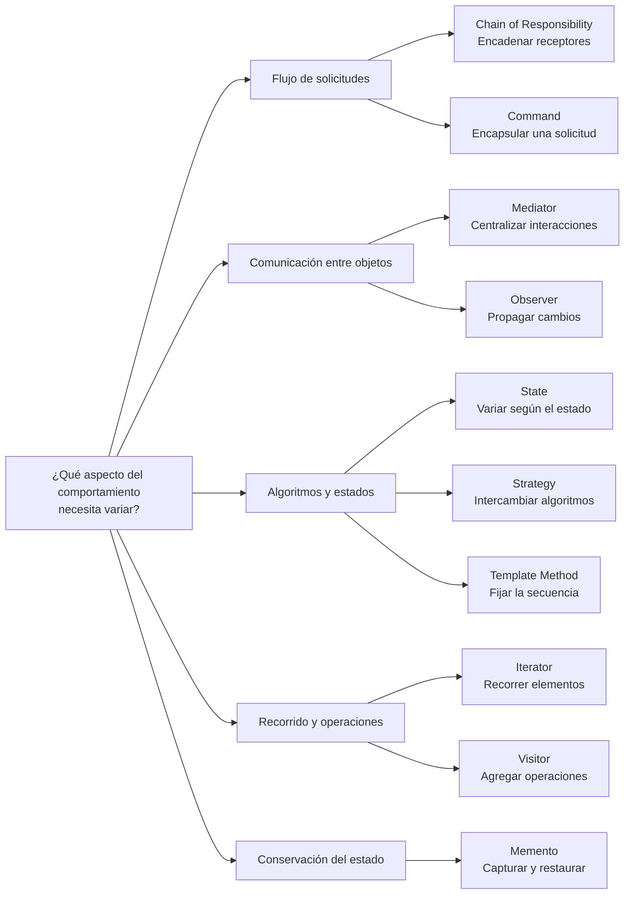

<nav class="chapter-nav" aria-label="Navegación superior entre capítulos"><a href="../capitulo-6/">← Capítulo 6</a><a class="chapter-nav__index" href="../">Recorrido</a><a class="chapter-nav__next" href="../capitulo-8/">Capítulo 8 →</a></nav>

# Capítulo 7 · Patrones de comportamiento

Páginas 249–314

Los patrones de comportamiento distribuyen algoritmos, responsabilidades y comunicaciones. El capítulo muestra cómo encadenar decisiones, encapsular solicitudes, recorrer colecciones, coordinar colegas, conservar estados, publicar cambios y sustituir comportamientos.

## Visión general de los patrones

El mapa organiza los patrones según el aspecto de la colaboración que permiten variar.

<section class="chapter-sections" aria-labelledby="chapter-sections-title">
<h2 id="chapter-sections-title">Secciones del capítulo</h2>
<ul class="chapter-section-list">
<li><a href="cadena_responsabilidad/"><strong>Chain of Responsibility</strong></a></li>
<li><a href="command/"><strong>Command</strong></a></li>
<li><a href="iterator/"><strong>Iterator</strong></a></li>
<li><a href="mediator/"><strong>Mediator</strong></a></li>
<li><a href="memento/"><strong>Memento</strong></a></li>
<li><a href="observer/"><strong>Observer</strong></a></li>
<li><a href="state/"><strong>State</strong></a></li>
<li><a href="strategy/"><strong>Strategy</strong></a></li>
<li><a href="template/"><strong>Template Method</strong></a></li>
<li><a href="visitor/"><strong>Visitor</strong></a></li>
</ul>
</section>

Al terminar los patrones, consulta las [consideraciones finales](capitulo-7/consideraciones-finales.md) para reconocer combinaciones y alternativas de diseño.

<nav class="chapter-nav chapter-nav--bottom" aria-label="Navegación inferior entre capítulos"><a href="../capitulo-6/">← Capítulo 6</a><a class="chapter-nav__index" href="../">Recorrido</a><a class="chapter-nav__next" href="../capitulo-8/">Capítulo 8 →</a></nav>
