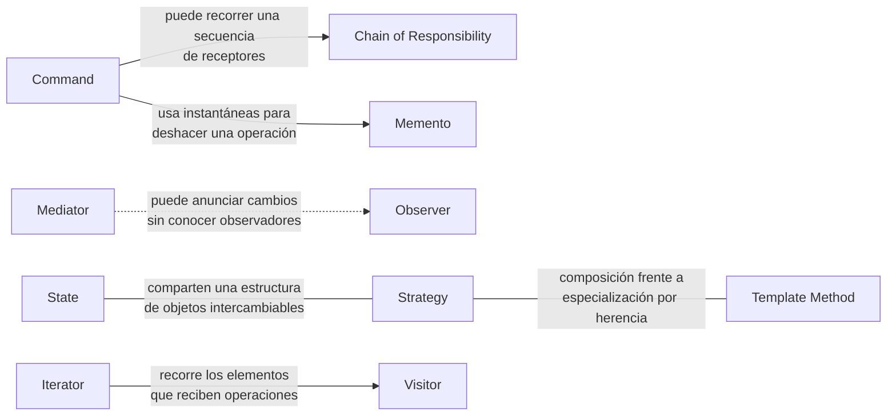

# Consideraciones finales

Los patrones de comportamiento distribuyen decisiones que suelen concentrarse en condicionales, métodos extensos o dependencias directas entre muchos objetos. Su valor aparece cuando permiten cambiar un algoritmo, una ruta de comunicación o una responsabilidad sin reescribir a todos los participantes.

La selección depende del tipo de variación. Puede variar el receptor de una solicitud, la forma de notificar un cambio, el algoritmo elegido, los pasos que una subclase especializa, el recorrido de una colección, las operaciones aplicadas a una estructura o el estado que debe recuperarse.

## Cómo se relacionan

Los patrones pueden formar colaboraciones mayores o presentarse como alternativas para distribuir una misma clase de responsabilidad.

**State** y **Strategy** se parecen estructuralmente, pero State representa transiciones internas y Strategy una elección de algoritmo. **Strategy** y **Template Method** ofrecen mecanismos alternativos —composición y herencia— para variar un proceso. **Command** puede apoyarse en **Memento** para deshacer acciones o circular por una **Chain of Responsibility**. **Mediator** puede usar **Observer** para difundir cambios, mientras **Iterator** puede proporcionar el recorrido que necesita **Visitor**.

!!! tip "Criterio de cierre"
    Sigue el flujo de la interacción: identifica quién inicia la acción, quién decide, quién ejecuta y qué parte debe poder cambiar. Esa secuencia suele revelar el patrón adecuado.
