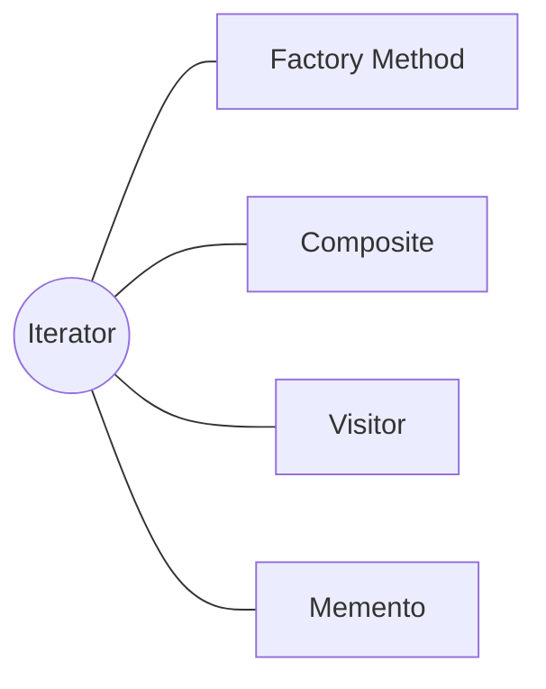

<h1 style="text-align:center;">
  <strong> Iterator (Iterador)</strong>
</h1>

<h4 style="text-align:center;"><em>“Proporciona un mecanismo para recorrer secuencialmente los elementos de una
colección sin exponer su estructura interna.”</em></h4>


## Definición

<p style="text-align:justify;">
El <b>patrón Iterator</b> tiene como propósito <b>abstraer el proceso de recorrido</b> de una colección de objetos, permitiendo acceder a sus elementos de forma secuencial sin conocer su estructura interna.
De este modo, una colección puede cambiar su implementación sin afectar la forma en que los clientes recorren sus elementos.
</p>

<hr/>

## Motivación

<p style="text-align:justify;">
El patrón <b>Iterator</b> encapsula la lógica de iteración en un objeto separado, denominado <b>Iterador</b>.
Esto resulta útil porque existen múltiples tipos de estructuras de datos —listas, colas, árboles, mapas, etc.— y cada una tiene su propia forma de recorrer sus elementos.
El <b>Iterador</b> permite tratar todas estas colecciones de manera uniforme.
</p>

<p style="text-align:justify;">
Además, el patrón se extiende más allá de las colecciones clásicas: cualquier objeto que pueda ser representado como una secuencia (por ejemplo, un flujo de datos, una colección de archivos o una lista de tareas) puede beneficiarse de este enfoque.
</p>

<p style="text-align:center;">
  
</p>
<p style="text-align:center;"><b>Figura 1.</b> Diagrama UML del patrón <i>Iterator</i>.</p>

<hr/>

## Modelo UML

<p style="text-align:justify;">
La interfaz <b>Iterable</b> define el contrato para devolver un iterador, mientras que el <b>IteradorConcreto</b> implementa las operaciones necesarias para recorrer los elementos del <b>IterableConcreto</b>.
Algunos autores usan el término <i>Agregado</i> para referirse al objeto iterable, pero en este libro se prefiere el término <b>Iterable</b> por ser más natural: una colección “es” iterable.
</p>

<hr/>

## Implementación genérica de la estructura

Las clases e interfaces conservan los nombres de los participantes del modelo UML anterior. Así puede seguirse cada relación del diagrama directamente en el código. Java se muestra por defecto; las otras pestañas expresan la misma colaboración sin cambiar su intención.

=== "Java"

    ```java
    interface Iterador<T> {
        boolean tieneSiguiente();
        T siguiente();
    }
    
    interface Iterable<T> {
        Iterador<T> crearIterador();
    }
    
    final class IterableConcreto<T> implements Iterable<T> {
        private final java.util.List<T> elementos;
        IterableConcreto(java.util.List<T> elementos) { this.elementos = elementos; }
        public Iterador<T> crearIterador() { return new IteradorConcreto<>(elementos); }
    }
    
    final class IteradorConcreto<T> implements Iterador<T> {
        private final java.util.List<T> elementos;
        private int posicion;
        IteradorConcreto(java.util.List<T> elementos) { this.elementos = elementos; }
        public boolean tieneSiguiente() { return posicion < elementos.size(); }
        public T siguiente() {
            if (!tieneSiguiente()) throw new java.util.NoSuchElementException();
            return elementos.get(posicion++);
        }
    }
    ```

=== "Python"

    ```python
    class Iterador:
        def __next__(self): raise NotImplementedError
    class Iterable:
        def __iter__(self): raise NotImplementedError
    class IteradorConcreto(Iterador):
        def __init__(self, elementos): self.elementos, self.posicion = elementos, 0
        def __iter__(self): return self
        def __next__(self):
            if self.posicion >= len(self.elementos): raise StopIteration
            valor = self.elementos[self.posicion]; self.posicion += 1; return valor
    class IterableConcreto(Iterable):
        def __init__(self, elementos): self.elementos = elementos
        def __iter__(self): return IteradorConcreto(self.elementos)
    ```

=== "C#"

    ```csharp
    interface Iterador<T> { bool TieneSiguiente(); T Siguiente(); }
    
    interface Iterable<T> { Iterador<T> CrearIterador(); }
    
    class IteradorConcreto<T> : Iterador<T> {
        private readonly System.Collections.Generic.IList<T> datos; private int posicion;
        public IteradorConcreto(System.Collections.Generic.IList<T> d) => datos = d;
        public bool TieneSiguiente() => posicion < datos.Count;
        public T Siguiente() => datos[posicion++];
    }
    
    class IterableConcreto<T> : Iterable<T> {
        private readonly System.Collections.Generic.IList<T> datos;
        public IterableConcreto(System.Collections.Generic.IList<T> d) => datos = d;
        public Iterador<T> CrearIterador() => new IteradorConcreto<T>(datos);
    }
    ```

=== "Pseudocódigo"

    ```text
    INTERFAZ Iterador: tieneSiguiente(), siguiente()
    INTERFAZ Iterable: crearIterador()
    CLASE IterableConcreto: contiene elementos
    CLASE IteradorConcreto: elementos + posición
        siguiente(): validar límite; retornar elemento; avanzar posición
    ```

## Participantes

<table>
  <thead>
    <tr>
      <th style="text-align:center;">Elemento</th>
      <th style="text-align:justify;">Descripción</th>
    </tr>
  </thead>
  <tbody>
    <tr>
      <td style="text-align:center;"><b>Iterador</b></td>
      <td style="text-align:justify;">Define las operaciones para recorrer secuencialmente una colección, como <code>hasNext()</code> y <code>next()</code>.</td>
    </tr>
    <tr>
      <td style="text-align:center;"><b>IteradorConcreto</b></td>
      <td style="text-align:justify;">Implementa el comportamiento de recorrido sobre una estructura de datos específica.</td>
    </tr>
    <tr>
      <td style="text-align:center;"><b>Iterable</b></td>
      <td style="text-align:justify;">Interfaz que declara el método para obtener un iterador asociado a la colección.</td>
    </tr>
    <tr>
      <td style="text-align:center;"><b>IterableConcreto</b></td>
      <td style="text-align:justify;">Clase que implementa la interfaz <b>Iterable</b> y devuelve un iterador concreto para recorrer sus elementos.</td>
    </tr>
  </tbody>
</table>

<hr/>

## Enunciado del problema

Se solicita explicar a un grupo de estudiantes la estructura interna del patrón Iterator de forma sencilla. En esta situación no hay problemas elaborados; el ejemplo se centra en explicar la estructura del patrón.

## Solución en código

El ejemplo deja visible el punto de entrada `main`; las clases que colaboran con él se explican en las secciones anteriores.

=== "Java"

    ```java
    package capitulo7.iterator;
    
    import capitulo7.iterator.iterador_arreglo.IterableArreglo;
    import capitulo7.iterator.iterador_persona.IterablePersona;
    import capitulo7.iterator.modelo.Persona;
    import capitulo7.iterator.modelo.Producto;
    
    public class Cliente {
        public static void main(String[] args) {
    
            final Integer[] numeros = {1, 2, 3, 4, 5, 6, 7, 8, 9, 10};
            final String[] nombres = {"Carlos", "Isabel", "Jesús"};
            final Producto[] productos = {new Producto(1, "P001")};
    
            final Iterador iteradorNumeros = new IterableArreglo<>(numeros)
                    .iterador();
            final Iterador iteradorNombres = new IterableArreglo<>(nombres)
                    .iterador();
            final Iterador iteradorProductos = new IterableArreglo<>(productos)
                    .iterador();
    
            System.out.print("Arreglo de números: ");
            iterar(iteradorNumeros);
            System.out.print("Arreglo de nombres: ");
            iterar(iteradorNombres);
            System.out.print("Arreglo de productos: ");
            iterar(iteradorProductos);
    
            final Persona persona1 = Persona.builder()
                    .nombre("Julián Perez Fernández").nombrePadre("Camilo Perez")
                    .nombreMadre("Andrea Fernández").build();
    
            final Persona persona2 = Persona.builder()
                    .nombre("Andres López Ramírez").nombrePadre("Julián López")
                    .nombreMadre("Claudia Ramírez")
                    .nombreHermanos("Ana, Sofía").build();
    
            System.out.println("Iterador de persona 1");
            final Iterador iteradorPersona1 = new IterablePersona(persona1)
                    .iterador();
            iterar(iteradorPersona1);
    
            System.out.println("Iterador de persona 2");
            final Iterador iteradorPersona2 = new IterablePersona(persona2)
                    .iterador();
            iterar(iteradorPersona2);
        }
    
        private static void iterar(final Iterador iterador) {
            while (iterador.hasNext()) {
                System.out.print(iterador.actual() + " ");
                iterador.siguiente();
            }
            System.out.println();
        }
    }
    ```

## Aplicabilidad

Utiliza Iterator cuando:

- El cliente deba recorrer una colección sin conocer su representación interna.
- Una misma colección necesite recorridos diferentes o simultáneos.
- Quieras ofrecer una interfaz uniforme para colecciones con estructuras distintas.
- El estado del recorrido deba permanecer fuera de la colección.
- Sea necesario recorrer estructuras complejas sin exponer nodos, índices o enlaces internos.

## Cómo implementar

1. Define una interfaz de iterador con operaciones para consultar, avanzar y obtener el elemento actual.
2. Define en la colección una operación para crear el iterador apropiado.
3. Implementa el iterador guardando la posición y una referencia a la colección.
4. Decide el comportamiento ante una colección vacía, el final del recorrido y las modificaciones concurrentes.
5. Crea iteradores adicionales para órdenes de recorrido diferentes.
6. Haz que el cliente dependa solo de las interfaces de colección e iterador.

## Ventajas y desventajas

### Ventajas

- Oculta la estructura interna de la colección.
- Permite múltiples recorridos independientes y especializados.
- Simplifica el cliente mediante un protocolo común.

### Desventajas

- Añade objetos e interfaces innecesarios para colecciones muy simples.
- Las modificaciones durante el recorrido pueden invalidar el iterador.
- Algunos recorridos especializados pueden acoplarse a detalles internos para ser eficientes.

## Relación con otros patrones



- [Factory Method](../capitulo-5/factory.md) permite que cada colección cree el iterador concreto apropiado.
- [Composite](../capitulo-6/composite.md) suele utilizar Iterator para recorrer árboles sin exponer su estructura.
- [Visitor](visitor.md) puede apoyarse en un iterador para visitar todos los elementos de una colección.
- [Memento](memento.md) puede conservar la posición de un recorrido que deba restaurarse.
