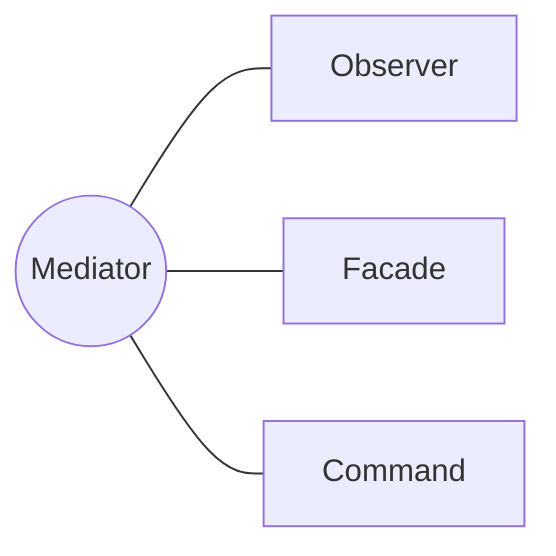

<h1 style="text-align:center;">
  <strong> Mediator (Mediador)</strong>
</h1>

<h4 style="text-align:center;"><em>“Define un objeto que encapsula cómo un conjunto de objetos interactúan entre sí,
promoviendo un acoplamiento débil.”</em></h4>


## Definición

<p style="text-align:justify;">
El <b>patrón Mediator</b> tiene como propósito <b>centralizar la comunicación entre objetos</b> que, de otro modo, estarían fuertemente acoplados.
A través de un <b>mediador</b>, los objetos llamados <b>colegas</b> dejan de comunicarse directamente entre sí y lo hacen a través de una interfaz común, mejorando la extensibilidad, reutilización y mantenibilidad del sistema.
</p>

<hr/>

## Motivación

<p style="text-align:justify;">
En sistemas complejos, múltiples objetos suelen necesitar interactuar entre sí. Sin embargo, estas interacciones pueden derivar en una red de dependencias difícil de mantener.
Cada cambio en uno de los componentes puede afectar a varios otros, generando una arquitectura frágil y acoplada.
El patrón <b>Mediator</b> soluciona este problema al introducir un objeto central —el mediador— que coordina y controla las interacciones entre los objetos participantes, eliminando las dependencias directas entre ellos.
</p>

<p style="text-align:justify;">
De esta forma, cada <b>colega</b> solo necesita conocer al mediador, lo que simplifica el mantenimiento del sistema y facilita agregar o modificar componentes sin alterar el resto de la estructura.
</p>

<hr/>

## Modelo UML

<p style="text-align:justify;">
La interfaz <b>IMediador</b> define las operaciones necesarias para permitir la comunicación entre objetos.
El <b>MediadorConcreto</b> implementa dicha interfaz y contiene la lógica que coordina a los <b>Colegas</b>.
Cada <b>ColegaConcreto</b> mantiene una referencia al mediador y delega en él la comunicación con otros colegas.
</p>

<p style="text-align:center;">
  
</p>
<p style="text-align:center;"><b>Figura 1.</b> Diagrama UML del patrón <i>Mediator</i>.</p>

<hr/>

## Implementación genérica de la estructura

Las clases e interfaces conservan los nombres de los participantes del modelo UML anterior. Así puede seguirse cada relación del diagrama directamente en el código. Java se muestra por defecto; las otras pestañas expresan la misma colaboración sin cambiar su intención.

=== "Java"

    ```java
    interface IMediador {
        void notificar(Colega emisor, String evento);
    }
    
    abstract class Colega {
        protected final IMediador mediador;
        protected Colega(IMediador mediador) { this.mediador = mediador; }
    }
    
    final class ColegaConcreto extends Colega {
        ColegaConcreto(IMediador mediador) { super(mediador); }
        void enviar(String evento) { mediador.notificar(this, evento); }
        void recibir(String evento) { System.out.println(evento); }
    }
    
    final class MediadorConcreto implements IMediador {
        private ColegaConcreto colega;
        void registrar(ColegaConcreto colega) { this.colega = colega; }
        public void notificar(Colega emisor, String evento) {
            if (colega != emisor) colega.recibir(evento);
        }
    }
    ```

=== "Python"

    ```python
    class IMediador:
        def notificar(self, emisor, evento): raise NotImplementedError
    class Colega:
        def __init__(self, mediador): self.mediador = mediador
    class ColegaConcreto(Colega):
        def enviar(self, evento): self.mediador.notificar(self, evento)
        def recibir(self, evento): self.ultimo = evento
    class MediadorConcreto(IMediador):
        def __init__(self): self.colegas = []
        def notificar(self, emisor, evento):
            for colega in self.colegas:
                if colega is not emisor: colega.recibir(evento)
    ```

=== "C#"

    ```csharp
    interface IMediador { void Notificar(Colega emisor, string evento); }
    
    abstract class Colega { protected IMediador mediador; protected Colega(IMediador m) => mediador = m; }
    
    class ColegaConcreto : Colega { public ColegaConcreto(IMediador m) : base(m) { } public void Enviar(string e) => mediador.Notificar(this,e); }
    
    class MediadorConcreto : IMediador { public void Notificar(Colega emisor, string evento) { /* coordina colegas */ } }
    ```

=== "Pseudocódigo"

    ```text
    INTERFAZ IMediador: notificar(emisor, evento)
    CLASE Colega: contiene IMediador
    CLASE ColegaConcreto: enviar mediante mediador
    CLASE MediadorConcreto
        notificar(emisor, evento): coordinar destinatarios sin acoplar colegas
    ```

## Participantes

<table>
  <thead>
    <tr>
      <th style="text-align:center;">Elemento</th>
      <th style="text-align:justify;">Descripción</th>
    </tr>
  </thead>
  <tbody>
    <tr>
      <td style="text-align:center;"><b>IMediador</b></td>
      <td style="text-align:justify;">Interfaz que define el contrato para la comunicación centralizada entre los diferentes colegas.</td>
    </tr>
    <tr>
      <td style="text-align:center;"><b>MediadorConcreto</b></td>
      <td style="text-align:justify;">Implementa las operaciones necesarias para coordinar y redirigir los mensajes entre los colegas.</td>
    </tr>
    <tr>
      <td style="text-align:center;"><b>Colega</b></td>
      <td style="text-align:justify;">Interfaz o clase base que define la comunicación entre los objetos participantes a través del mediador.</td>
    </tr>
    <tr>
      <td style="text-align:center;"><b>ColegaConcreto</b></td>
      <td style="text-align:justify;">Implementa las operaciones específicas y delega la comunicación al mediador.</td>
    </tr>
  </tbody>
</table>

<hr/>

## Enunciado del problema

Se solicita implementar un sistema de comunicación genérico que pueda utilizarse en diferentes dominios de negocio; por ejemplo, una sala de chat que permita a dos usuarios comunicarse entre ellos o una torre de control que permita notificar el estado de diferentes vuelos.

## Solución en código

El ejemplo deja visible el punto de entrada `main`; las clases que colaboran con él se explican en las secciones anteriores.

=== "Java"

    ```java
    package capitulo7.mediator;
    
    import capitulo7.mediator.colega.Colega;
    import capitulo7.mediator.colega.concreto.ColegaUsuario;
    import capitulo7.mediator.colega.concreto.ColegaVuelo;
    import capitulo7.mediator.mediador.Mediador;
    import capitulo7.mediator.mediador.concreto.MediadorUsuario;
    import capitulo7.mediator.mediador.concreto.MediadorVuelo;
    import capitulo7.mediator.modelo.Usuario;
    import capitulo7.mediator.modelo.Vuelo;
    
    public class Cliente {
        public static void main(String[] args) {
            chat();
            torreControl();
        }
    
        private static void chat() {
    
            final Mediador<Usuario> chat = new MediadorUsuario();
            final Colega<Usuario> carlos = new ColegaUsuario(chat, new Usuario("1",
                    "Carlos Orozco", "3111111111"), "corozco");
            final Colega<Usuario> isabel = new ColegaUsuario(chat, new Usuario("2",
                    "Isabel López", "3124326785"), "isalopez");
    
            chat.add(carlos);
            chat.add(isabel);
    
            System.out.println("Sala de chat");
    
            carlos.enviarMensaje("2", "Hola");
            System.out.println();
            isabel.enviarMensaje("1", "Hola, bien bien");
        }
    
        private static void torreControl() {
    
            final Mediador<Vuelo> torreControl = new MediadorVuelo();
    
            final Colega<Vuelo> vueloA = new ColegaVuelo(torreControl, new Vuelo("1", "VueloA"), "VueloA");
            final Colega<Vuelo> vueloB = new ColegaVuelo(torreControl, new Vuelo("2", "VueloB"), "VueloB");
            final Colega<Vuelo> vueloC = new ColegaVuelo(torreControl, new Vuelo("3", "VueloC"), "VueloC");
    
            torreControl.add(vueloA);
            torreControl.add(vueloB);
            torreControl.add(vueloC);
    
            System.out.println("\nTorre de control");
            vueloA.enviarMensaje("1", "\t" + vueloA.getLabel() + " solicita permiso para aterrizar");
            vueloB.enviarMensaje("2", "\t" + vueloB.getLabel() + " solicita permiso para despegar");
        }
    }
    ```

## Aplicabilidad

Utiliza Mediator cuando:

- Numerosos objetos se comuniquen entre sí mediante dependencias difíciles de mantener.
- Las reglas de coordinación deban centralizarse sin modificar cada participante.
- Quieras reutilizar colegas que actualmente dependen de colegas concretos.
- Una interacción compleja pueda describirse con mayor claridad desde un coordinador.
- Dominios como una sala de chat o una torre de control necesiten arbitrar mensajes entre participantes.

## Cómo implementar

1. Identifica las interacciones directas que generan acoplamiento entre colegas.
2. Define una interfaz de mediador para los eventos que deben coordinarse.
3. Haz que cada colega conserve una referencia al mediador y le notifique sus acciones.
4. Traslada al mediador concreto las reglas de comunicación y selección de destinatarios.
5. Elimina las referencias directas entre colegas.
6. Divide el mediador si comienza a concentrar reglas de dominios independientes.

## Ventajas y desventajas

### Ventajas

- Reduce dependencias muchos-a-muchos entre participantes.
- Centraliza y hace visibles las reglas de coordinación.
- Permite reutilizar y probar los colegas de forma independiente.

### Desventajas

- El mediador puede convertirse en una clase demasiado grande y compleja.
- Introduce un punto central cuya falla puede detener toda la interacción.
- Puede ocultar el flujo si las notificaciones no tienen nombres claros.

## Relación con otros patrones



- [Observer](observer.md) puede ayudar al mediador a difundir eventos a varios colegas.
- [Facade](../capitulo-6/facade.md) simplifica el acceso externo a un subsistema; Mediator coordina las interacciones internas.
- [Command](command.md) permite representar como objetos las acciones que el mediador distribuye.
