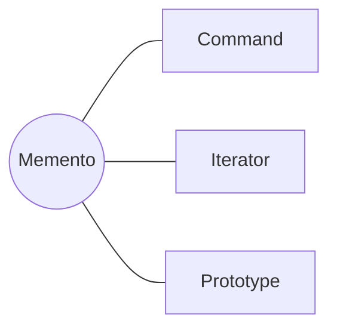

<h1 style="text-align:center;">
  <strong> Memento (Memoria)</strong>
</h1>

<h4 style="text-align:center;"><em>“Captura y restaura el estado interno de un objeto sin violar su
encapsulamiento.”</em></h4>


## Definición

<p style="text-align:justify;">
El <b>patrón Memento</b> tiene como propósito <b>guardar el estado interno de un objeto</b> en un momento específico para poder <b>restaurarlo más adelante</b>.
Esto lo convierte en una solución ideal para sistemas que necesitan funcionalidades como <i>deshacer</i> (undo), <i>rehacer</i> (redo) o gestión de versiones.
</p>

<hr/>

## Motivación

<p style="text-align:justify;">
En diversas aplicaciones —como editores de texto, sistemas de diseño gráfico o entornos de desarrollo— es necesario que los usuarios puedan revertir acciones previas.
El patrón <b>Memento</b> resuelve este problema al permitir que un objeto capture su estado actual y lo guarde como una "instantánea" o <b>memento</b>.
Posteriormente, ese estado puede ser restaurado sin que otras clases necesiten conocer la estructura interna del objeto.
</p>

<p style="text-align:justify;">
En otras palabras, el patrón actúa como el mecanismo conceptual detrás del conocido comando <b>Ctrl + Z</b>: volver atrás en el tiempo a un punto de guardado anterior.
</p>

<hr/>

## Modelo UML

<p style="text-align:justify;">
El <b>Originador</b> es el objeto cuyo estado se desea guardar o restaurar.
El <b>Memento</b> almacena una copia de ese estado en un momento dado, mientras que el <b>Cuidador</b> se encarga de almacenar los diferentes mementos creados y de proveer los mecanismos para acceder a ellos.
</p>

<p style="text-align:center;">
  
</p>
<p style="text-align:center;"><b>Figura 1.</b> Diagrama UML del patrón <i>Memento</i>.</p>

<hr/>

## Implementación genérica de la estructura

Las clases e interfaces conservan los nombres de los participantes del modelo UML anterior. Así puede seguirse cada relación del diagrama directamente en el código. Java se muestra por defecto; las otras pestañas expresan la misma colaboración sin cambiar su intención.

=== "Java"

    ```java
    final class Memento {
        private final String estado;
        Memento(String estado) { this.estado = estado; }
        String obtenerEstado() { return estado; }
    }
    
    final class Originador {
        private String estado;
        void cambiarEstado(String estado) { this.estado = estado; }
        Memento guardar() { return new Memento(estado); }
        void restaurar(Memento memento) { estado = memento.obtenerEstado(); }
    }
    
    final class Cuidador {
        private final java.util.Deque<Memento> historial = new java.util.ArrayDeque<>();
        void guardar(Memento memento) { historial.push(memento); }
        Memento recuperar() { return historial.pop(); }
    }
    ```

=== "Python"

    ```python
    class Memento:
        def __init__(self, estado): self._estado = estado
    class Originador:
        def __init__(self): self.estado = None
        def guardar(self): return Memento(self.estado)
        def restaurar(self, memento): self.estado = memento._estado
    class Cuidador:
        def __init__(self): self.historial = []
        def guardar(self, memento): self.historial.append(memento)
        def recuperar(self): return self.historial.pop()
    ```

=== "C#"

    ```csharp
    record Memento(string Estado);
    
    class Originador {
        public string Estado { get; set; }
        public Memento Guardar() => new(Estado);
        public void Restaurar(Memento m) => Estado = m.Estado;
    }
    
    class Cuidador { public Stack<Memento> Historial { get; } = new(); }
    ```

=== "Pseudocódigo"

    ```text
    CLASE Memento: estado inmutable
    CLASE Originador
        guardar(): RETORNAR Memento(estado)
        restaurar(memento): estado ← memento.estado
    CLASE Cuidador: pila de Memento
    ```

## Participantes

<table>
  <thead>
    <tr>
      <th style="text-align:center;">Elemento</th>
      <th style="text-align:justify;">Descripción</th>
    </tr>
  </thead>
  <tbody>
    <tr>
      <td style="text-align:center;"><b>Originador</b></td>
      <td style="text-align:justify;">Clase que conoce su propio estado y puede crear un <b>Memento</b> para almacenarlo o restaurarlo más adelante.</td>
    </tr>
    <tr>
      <td style="text-align:center;"><b>Memento</b></td>
      <td style="text-align:justify;">Objeto inmutable que almacena el estado del <b>Originador</b> en un instante del tiempo sin exponer su estructura interna.</td>
    </tr>
    <tr>
      <td style="text-align:center;"><b>Cuidador</b></td>
      <td style="text-align:justify;">Administra la colección de mementos y permite recuperar o revertir estados anteriores del <b>Originador</b>.</td>
    </tr>
  </tbody>
</table>

<hr/>

## Enunciado del problema

Se solicita implementar, como parte de un equipo que desarrolla un juego de mundo abierto, la lógica para guardar el progreso del jugador y restaurar el último estado disponible cuando muera. En este punto del proyecto, el sistema ya incluye la clase `Jugador`.

## Solución en código

El ejemplo deja visible el punto de entrada `main`; las clases que colaboran con él se explican en las secciones anteriores.

=== "Java"

    ```java
    package capitulo7.memento;
    
    import capitulo7.memento.historico.Cuidador;
    import capitulo7.memento.modelo.Jugador;
    
    public class Cliente {
        public static void main(String[] args) {
    
            final Cuidador cuidador = new Cuidador();
            final Jugador jugador = new Jugador(1, 100, 0, 1, true);
    
            System.out.println("Estado: " + jugador);
            cuidador.agregarMemento(jugador.guardarMemento());
            jugador.setExp(300);
            jugador.setNivel(2); // Sube de nivel
            System.out.println("Checkpoint: " + jugador);
            cuidador.agregarMemento(jugador.guardarMemento());
    
            // Mata al jugador
            jugador.setHp(0);
            jugador.setVivo(false);
    
            System.out.println("Jugador ha muerto: " + jugador);
            System.out.println("\nEstados guardados: " + cuidador.getEstados());
            System.out.println("Retorna al ultimo punto de control.");
            int ultimoEstado = cuidador.getEstados().size() - 1;
            jugador.restaurarMemento(cuidador.getMemento(ultimoEstado));
            System.out.println("Jugador vivo: " + jugador);
        }
    }
    ```

## Aplicabilidad

Utiliza Memento cuando:

- Debas guardar puntos de control para restaurar el estado anterior de un objeto.
- Exponer directamente ese estado rompería su encapsulamiento.
- El sistema necesite deshacer, rehacer, guardar partidas o implementar transacciones reversibles.
- Solo el objeto originador deba interpretar el contenido de la instantánea.
- El costo de almacenar las copias sea aceptable frente al valor de la recuperación.

## Cómo implementar

1. Identifica el estado mínimo que el originador necesita para restaurarse.
2. Crea una clase memento que almacene una instantánea inmutable de ese estado.
3. Añade al originador operaciones para producir y restaurar mementos.
4. Define un cuidador que almacene el historial sin modificar ni interpretar las instantáneas.
5. Establece una política de cantidad, expiración o persistencia de mementos.
6. Copia profundamente el estado mutable cuando no deba compartirse con el originador.

## Ventajas y desventajas

### Ventajas

- Conserva el encapsulamiento del objeto cuyo estado se captura.
- Simplifica la implementación de puntos de control y deshacer.
- Separa la gestión del historial de la lógica del originador.

### Desventajas

- Las instantáneas grandes o frecuentes pueden consumir mucha memoria.
- El cuidador necesita políticas para liberar estados obsoletos.
- Las referencias mutables dentro del memento pueden impedir una restauración fiel.

## Relación con otros patrones



- [Command](command.md) utiliza Memento para recuperar el estado previo al deshacer una operación.
- [Iterator](iterator.md) puede almacenar su posición en un memento y reanudar el recorrido.
- [Prototype](../capitulo-5/prototype.md) puede facilitar la copia del estado, aunque su objetivo es crear objetos independientes y no administrar un historial.
