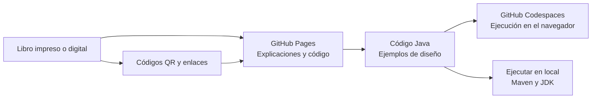

  

  

    <h1>Notas a mano sobre análisis orientado a objetos y patrones de diseño</h1>
    
Primera edición · 2025

    
Fundamentos, criterios de diseño y ejemplos Java para comprender cómo colaboran los objetos y cuándo resulta útil cada patrón.

    <ul class="book-hero__authors" aria-label="Autores de la obra">
      <li>Carlos Eduardo Orozco Garcés</li>
      <li>César Jesús Pardo Calvache</li>
      <li>Eydy del Carmen Suárez Brieva</li>
    </ul>
    

      <a class="md-button md-button--primary book-hero__explore" href="capitulos/"><svg class="book-hero__explore-icon" aria-hidden="true" viewBox="0 0 24 24"><path d="M4 5.5A2.5 2.5 0 0 1 6.5 3H11a2 2 0 0 1 2 2v14.25A3.75 3.75 0 0 0 9.25 16H4V5.5Zm16 0V16h-5.25A3.75 3.75 0 0 0 11 19.25V5a2 2 0 0 1 2-2h4.5A2.5 2.5 0 0 1 20 5.5Z"/></svg>Explorar capítulos</a>
      <a class="md-button md-button--primary book-hero__authors-link" href="autores/"><svg class="book-hero__authors-icon" aria-hidden="true" viewBox="0 0 24 24"><path d="M12 12a4 4 0 1 0 0-8 4 4 0 0 0 0 8Zm0 2c-4.42 0-8 2.24-8 5v1h16v-1c0-2.76-3.58-5-8-5Z"/></svg>Sobre los autores</a>
      <a class="md-button md-button--primary book-hero__series-link" href="https://a.co/d/9rEY0dC" target="_blank" rel="noopener noreferrer"><svg class="book-hero__series-icon" aria-hidden="true" viewBox="0 0 24 24"><path d="M6 3.5A2.5 2.5 0 0 1 8.5 1H17a2 2 0 0 1 2 2v17.25A3.75 3.75 0 0 0 15.25 17H6V3.5Z"/></svg>Consultar el libro</a>
    

  

## Mapa de aprendizaje del libro

De los fundamentos orientados a objetos a la selección razonada de patrones. Estas cinco etapas muestran cómo se conectan los capítulos y qué propósito cumple cada parte del recorrido.

  <article class="learning-roadmap__stage learning-roadmap__stage--foundations" role="listitem">
1

<strong>Comprender objetos y diseño</strong>Capítulos 1–2

Origen de los patrones, clases, objetos, abstracción, encapsulamiento, herencia y polimorfismo.
<em>Reconocerás los elementos con los que se construye y comunica un modelo orientado a objetos.</em>
<a href="capitulos/capitulo-1/">Capítulo 1</a><a href="capitulos/capitulo-2/">Capítulo 2</a>

</article>
  <article class="learning-roadmap__stage learning-roadmap__stage--notation" role="listitem">
2

<strong>Asignar responsabilidades</strong>Capítulo 3

Principios GRASP y SOLID para distribuir comportamiento, controlar dependencias y preparar el cambio.
<em>Justificarás decisiones de diseño mediante responsabilidades, cohesión y acoplamiento.</em>
<a href="capitulos/capitulo-3/">Capítulo 3</a>

</article>
  <article class="learning-roadmap__stage learning-roadmap__stage--structured" role="listitem">
3

<strong>Aplicar buenas prácticas</strong>Capítulo 4

DRY, KISS, YAGNI y Ley de Demeter como criterios para reducir complejidad accidental.
<em>Detectarás problemas frecuentes y elegirás mejoras proporcionadas al contexto.</em>
<a href="capitulos/capitulo-4/">Capítulo 4</a>

</article>
  <article class="learning-roadmap__stage learning-roadmap__stage--recursive" role="listitem">
4

<strong>Construir y componer objetos</strong>Capítulos 5–6

Patrones creacionales y estructurales para desacoplar la construcción y organizar colaboraciones.
<em>Relacionarás cada estructura con las fuerzas y consecuencias del problema que resuelve.</em>
<a href="capitulos/capitulo-5/">Capítulo 5</a><a href="capitulos/capitulo-6/">Capítulo 6</a>

</article>
  <article class="learning-roadmap__stage learning-roadmap__stage--algorithms" role="listitem">
5

<strong>Coordinar y evaluar diseños</strong>Capítulos 7–8

Patrones de comportamiento y reflexiones para seleccionar soluciones con criterio.
<em>Compararás alternativas y explicarás sus participantes, colaboraciones y límites.</em>
<a href="capitulos/capitulo-7/">Capítulo 7</a><a href="capitulos/capitulo-8/">Capítulo 8</a>

</article>

<strong>Durante todo el recorrido</strong>
Parte del problema, identifica sus fuerzas y compara las consecuencias antes de elegir un principio o patrón.

## Cómo se conectan los recursos

El diagrama resume el recorrido recomendado: el libro desarrolla los conceptos, Pages organiza la consulta y el repositorio permite estudiar y ejecutar los ejemplos Java.

## Empieza según tu objetivo

| Si quieres… | Empieza por… |
| --- | --- |
| Seguir el libro | [Recorrido por capítulos](capitulos/index.md) |
| Encontrar una implementación | [Correspondencia libro-código](correspondencia.md) |
| Repasar criterios de diseño | [GRASP y SOLID](capitulos/capitulo-3.md) |
| Comparar familias de patrones | [Creacionales](capitulos/capitulo-5.md), [estructurales](capitulos/capitulo-6.md) y [de comportamiento](capitulos/capitulo-7.md) |

## Cómo empezar

1. Revisa [Cómo usar los ejemplos](recursos.md) para conocer la relación entre las explicaciones, los diagramas UML y el código Java.
2. Sigue el [recorrido por capítulos](capitulos/index.md) o localiza una sección impresa mediante la [correspondencia libro–sitio](correspondencia.md).
3. Abre los ejemplos en [GitHub Codespaces](codespaces.md) o ejecútalos localmente para observar las colaboraciones entre clases y objetos.

!!! note "Alcance"
    El sitio orienta, resume y conecta los recursos de la obra. El desarrollo completo de los conceptos, decisiones y ejemplos permanece en el libro.
