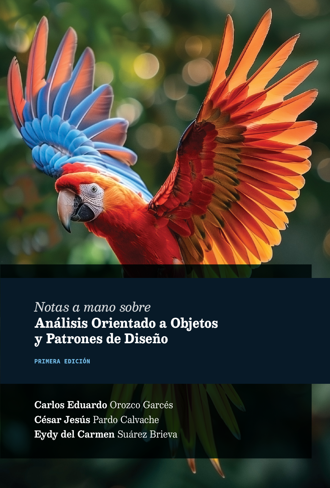
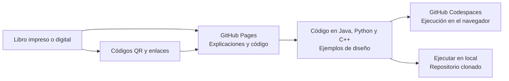

  

  

    <h1>Notas a mano sobre análisis orientado a objetos y patrones de diseño</h1>
    
Primera edición · 2025

    
Fundamentos, criterios de diseño y ejemplos para comprender cómo colaboran los objetos y cuándo resulta útil cada patrón.

    <ul class="book-hero__authors" aria-label="Autores de la obra"><li>Carlos Eduardo Orozco Garcés</li><li>César Jesús Pardo Calvache</li><li>Eydy del Carmen Suárez Brieva</li></ul>
    

      <a class="md-button md-button--primary book-hero__explore" href="capitulos/"><svg class="book-hero__explore-icon" aria-hidden="true" viewBox="0 0 24 24" focusable="false"><path d="m19 1-5 5v11l5-4.5zm2 4v13.5c-1.1-.35-2.3-.5-3.5-.5-1.7 0-4.15.65-5.5 1.5V6c-1.45-1.1-3.55-1.5-5.5-1.5S2.45 4.9 1 6v14.65c0 .25.25.5.5.5.1 0 .15-.05.25-.05C3.1 20.45 5.05 20 6.5 20c1.95 0 4.05.4 5.5 1.5 1.35-.85 3.8-1.5 5.5-1.5 1.65 0 3.35.3 4.75 1.05.1.05.15.05.25.05.25 0 .5-.25.5-.5V6c-.6-.45-1.25-.75-2-1M10 18.41C8.75 18.09 7.5 18 6.5 18c-1.06 0-2.32.19-3.5.5V7.13c.91-.4 2.14-.63 3.5-.63s2.59.23 3.5.63z"/></svg>Explorar capítulos</a>
      <a class="md-button md-button--primary book-hero__authors-link" href="autores/"><svg class="book-hero__authors-icon" aria-hidden="true" viewBox="0 0 24 24" focusable="false"><path d="M12 5a3.5 3.5 0 0 0-3.5 3.5A3.5 3.5 0 0 0 12 12a3.5 3.5 0 0 0 3.5-3.5A3.5 3.5 0 0 0 12 5m0 2a1.5 1.5 0 0 1 1.5 1.5A1.5 1.5 0 0 1 12 10a1.5 1.5 0 0 1-1.5-1.5A1.5 1.5 0 0 1 12 7M5.5 8A2.5 2.5 0 0 0 3 10.5c0 .94.53 1.75 1.29 2.18.36.2.77.32 1.21.32s.85-.12 1.21-.32c.37-.21.68-.51.91-.87A5.42 5.42 0 0 1 6.5 8.5v-.28c-.3-.14-.64-.22-1-.22m13 0c-.36 0-.7.08-1 .22v.28c0 1.2-.39 2.36-1.12 3.31.12.19.25.34.4.49a2.482 2.482 0 0 0 1.72.7c.44 0 .85-.12 1.21-.32.76-.43 1.29-1.24 1.29-2.18A2.5 2.5 0 0 0 18.5 8M12 14c-2.34 0-7 1.17-7 3.5V19h14v-1.5c0-2.33-4.66-3.5-7-3.5m-7.29.55C2.78 14.78 0 15.76 0 17.5V19h3v-1.93c0-1.01.69-1.85 1.71-2.52m14.58 0c1.02.67 1.71 1.51 1.71 2.52V19h3v-1.5c0-1.74-2.78-2.72-4.71-2.95M12 16c1.53 0 3.24.5 4.23 1H7.77c.99-.5 2.7-1 4.23-1"/></svg>Sobre los autores</a>
      <a class="md-button md-button--primary book-hero__series-link" href="https://www.amazon.com/dp/B0DH2Z4VHD" target="_blank" rel="noopener noreferrer"><svg class="book-hero__series-icon" aria-hidden="true" viewBox="0 0 24 24" focusable="false"><path d="M9 3v15h3V3zm3 2 4 13 3-1-4-13zM5 5v13h3V5zM3 19v2h18v-2z"/></svg>Serie Notas a Mano</a>
      <a class="md-button md-button--primary book-hero__purchase-link" href="https://a.co/d/9rEY0dC" target="_blank" rel="noopener noreferrer"><svg class="book-hero__purchase-icon" aria-hidden="true" viewBox="0 0 24 24" focusable="false"><path d="M17 18a2 2 0 0 1 2 2 2 2 0 0 1-2 2 2 2 0 0 1-2-2c0-1.11.89-2 2-2M1 2h3.27l.94 2H20a1 1 0 0 1 1 1c0 .17-.05.34-.12.5l-3.58 6.47c-.34.61-1 1.03-1.75 1.03H8.1l-.9 1.63-.03.12a.25.25 0 0 0 .25.25H19v2H7a2 2 0 0 1-2-2c0-.35.09-.68.24-.96l1.36-2.45L3 4H1zm6 16a2 2 0 0 1 2 2 2 2 0 0 1-2 2 2 2 0 0 1-2-2c0-1.11.89-2 2-2m9-7 2.78-5H6.14l2.36 5z"/></svg>Obtener el libro</a>
    

  

## Mapa de aprendizaje del libro

De los fundamentos orientados a objetos a la selección razonada de patrones. Estas cinco etapas muestran cómo se conectan los capítulos y qué propósito cumple cada parte del recorrido.

  <article class="learning-roadmap__stage learning-roadmap__stage--foundations" role="listitem">
1

<strong>Comprender objetos y diseño</strong>Capítulos 1–2

Origen de los patrones, clases, objetos, abstracción, encapsulamiento, herencia y polimorfismo.
<em>Reconocerás los elementos con los que se construye y comunica un modelo orientado a objetos.</em>
Capítulo 1 · Próximamente<a href="capitulos/capitulo-2/programacion-orientada-a-objetos/">Capítulo 2</a>

</article>
  <article class="learning-roadmap__stage learning-roadmap__stage--notation" role="listitem">
2

<strong>Asignar responsabilidades</strong>Capítulo 3

Principios GRASP y SOLID para distribuir comportamiento, controlar dependencias y preparar el cambio.
<em>Justificarás decisiones de diseño mediante responsabilidades, cohesión y acoplamiento.</em>
Capítulo 3 · Próximamente

</article>
  <article class="learning-roadmap__stage learning-roadmap__stage--structured" role="listitem">
3

<strong>Aplicar buenas prácticas</strong>Capítulo 4

DRY, KISS, YAGNI y Ley de Demeter como criterios para reducir complejidad accidental.
<em>Detectarás problemas frecuentes y elegirás mejoras proporcionadas al contexto.</em>
Capítulo 4 · Próximamente

</article>
  <article class="learning-roadmap__stage learning-roadmap__stage--recursive" role="listitem">
4

<strong>Construir y componer objetos</strong>Capítulos 5–6

Patrones creacionales y estructurales para desacoplar la construcción y organizar colaboraciones.
<em>Relacionarás cada estructura con las fuerzas y consecuencias del problema que resuelve.</em>
Capítulos 5–6 · Próximamente

</article>
  <article class="learning-roadmap__stage learning-roadmap__stage--algorithms" role="listitem">
5

<strong>Coordinar y evaluar diseños</strong>Capítulos 7–8

Patrones de comportamiento y reflexiones para seleccionar soluciones con criterio.
<em>Compararás alternativas y explicarás sus participantes, colaboraciones y límites.</em>
Capítulos 7–8 · Próximamente

</article>

<strong>Durante todo el recorrido</strong>
Parte del problema, identifica sus fuerzas y compara las consecuencias antes de elegir un principio o patrón.

## Cómo se conectan los recursos

El diagrama resume el recorrido recomendado: el libro desarrolla los conceptos, Pages organiza la consulta y el repositorio permite estudiar y ejecutar los ejemplos.

```mermaid
flowchart LR
    Libro[Libro impreso o digital] --> Pages[GitHub Pages<br/>Explicaciones y código]
    Pages --> Codigo[Código en Java, Python y C++<br/>Ejemplos de diseño]
    Codigo --> Codespaces[GitHub Codespaces<br/>Ejecución en el navegador]
    Codigo --> Local[Ejecutar en local<br/>Repositorio clonado]
    Libro --> QR[Códigos QR y enlaces]
    QR --> Pages
```

## Empieza según tu objetivo

| Si quieres… | Empieza por… |
| --- | --- |
| Seguir el libro | [Recorrido por capítulos](capitulos/index.md) |
| Estudiar el capítulo disponible | [Pilares de la programación orientada a objetos](capitulos/capitulo-2/programacion-orientada-a-objetos.md) |
| Encontrar una implementación | [Correspondencia libro–código](correspondencia.md) |
| Consultar términos clave | [Glosario](glosario.md) |

## Cómo empezar

1. Revisa [Cómo usar los ejemplos](recursos.md) para conocer la relación entre las explicaciones, los diagramas UML y el código.
2. Sigue el [recorrido por capítulos](capitulos/index.md) o localiza una sección impresa mediante la [correspondencia libro–sitio](correspondencia.md).
3. Abre los ejemplos en [GitHub Codespaces](codespaces.md) o ejecútalos localmente para observar las colaboraciones entre clases y objetos.

!!! note "Alcance"
    Se conserva la estructura completa del libro y sus recursos de consulta. Durante la preparación de esta edición, el capítulo 2 es el único capítulo disponible en la lista y presenta exclusivamente la sección de pilares de la programación orientada a objetos.
