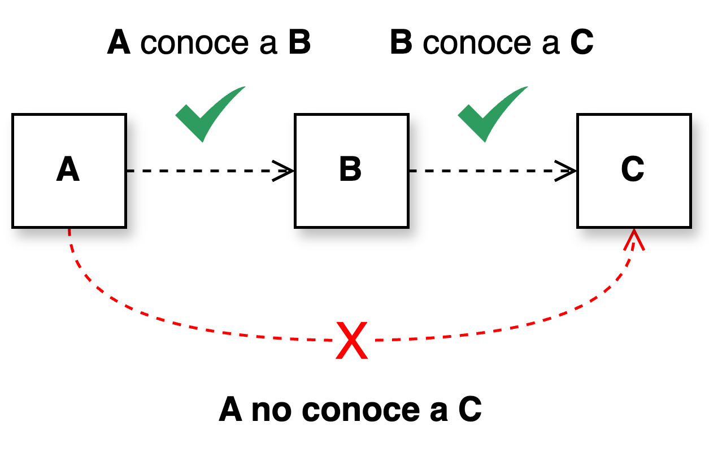

<h1 style="text-align:center;"><strong>📏 Ley de Demeter</strong></h1>

<h4 style="text-align:center;"><em>“No hables con extraños”.</em></h4>

La <b>Ley de Demeter</b> —también conocida como <b>principio de menor conocimiento</b>— establece que cada objeto en un sistema debería comunicarse únicamente con sus <b>colaboradores directos</b>.  
Este principio busca <b>minimizar el acoplamiento</b> entre clases y promover una estructura <b>modular, mantenible y encapsulada</b>.  
Fue propuesta por Ian Holland en 1987, en la Universidad de Northeastern, como parte de una iniciativa para definir mejores prácticas de <b>diseño orientado a objetos</b> (<a href="#ref">Lieberherr, 1988</a>).

---

## 🧭 Definición general

De acuerdo con la Ley de Demeter, un método de una clase <b>solo debería interactuar con:</b>

- Sus propios atributos o métodos.
- Los parámetros que recibe como argumento.
- Los objetos que crea directamente.
- Sus colaboradores inmediatos (atributos o dependencias directas).

En otras palabras, <b>cada objeto debe hablar únicamente con sus vecinos</b>, evitando depender de los “amigos de sus amigos”.  
Las llamadas encadenadas como <code>a.getB().getC().hacerAlgo()</code> violan este principio, ya que exponen detalles internos de la estructura y aumentan el acoplamiento entre módulos.

  <figure>
    
    <figcaption><b>Figura 1.</b> Interacción correcta según la Ley de Demeter: comunicación solo entre colaboradores directos.</figcaption>
  </figure>

---

## 🧩 Intuición del principio

Imagina tres clases: <b>A</b>, <b>B</b> y <b>C</b>.  
La clase <b>A</b> colabora con <b>B</b>, y <b>B</b> colabora con <b>C</b>.  
Según la Ley de Demeter, <b>A</b> no debería depender directamente de <b>C</b>; en su lugar, <b>B</b> debe encargarse de encapsular la interacción.  
Este modelo favorece la <b>delegación de responsabilidades</b> y garantiza que los cambios en una parte del sistema tengan un impacto mínimo en las demás.

En esencia, este principio fomenta la <b>independencia entre componentes</b> y refuerza la idea de que cada módulo debe conocer solo lo necesario para cumplir su función.  
De este modo, se obtiene un diseño más <b>robusto, flexible y fácil de mantener</b>.

---

## 💡 Beneficios principales

<table>
  <thead>
    <tr>
      <th style="text-align:center;">🧱 Beneficio</th>
      <th style="text-align:justify;">🎯 Descripción</th>
    </tr>
  </thead>
  <tbody>
    <tr>
      <td style="text-align:center;"><b>Menor acoplamiento</b></td>
      <td style="text-align:justify;">Disminuye la dependencia entre clases, evitando efectos colaterales al modificar el código.</td>
    </tr>
    <tr>
      <td style="text-align:center;"><b>Mayor encapsulación</b></td>
      <td style="text-align:justify;">Cada objeto protege su estado interno y sus detalles de implementación, reduciendo fugas de información.</td>
    </tr>
    <tr>
      <td style="text-align:center;"><b>Mejor mantenibilidad</b></td>
      <td style="text-align:justify;">Facilita el refactor y la comprensión del sistema, permitiendo aislar errores y aplicar cambios localizados.</td>
    </tr>
    <tr>
      <td style="text-align:center;"><b>Mayor cohesión</b></td>
      <td style="text-align:justify;">Las clases mantienen un propósito claro y bien definido, evitando responsabilidades cruzadas.</td>
    </tr>
    <tr>
      <td style="text-align:center;"><b>Alta extensibilidad</b></td>
      <td style="text-align:justify;">Los cambios o nuevas funciones afectan solo a los colaboradores directos, simplificando la evolución del sistema.</td>
    </tr>
  </tbody>
</table>

---

## 🚨 Señales de violación

El incumplimiento de la Ley de Demeter suele manifestarse en arquitecturas con alta fragilidad y dependencia entre módulos.  
Algunas señales de alerta son:

- Encadenamientos excesivos de llamadas a métodos (<code>a.b().c().d()</code>).
- Exposición innecesaria de objetos internos a otras clases.
- Métodos que recorren dependencias para acceder a datos profundos.
- Alta sensibilidad del sistema ante pequeños cambios en otras clases.

---

## 🧱 Recomendaciones prácticas

- Implementa <b>métodos de delegación</b> que oculten la complejidad interna.
- Expón <b>interfaces coherentes</b> y de alto nivel en tus colaboradores.
- Evita devolver referencias mutables o internas directamente.
- Utiliza <b>métodos de fachada</b> que expresen la intención del dominio, no los detalles técnicos.

---

## 🧠 Conceptos clave

### 🔹 Acoplamiento

Mide el grado de dependencia entre clases. Un acoplamiento bajo permite modificar un componente sin alterar el resto del sistema.

### 🔹 Cohesión

Evalúa qué tan enfocadas están las responsabilidades de una clase.  
La Ley de Demeter fomenta una <b>alta cohesión</b> al restringir el conocimiento de las clases sobre sus colaboradores.

### 🔹 Encapsulación

Garantiza que cada clase controle su propio estado y comportamiento, limitando la visibilidad de sus detalles internos hacia otras partes del sistema.

---

## 📎 Referencia

Lieberherr, K., Holland, I., &amp; Riel, A. (1988). <i>Object-Oriented Programming: An Objective Sense of Style</i>.  
SIGPLAN Notices, 23(11), 323–334.  
<a href="https://doi.org/10.1145/62084.62113">https://doi.org/10.1145/62084.62113</a>

