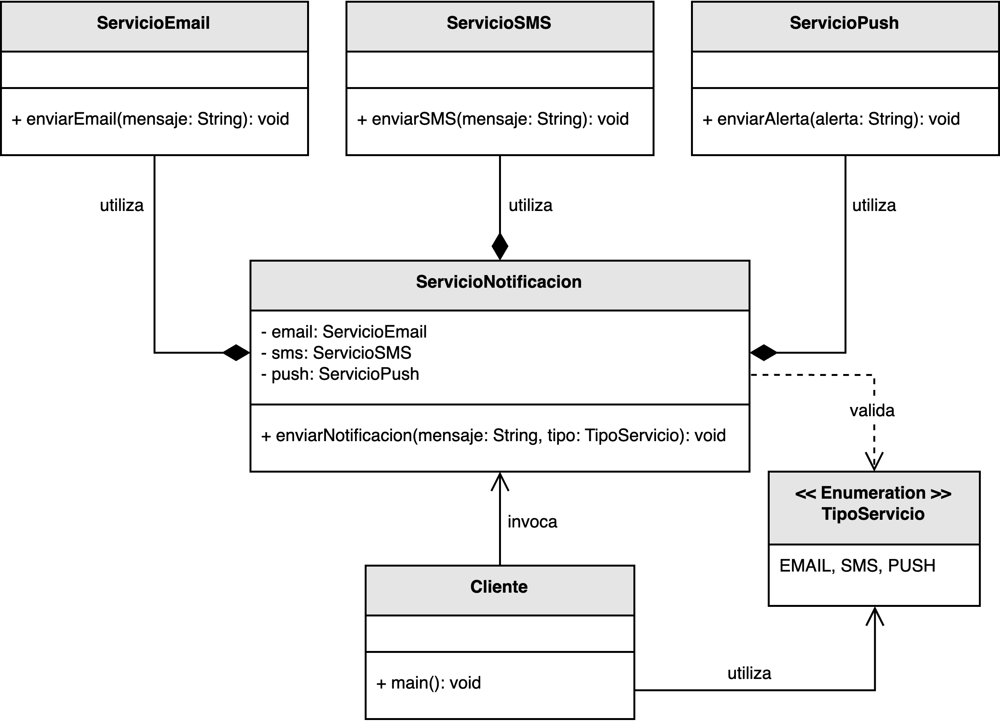
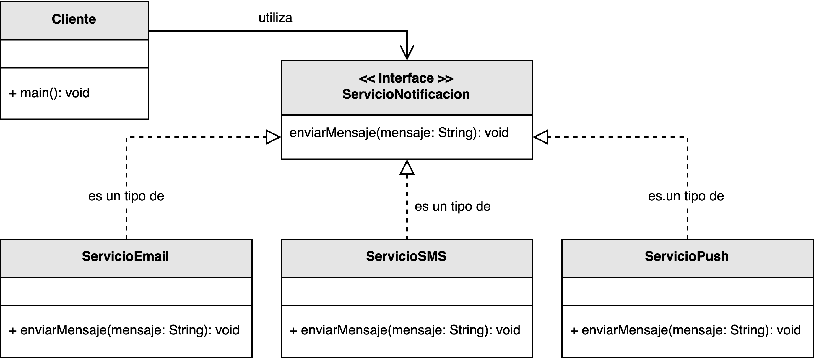

<h1 style="text-align:center;">
  <strong>📨 Ejemplo: Servicio de Notificaciones</strong>
</h1>

<h2><strong>🧩 Descripción del problema</strong></h2>

Se solicitó a <em>nuestro desarrollador</em> diseñar un sistema que permita <b>enviar alertas personalizadas</b> a los usuarios.  
El sistema debe ser capaz de manejar distintos canales de comunicación, como <b>correo electrónico</b>, <b>mensajes SMS</b> y <b>notificaciones push</b>.  
Además, la arquitectura debe ser lo suficientemente flexible como para permitir la incorporación de <b>nuevos tipos de mensajes</b> en el futuro sin requerir modificaciones sustanciales en el código existente.

El reto principal consiste en evitar un <b>alto acoplamiento</b> entre los componentes del sistema.  
En un diseño inicial poco estructurado, cada clase responsable del envío de mensajes depende directamente de las demás, lo que hace que cualquier cambio en un canal de notificación afecte al resto del sistema.  
El objetivo es aplicar el principio de <b>bajo acoplamiento</b> para obtener una solución más <b>modular, extensible y fácil de mantener</b>.

<h2><strong>📂 Estructura del ejemplo y accesos directos</strong></h2>

<table style="width:100%; border-collapse:collapse;">
  <thead>
    <tr style="background:#f5f5f5;">
      <th style="border:1px solid #ddd; padding:8px; text-align:center;">❌ Alto acoplamiento</th>
      <th style="border:1px solid #ddd; padding:8px; text-align:center;">✅ Bajo acoplamiento</th>
    </tr>
  </thead>
  <tbody>
    <tr>
      <td style="border:1px solid #ddd; padding:8px;">
        

          La clase cliente <b>conoce</b> e invoca implementaciones concretas, generando dependencia rígida.
        

        <ul style="margin:0 0 4px 18px;">
          <li>▶️ <a href="./ejemplo_alto_acoplamiento/servicios/Cliente.java" target="_blank"><b>Cliente.java</b></a></li>
          <li>▶️ <a href="./ejemplo_alto_acoplamiento/servicios/ServicioNotificacion.java" target="_blank"><b>ServicioNotificacion.java</b></a></li>
          <li>▶️ <a href="./ejemplo_alto_acoplamiento/servicios/TipoServicio.java" target="_blank"><b>TipoServicio.java</b></a></li>
        </ul>
      </td>
      <td style="border:1px solid #ddd; padding:8px;">
        

          La clase cliente depende de <b>abstracciones</b> (interfaces/contratos). Agregar un canal nuevo no exige modificar el cliente.
        

        <ul style="margin:0 0 4px 18px;">
          <li>▶️ <a href="./ejemplo_bajo_acoplamiento/servicios/Cliente.java" target="_blank"><b>Cliente.java</b></a></li>
        </ul>
      </td>
    </tr>
  </tbody>
</table>

<h2 style="text-align:justify;"><strong>❌ Modelo UML con alto acoplamiento</strong></h2>

En la primera versión del sistema, cada módulo depende directamente de las implementaciones concretas de los diferentes canales de notificación.  
Esto implica que la clase principal debe conocer los detalles de cada servicio (por ejemplo, <code>CorreoService</code>, <code>SMSService</code> o <code>PushService</code>), creando un <b>acoplamiento fuerte</b> y reduciendo la capacidad del sistema para adaptarse a nuevos requerimientos.

Como resultado, si se desea añadir un nuevo canal de notificación (por ejemplo, <em>mensajes por WhatsApp</em> o <em>notificaciones por Slack</em>), es necesario modificar directamente la clase principal, violando así el <b>principio abierto/cerrado (OCP)</b>.

  

<b>Figura 1.</b> Diseño inicial con alto acoplamiento entre los componentes.

<h2 style="text-align:justify;"><strong>✅ Modelo UML con bajo acoplamiento</strong></h2>

En la versión mejorada, el sistema se rediseña aplicando el <b>principio de bajo acoplamiento</b>.  
Se introduce una interfaz común, por ejemplo <code>INotificador</code>, que define el contrato genérico para enviar notificaciones.  
Cada canal de comunicación (correo, SMS, push, etc.) implementa esta interfaz y define su propia lógica de envío.  
De este modo, la clase principal solo depende de la <b>abstracción</b> y no de las implementaciones concretas.

Este enfoque permite extender el sistema fácilmente: para añadir un nuevo tipo de notificación, basta con crear una nueva clase que implemente la interfaz <code>INotificador</code> sin alterar las clases existentes.  
Así, el diseño cumple los principios de <b>abierto/cerrado (OCP)</b> y <b>inversión de dependencias (DIP)</b>.

  

<b>Figura 2.</b> Diseño con bajo acoplamiento mediante el uso de abstracciones.

<h2><strong>💡 Conclusión</strong></h2>

El rediseño del sistema de notificaciones ilustra claramente cómo aplicar el <b>principio de bajo acoplamiento</b> permite lograr una arquitectura más flexible y escalable.  
Al depender de <b>interfaces</b> en lugar de <b>implementaciones concretas</b>, el sistema se vuelve más fácil de mantener, probar y extender sin afectar el código existente.  
Este tipo de diseño es fundamental en entornos modernos donde los requisitos cambian con frecuencia y la adaptabilidad es esencial.

