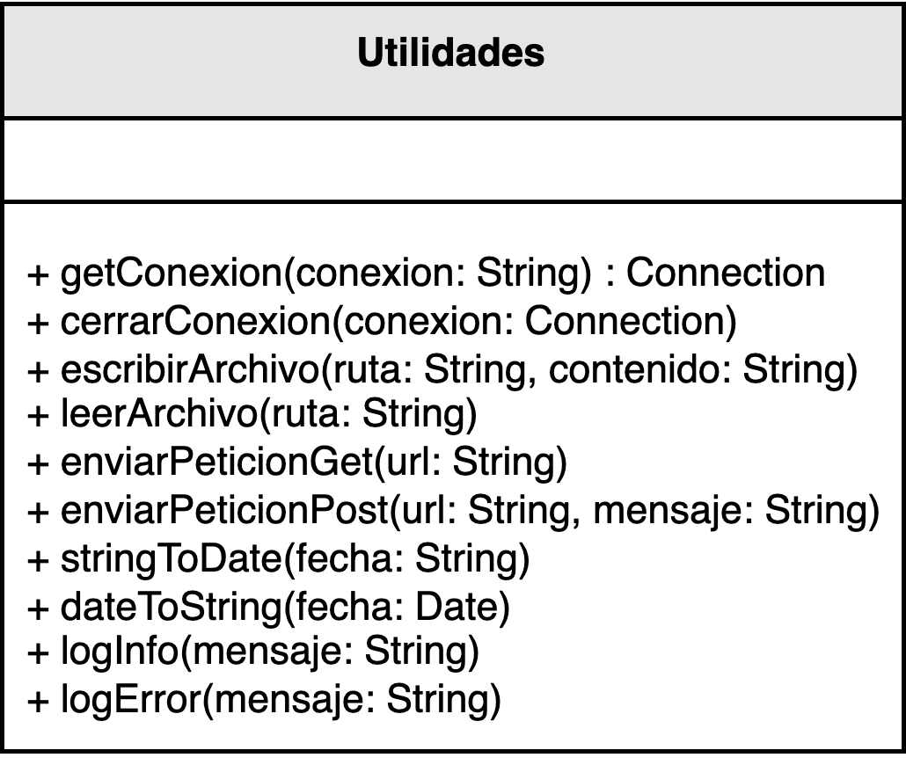
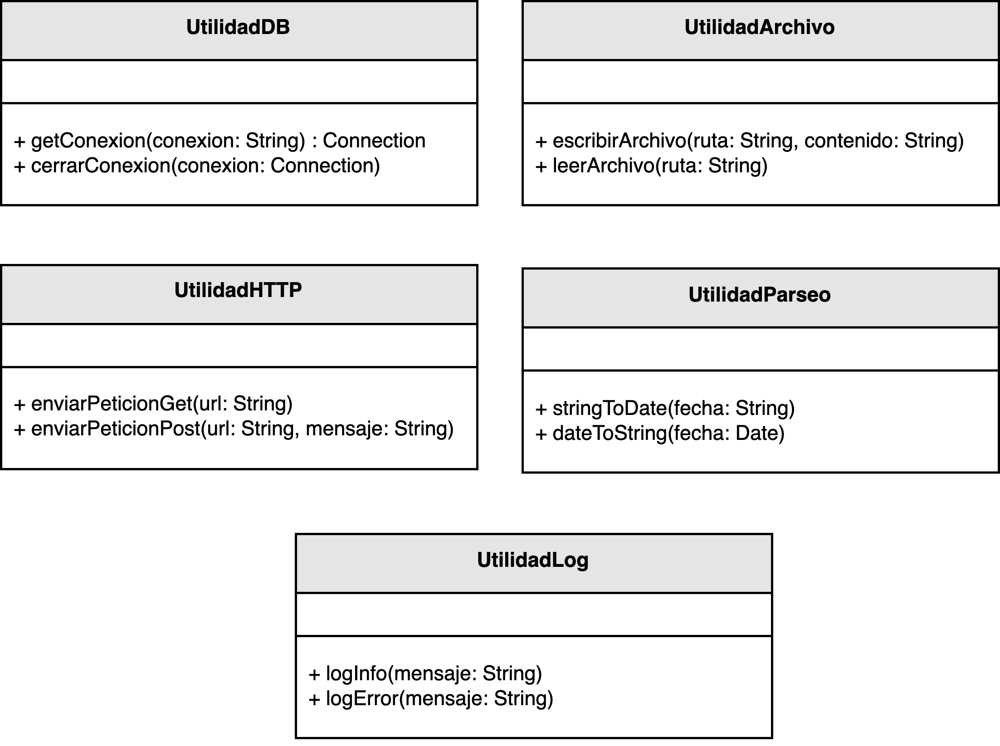

<h1 style="text-align:center;">
  <strong>🧩 Ejemplo: Cohesión en una Clase de Utilidades</strong>
</h1>

<h2><strong>📘 Descripción del problema</strong></h2>

La empresa donde trabaja <em>nuestro desarrollador</em> busca reducir la <b>deuda técnica</b> acumulada en uno de sus proyectos más críticos.  
Durante la revisión del código, se detectó que varios módulos presentan <b>baja cohesión</b>: cada clase realiza múltiples tareas sin una responsabilidad claramente definida, lo que dificulta su mantenimiento y evolución.  
El objetivo del desarrollador es <b>identificar los puntos de mejora</b> en la cohesión de las clases y aplicar <b>acciones correctivas</b> que fortalezcan la arquitectura general del sistema.

La <b>cohesión</b> se refiere al grado en que las responsabilidades de un módulo o clase están relacionadas entre sí.  
Una clase con alta cohesión tiene <b>una única responsabilidad bien definida</b>, mientras que una clase con baja cohesión tiende a agrupar comportamientos dispares, actuando como un “contenedor de todo”.

<h2><strong>📂 Estructura del ejemplo y accesos directos</strong></h2>

<table style="width:100%; border-collapse:collapse;">
  <thead>
    <tr style="background:#f5f5f5;">
      <th style="border:1px solid #ddd; padding:8px; text-align:center;">❌ Baja cohesión</th>
      <th style="border:1px solid #ddd; padding:8px; text-align:center;">✅ Alta cohesión</th>
    </tr>
  </thead>
  <tbody>
    <tr>
      <td style="border:1px solid #ddd; padding:8px;">
        

          Clase monolítica con múltiples responsabilidades (parcheo rápido, difícil de mantener).
        

        <ul style="margin:0 0 4px 18px;">
          <li>▶️ <a href="./ejemplo_baja_cohesion/Utilidades.java" target="_blank"><b>Utilidades.java</b></a></li>
        </ul>
      </td>
      <td style="border:1px solid #ddd; padding:8px;">
        

          Responsabilidades separadas por dominio técnico; clases pequeñas, enfocadas y testeables.
        

        <ul style="margin:0 0 4px 18px;">
          <li>▶️ <a href="./ejemplo_alta_cohesion/UtilidadesArchivo.java" target="_blank"><b>UtilidadesArchivo.java</b></a></li>
          <li>▶️ <a href="./ejemplo_alta_cohesion/UtilidadesDB.java" target="_blank"><b>UtilidadesDB.java</b></a></li>
          <li>▶️ <a href="./ejemplo_alta_cohesion/UtilidadesHttp.java" target="_blank"><b>UtilidadesHttp.java</b></a></li>
          <li>▶️ <a href="./ejemplo_alta_cohesion/UtilidadesLog.java" target="_blank"><b>UtilidadesLog.java</b></a></li>
          <li>▶️ <a href="./ejemplo_alta_cohesion/UtilidadesParseo.java" target="_blank"><b>UtilidadesParseo.java</b></a></li>
        </ul>
      </td>
    </tr>
  </tbody>
</table>

<h2 style="text-align:justify;"><strong>❌ Modelo UML con baja cohesión</strong></h2>

En el diseño original, la clase <code>Utilidades</code> agrupa funciones sin relación directa entre ellas, como cálculos financieros, validaciones de datos y operaciones de texto.  
Esto genera una clase monolítica y difícil de mantener, ya que cualquier cambio en una de sus funciones puede afectar otras partes del sistema.  
Además, el código viola el <b>Principio de Responsabilidad Única (SRP)</b> del diseño orientado a objetos.

  

<b>Figura 1.</b> Clase con baja cohesión: múltiples responsabilidades mezcladas.

<h2 style="text-align:justify;"><strong>✅ Modelo UML con alta cohesión</strong></h2>

En la versión mejorada, la clase <code>Utilidades</code> se divide en <b>módulos especializados</b>, cada uno con una responsabilidad clara.  
Por ejemplo, se crean clases como <code>CalculadoraFinanciera</code>, <code>ValidadorDatos</code> y <code>ManipuladorTexto</code>, encargadas exclusivamente de una tarea específica.  
De esta manera, cada clase se vuelve más fácil de mantener, probar y extender.

El resultado es un sistema <b>más modular, legible y robusto</b>, que cumple con el principio de <b>alta cohesión</b> al asegurar que cada componente tenga una única razón para cambiar.

  

<b>Figura 2.</b> Reestructuración de clases con alta cohesión y responsabilidades bien definidas.

<h2><strong>💡 Conclusión</strong></h2>

El principio de <b>alta cohesión</b> mejora significativamente la calidad del diseño al <b>aislar responsabilidades</b> y <b>reducir dependencias innecesarias</b>.  
Aplicarlo no solo facilita la lectura y el mantenimiento del código, sino que también fortalece la arquitectura del sistema, haciéndolo más estable ante el cambio.  
Una clase con cohesión adecuada es más fácil de entender, probar y reutilizar, cualidades esenciales en el desarrollo de software de calidad.

