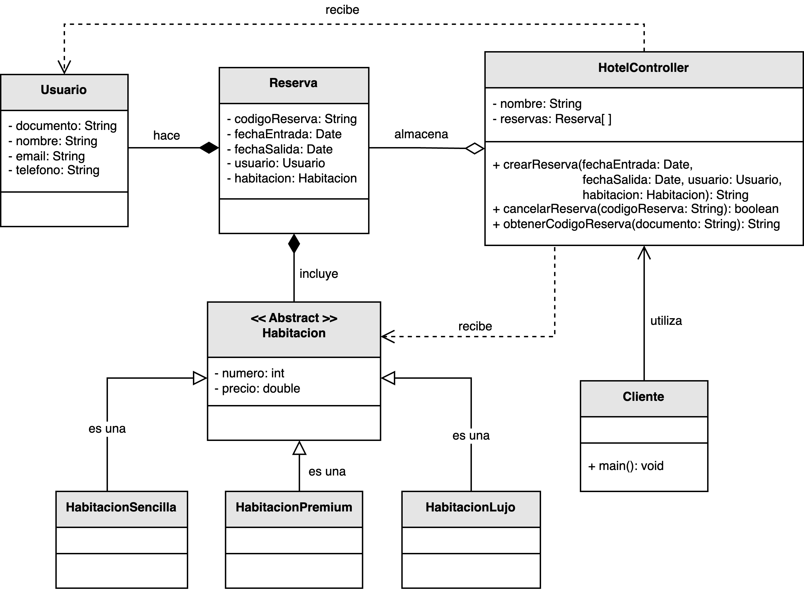

<h1 style="text-align:center;">
  <strong>🏨 Ejemplo: Sistema de Reserva de Habitaciones</strong>
</h1>

<h2><strong>📖 Descripción del problema</strong></h2>

Se solicitó a <em>nuestro desarrollador</em> implementar un sistema que permita <b>gestionar las reservas de un hotel</b>.  
El sistema debe ofrecer las operaciones básicas para <b>crear</b> y <b>eliminar reservas</b>, asociando cada una a un <b>usuario</b> y a un <b>tipo de habitación</b>.  
El hotel dispone de tres categorías de habitaciones:

<ul style="text-align:justify;">
  <li><b>Habitación Sencilla:</b> básica y de menor costo.</li>
  <li><b>Habitación Premium:</b> con servicios adicionales y mayor comodidad.</li>
  <li><b>Habitación de Lujo:</b> con características exclusivas y mayor precio.</li>
</ul>

Además, el sistema debe ser <b>extensible</b>, permitiendo agregar nuevos tipos de habitaciones en el futuro sin modificar el código existente.  
Para lograr este comportamiento, se aplicó el <b>principio Controller</b> de los patrones <b>GRASP</b>, asignando la responsabilidad de coordinar los eventos y solicitudes a una clase controladora: <code>HotelController</code>.

<h2><strong>🗂️ Estructura del ejemplo y accesos directos</strong></h2>

<table style="width:100%; border-collapse:collapse;">
  <thead>
    <tr style="background:#f5f5f5;">
      <th style="border:1px solid #ddd; padding:8px; text-align:center;">Cliente / Controlador</th>
      <th style="border:1px solid #ddd; padding:8px; text-align:center;">Modelo (Dominio)</th>
      <th style="border:1px solid #ddd; padding:8px; text-align:center;">Habitaciones</th>
    </tr>
  </thead>
  <tbody>
    <tr>
      <td style="border:1px solid #ddd; padding:8px;">
        ▶️ <a href="./Cliente.java" target="_blank"><b>Cliente.java</b></a> 
        ▶️ <a href="./HotelController.java" target="_blank"><b>HotelController.java</b></a>
      </td>
      <td style="border:1px solid #ddd; padding:8px;">
        ▶️ <a href="./modelo/Usuario.java" target="_blank"><b>Usuario.java</b></a> 
        ▶️ <a href="./modelo/Reserva.java" target="_blank"><b>Reserva.java</b></a>
      </td>
      <td style="border:1px solid #ddd; padding:8px;">
        ▶️ <a href="./habitacion/Habitacion.java" target="_blank"><b>Habitacion.java</b></a> 
        ▶️ <a href="./habitacion/HabitacionSencilla.java" target="_blank"><b>HabitacionSencilla.java</b></a> 
        ▶️ <a href="./habitacion/HabitacionPremium.java" target="_blank"><b>HabitacionPremium.java</b></a> 
        ▶️ <a href="./habitacion/HabitacionLujo.java" target="_blank"><b>HabitacionLujo.java</b></a>
      </td>
    </tr>
  </tbody>
</table>

<h2><strong>🧩 Modelo UML</strong></h2>

En el siguiente diagrama UML se muestra cómo se estructura el sistema aplicando el principio <b>Controller</b>.  
La clase <code>HotelController</code> actúa como intermediario entre los objetos del dominio (<code>Reserva</code>, <code>Usuario</code> y <code>Habitación</code>) y los clientes que solicitan servicios.  
De este modo, se garantiza una comunicación ordenada, con <b>bajo acoplamiento</b> y <b>alta cohesión</b> entre las clases del sistema.

  

  <b>Figura 1.</b> Diagrama UML del sistema de reservas de hotel aplicando el principio <i>Controller</i> de GRASP.

<h2><strong>⚙️ Análisis del diseño</strong></h2>

<ul style="text-align:justify;">
  <li>
    <b>HotelController:</b> es el <em>controlador</em> principal del sistema.  
    Centraliza la creación, cancelación y consulta de reservas mediante los métodos:
    <code>crearReserva()</code>, <code>cancelarReserva()</code> y <code>obtenerCodigoReserva()</code>.
  </li>
  <li>
    <b>Reserva:</b> representa la entidad del dominio que asocia un <code>Usuario</code> con una <code>Habitación</code> y define las fechas de entrada y salida.
  </li>
  <li>
    <b>Usuario:</b> contiene los datos personales del cliente que realiza la reserva (documento, nombre, email y teléfono).
  </li>
  <li>
    <b>Habitación (abstracta):</b> define los atributos comunes (<code>número</code> y <code>precio</code>) y sirve como base para las subclases <code>HabitacionSencilla</code>, <code>HabitacionPremium</code> y <code>HabitacionLujo</code>.
  </li>
  <li>
    <b>Cliente:</b> representa el punto de entrada (CLI, UI o API) que usa <code>HotelController</code> para interactuar con el dominio.
  </li>
</ul>

<h2><strong>💡 Observaciones</strong></h2>

<ul style="text-align:justify;">
  <li>El <code>HotelController</code> desacopla la capa de presentación del dominio, manteniendo la lógica de negocio fuera de la interfaz de usuario.</li>
  <li>El uso de herencia en <code>Habitación</code> facilita la extensión con nuevas categorías sin modificar el código existente.</li>
  <li>El modelo respeta <b>SRP</b> (Responsabilidad Única) y <b>OCP</b> (Abierto/Cerrado).</li>
</ul>

<h2><strong>📚 Referencias</strong></h2>

<ul style="text-align:justify;">
  <li>Larman, C. (2005). <i>Applying UML and Patterns: An Introduction to Object-Oriented Analysis and Design and Iterative Development.</i> Prentice Hall.</li>
  <li>Stevens, W. P., Myers, G. J., & Constantine, L. L. (1974). <i>Structured Design.</i></li>
  <li>Yourdon, E., & Constantine, L. L. (1979). <i>Structured Design: Fundamentals of a Discipline of Computer Program and System Design.</i></li>
</ul>