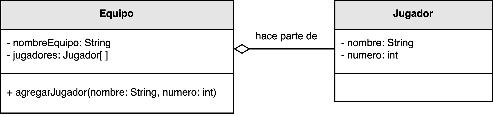

<h1 style="text-align:center;">
  <strong>⚽ Ejemplo: Relación de Agregación</strong>
</h1>

<h2><strong>📖 Descripción del problema</strong></h2>

En este ejemplo se modela la relación entre un <b>Equipo</b> y sus <b>Jugadores</b> dentro de una aplicación de gestión deportiva.  
Cada equipo debe ser capaz de <b>crear y agregar nuevos jugadores</b> a su plantilla, asignándoles un nombre y un número identificador.  
El sistema debe garantizar que la creación de jugadores se realice de forma controlada y coherente con la estructura del equipo al que pertenecen.

De acuerdo con el principio <b>Creator</b> de los patrones <b>GRASP</b>, la responsabilidad de crear instancias de <code>Jugador</code> recae sobre la clase <code>Equipo</code>, ya que:

<ul style="text-align:justify;">
  <li>La clase <code>Equipo</code> <b>contiene</b> objetos de tipo <code>Jugador</code> mediante una relación de <b>agregación</b>.</li>
  <li><code>Equipo</code> posee la <b>información necesaria</b> para inicializar correctamente a cada jugador (nombre y número).</li>
  <li>El ciclo de vida y la gestión de los jugadores están <b>conceptualmente ligados</b> a la entidad <code>Equipo</code>.</li>
</ul>

Asignar la responsabilidad de creación a <code>Equipo</code> favorece un diseño con <b>bajo acoplamiento</b> y <b>alta cohesión</b>, ya que evita que otras clases conozcan los detalles internos de cómo se crean y administran los jugadores.

<h2><strong>🗂️ Estructura del ejemplo y accesos directos</strong></h2>

<table style="width:100%; border-collapse:collapse;">
  <thead>
    <tr style="background:#f5f5f5;">
      <th style="border:1px solid #ddd; padding:8px; text-align:center;">Cliente</th>
      <th style="border:1px solid #ddd; padding:8px; text-align:center;">Entidades del dominio</th>
    </tr>
  </thead>
  <tbody>
    <tr>
      <td style="border:1px solid #ddd; padding:8px;">
        ▶️ <a href="./Cliente.java" target="_blank"><b>Cliente.java</b></a>
      </td>
      <td style="border:1px solid #ddd; padding:8px;">
        ▶️ <a href="./Equipo.java" target="_blank"><b>Equipo.java</b></a> 
        ▶️ <a href="./Jugador.java" target="_blank"><b>Jugador.java</b></a>
      </td>
    </tr>
  </tbody>
</table>

<h2><strong>🧩 Modelo UML</strong></h2>

El siguiente diagrama UML representa la relación de <b>agregación</b> entre las clases <code>Equipo</code> y <code>Jugador</code>.  
La operación <code>agregarJugador()</code> encapsula la creación de instancias de <code>Jugador</code> dentro de la clase <code>Equipo</code>, cumpliendo con el principio <b>Creator</b>.

  

  <b>Figura 1.</b> Diagrama UML de la relación de agregación entre <code>Equipo</code> y <code>Jugador</code>.

<h2><strong>💡 Análisis del diseño</strong></h2>

<ul style="text-align:justify;">
  <li><b>Equipo:</b> Es la clase responsable de crear y administrar los objetos <code>Jugador</code>.  
  Representa el contexto natural de agregación y mantiene la lista de jugadores que pertenecen al equipo.</li>

  <li><b>Jugador:</b> Es la entidad que modela a un integrante del equipo.  
  Su ciclo de vida está asociado al de <code>Equipo</code>, pero puede existir de manera independiente, lo que justifica el uso de una <b>agregación</b> y no una <b>composición</b>.</li>

  <li><b>Relación de agregación:</b> Indica que <code>Equipo</code> conoce y administra a sus <code>Jugadores</code>,  
  pero estos pueden seguir existiendo aunque el equipo sea eliminado, reflejando una relación débil de pertenencia.</li>
</ul>

<h2><strong>🎯 Conclusión</strong></h2>

Este ejemplo demuestra cómo el principio <b>Creator</b> orienta la asignación de responsabilidades en sistemas orientados a objetos.  
Al delegar la creación de los objetos <code>Jugador</code> a la clase <code>Equipo</code>, se garantiza que las instancias se generen en el lugar adecuado,  
preservando la coherencia del modelo y reduciendo el acoplamiento entre los componentes del sistema.

Además, este enfoque favorece la extensión futura del sistema, permitiendo agregar nuevos tipos de jugadores o roles sin alterar las clases externas,  
cumpliendo así con el principio de diseño <b>abierto/cerrado (OCP)</b>.

<h2><strong>📚 Referencias</strong></h2>

<ul style="text-align:justify;">
  <li>Larman, C. (2005). <i>Applying UML and Patterns: An Introduction to Object-Oriented Analysis and Design and Iterative Development.</i> Prentice Hall.</li>
  <li>Stevens, W. P., Myers, G. J., & Constantine, L. L. (1974). <i>Structured Design.</i></li>
  <li>Yourdon, E., & Constantine, L. L. (1979). <i>Structured Design: Fundamentals of a Discipline of Computer Program and System Design.</i></li>
</ul>