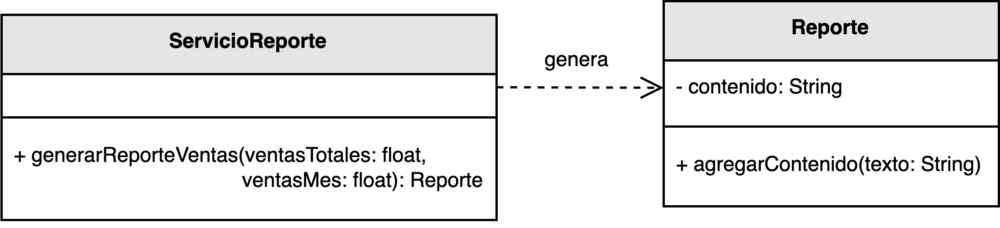

<h1 style="text-align:center;">
  <strong>🧾 Ejemplo: Relación de Asociación / Dependencia</strong>
</h1>

<h2><strong>📖 Descripción del problema</strong></h2>

En este ejemplo se modela la relación entre las clases <b>ServicioReporte</b> y <b>Reporte</b>.  
El objetivo es definir qué clase debe asumir la responsabilidad de crear los objetos <code>Reporte</code> cuando se requiere generar información sobre las ventas totales y mensuales de una empresa.

Siguiendo el principio <b>Creator</b> de los patrones <b>GRASP</b>, la clase <code>ServicioReporte</code> es la responsable de crear instancias de <code>Reporte</code>, ya que:

<ul style="text-align:justify;">
  <li><code>ServicioReporte</code> <b>utiliza</b> directamente los objetos <code>Reporte</code> en su proceso de generación.</li>
  <li>Posee los <b>datos necesarios</b> para inicializar el contenido de cada reporte (ventas totales y ventas del mes).</li>
  <li>Existe una relación de <b>dependencia funcional</b> entre ambas clases: el servicio depende del reporte para cumplir su objetivo.</li>
</ul>

De esta manera, el diseño distribuye las responsabilidades de forma coherente, concentrando la creación de los objetos <code>Reporte</code> en el lugar donde su uso es más natural y semánticamente consistente.

<h2><strong>🗂️ Estructura del ejemplo y accesos directos</strong></h2>

<table style="width:100%; border-collapse:collapse;">
  <thead>
    <tr style="background:#f5f5f5;">
      <th style="border:1px solid #ddd; padding:8px; text-align:center;">Cliente</th>
      <th style="border:1px solid #ddd; padding:8px; text-align:center;">Clases principales</th>
    </tr>
  </thead>
  <tbody>
    <tr>
      <td style="border:1px solid #ddd; padding:8px;">
        ▶️ <a href="./Cliente.java" target="_blank"><b>Cliente.java</b></a>
      </td>
      <td style="border:1px solid #ddd; padding:8px;">
        ▶️ <a href="./ServicioReporte.java" target="_blank"><b>ServicioReporte.java</b></a> 
        ▶️ <a href="./Reporte.java" target="_blank"><b>Reporte.java</b></a>
      </td>
    </tr>
  </tbody>
</table>

<h2><strong>🧩 Modelo UML</strong></h2>

El siguiente diagrama UML muestra una relación de <b>asociación / dependencia</b> entre <code>ServicioReporte</code> y <code>Reporte</code>.  
La clase <code>ServicioReporte</code> genera instancias de <code>Reporte</code> para construir el contenido del informe, mientras que <code>Reporte</code> encapsula la información textual y las operaciones que permiten modificar su contenido.

  

  <b>Figura 1.</b> Relación de asociación y dependencia entre <code>ServicioReporte</code> y <code>Reporte</code>.

<h2><strong>💡 Análisis del diseño</strong></h2>

<ul style="text-align:justify;">
  <li><b>ServicioReporte:</b> Actúa como punto de entrada para la creación de reportes.  
  Recibe los datos, los procesa y genera una nueva instancia de <code>Reporte</code>, aplicando el principio <b>Creator</b>.</li>

  <li><b>Reporte:</b> Es el objeto resultante del proceso.  
  Encapsula el contenido textual y define métodos para agregar información al informe generado.</li>

  <li><b>Relación de dependencia:</b> La creación del objeto <code>Reporte</code> depende de los cálculos realizados por <code>ServicioReporte</code>.  
  Sin embargo, el <code>Reporte</code> no tiene conocimiento del servicio que lo crea, manteniendo así un <b>bajo acoplamiento</b>.</li>
</ul>

<h2><strong>🎯 Conclusión</strong></h2>

Este ejemplo ilustra cómo el principio <b>Creator</b> puede aplicarse también en relaciones de <b>asociación o dependencia</b>.  
En este tipo de vínculos, una clase que utiliza o depende de otra puede asumir la responsabilidad de crear sus instancias, siempre que posea la información necesaria para hacerlo correctamente.

El resultado es un diseño más claro y modular, donde las responsabilidades se asignan de acuerdo con las interacciones naturales entre los objetos, preservando la coherencia semántica y el bajo acoplamiento del sistema.

<h2><strong>📚 Referencias</strong></h2>

<ul style="text-align:justify;">
  <li>Larman, C. (2005). <i>Applying UML and Patterns: An Introduction to Object-Oriented Analysis and Design and Iterative Development.</i> Prentice Hall.</li>
  <li>Stevens, W. P., Myers, G. J., & Constantine, L. L. (1974). <i>Structured Design.</i></li>
  <li>Yourdon, E., & Constantine, L. L. (1979). <i>Structured Design: Fundamentals of a Discipline of Computer Program and System Design.</i></li>
</ul>