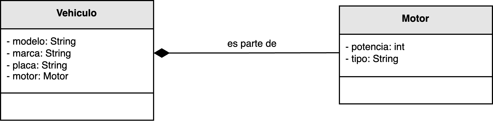

<h1 style="text-align:center;">
  <strong>🚗 Ejemplo: Relación de Composición</strong>
</h1>

<h2><strong>📖 Descripción del problema</strong></h2>

En este ejemplo se modela la relación entre las clases <b>Vehículo</b> y <b>Motor</b> dentro de un sistema de gestión automotriz.  
Cada vehículo posee un motor que forma parte integral de su estructura. Si el vehículo deja de existir, su motor también deja de hacerlo.  
Este vínculo refleja una <b>relación de composición</b>, donde el ciclo de vida del objeto contenido depende completamente del objeto contenedor.

Siguiendo el principio <b>Creator</b> de los patrones <b>GRASP</b>, la clase <code>Vehiculo</code> es la responsable de crear instancias de <code>Motor</code>, ya que:

<ul style="text-align:justify;">
  <li><code>Vehiculo</code> <b>contiene</b> directamente a <code>Motor</code> como parte de su estructura interna.</li>
  <li>Existe una <b>relación de fuerte dependencia</b> entre ambos objetos: el motor no puede existir sin el vehículo que lo contiene.</li>
  <li>El vehículo <b>posee toda la información necesaria</b> para inicializar correctamente su motor al momento de la creación.</li>
</ul>

Este tipo de relación garantiza un <b>alto grado de cohesión</b> dentro de la clase contenedora y evita acoplamientos innecesarios con otras partes del sistema, promoviendo un diseño claro y de responsabilidad única.

<h2><strong>🗂️ Estructura del ejemplo y accesos directos</strong></h2>

<table style="width:100%; border-collapse:collapse;">
  <thead>
    <tr style="background:#f5f5f5;">
      <th style="border:1px solid #ddd; padding:8px; text-align:center;">Cliente</th>
      <th style="border:1px solid #ddd; padding:8px; text-align:center;">Clases principales</th>
    </tr>
  </thead>
  <tbody>
    <tr>
      <td style="border:1px solid #ddd; padding:8px;">
        ▶️ <a href="./Cliente.java" target="_blank"><b>Cliente.java</b></a>
      </td>
      <td style="border:1px solid #ddd; padding:8px;">
        ▶️ <a href="./Vehiculo.java" target="_blank"><b>Vehiculo.java</b></a> 
        ▶️ <a href="./Motor.java" target="_blank"><b>Motor.java</b></a>
      </td>
    </tr>
  </tbody>
</table>

<h2><strong>🧩 Modelo UML</strong></h2>

El siguiente diagrama UML representa la relación de <b>composición</b> entre las clases <code>Vehiculo</code> y <code>Motor</code>.  
La composición indica que el <code>Motor</code> es una parte esencial del <code>Vehiculo</code> y que su existencia depende completamente del objeto que lo contiene.

  

  <b>Figura 1.</b> Relación de composición entre <code>Vehículo</code> y <code>Motor</code>.

<h2><strong>💡 Análisis del diseño</strong></h2>

<ul style="text-align:justify;">
  <li><b>Vehiculo:</b> Representa la entidad principal del sistema.  
  Contiene al objeto <code>Motor</code> como una parte fundamental de su estructura.  
  Según el principio <b>Creator</b>, tiene la responsabilidad de instanciar el motor durante su propio proceso de creación.</li>

  <li><b>Motor:</b> Es un componente interno y dependiente del vehículo.  
  No puede existir de manera independiente, por lo que su ciclo de vida está completamente determinado por el objeto <code>Vehiculo</code>.</li>

  <li><b>Relación de composición:</b> Define un vínculo de <b>posesión total</b>, donde el contenedor (<code>Vehiculo</code>) controla completamente la existencia del contenido (<code>Motor</code>).  
  Este tipo de relación refuerza la integridad estructural del sistema y garantiza la coherencia entre los objetos.</li>
</ul>

<h2><strong>🎯 Conclusión</strong></h2>

Este ejemplo demuestra cómo el principio <b>Creator</b> puede aplicarse eficazmente en relaciones de <b>composición</b>,  
donde una clase “contenedora” es responsable de crear y mantener los objetos que forman parte inseparable de su estructura interna.

Al delegar la creación del <code>Motor</code> a la clase <code>Vehiculo</code>, el diseño se vuelve más coherente y autosuficiente,  
reduciendo la posibilidad de inconsistencias y favoreciendo un modelo de objetos estable y bien estructurado.

<h2><strong>📚 Referencias</strong></h2>

<ul style="text-align:justify;">
  <li>Larman, C. (2005). <i>Applying UML and Patterns: An Introduction to Object-Oriented Analysis and Design and Iterative Development.</i> Prentice Hall.</li>
  <li>Stevens, W. P., Myers, G. J., & Constantine, L. L. (1974). <i>Structured Design.</i></li>
  <li>Yourdon, E., & Constantine, L. L. (1979). <i>Structured Design: Fundamentals of a Discipline of Computer Program and System Design.</i></li>
</ul>