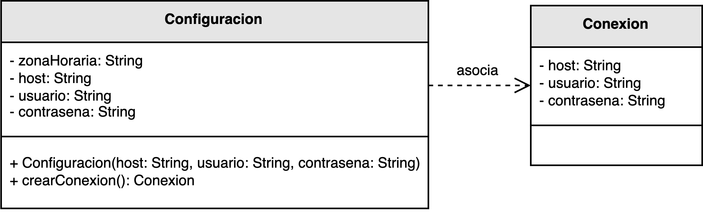

<h1 style="text-align:center;">
  <strong>🧩 Ejemplo: Relación de Inicialización</strong>
</h1>

<h2><strong>📖 Descripción del problema</strong></h2>

En este ejemplo se modela la relación entre las clases <b>Configuración</b> y <b>Conexión</b> dentro de un sistema que gestiona la comunicación con un servidor externo.  
Cada instancia de <code>Configuración</code> contiene los parámetros necesarios —como el host, usuario y contraseña— para inicializar una nueva conexión.  
El sistema debe ser capaz de crear y establecer conexiones de forma controlada, asegurando la correcta configuración antes de su uso.

De acuerdo con el principio <b>Creator</b> de los patrones <b>GRASP</b>, la clase <code>Configuración</code> es responsable de crear instancias de <code>Conexión</code>,  
ya que posee todos los datos requeridos para su inicialización. Esta relación se conoce como una <b>relación de inicialización</b>,  
pues el objeto creador dispone de la información necesaria para configurar el nuevo objeto de manera coherente y completa.

Este enfoque promueve un diseño más consistente, al centralizar la lógica de creación en la clase que conoce el contexto de inicialización,  
evitando duplicación de responsabilidades y posibles errores de configuración en otras partes del sistema.

<h2><strong>🗂️ Estructura del ejemplo y accesos directos</strong></h2>

<table style="width:100%; border-collapse:collapse;">
  <thead>
    <tr style="background:#f5f5f5;">
      <th style="border:1px solid #ddd; padding:8px; text-align:center;">Cliente</th>
      <th style="border:1px solid #ddd; padding:8px; text-align:center;">Clases principales</th>
    </tr>
  </thead>
  <tbody>
    <tr>
      <td style="border:1px solid #ddd; padding:8px;">
        ▶️ <a href="./Cliente.java" target="_blank"><b>Cliente.java</b></a>
      </td>
      <td style="border:1px solid #ddd; padding:8px;">
        ▶️ <a href="./Configuracion.java" target="_blank"><b>Configuracion.java</b></a> 
        ▶️ <a href="./Conexion.java" target="_blank"><b>Conexion.java</b></a>
      </td>
    </tr>
  </tbody>
</table>

<h2><strong>🧩 Modelo UML</strong></h2>

El siguiente diagrama UML muestra la relación de <b>inicialización</b> entre las clases <code>Configuración</code> y <code>Conexión</code>.  
La clase <code>Configuración</code> encapsula los parámetros de acceso y proporciona un método <code>crearConexion()</code> que instancia y devuelve un nuevo objeto de tipo <code>Conexión</code> configurado correctamente.

  

  <b>Figura 1.</b> Relación de inicialización entre <code>Configuración</code> y <code>Conexión</code>.

<h2><strong>💡 Análisis del diseño</strong></h2>

<ul style="text-align:justify;">
  <li><b>Configuración:</b> Es la clase que posee toda la información requerida para establecer una conexión válida.  
  Su responsabilidad es instanciar y devolver un objeto <code>Conexión</code> correctamente inicializado,  
  de acuerdo con los valores de configuración almacenados internamente.</li>

  <li><b>Conexión:</b> Representa la entidad que interactúa con el servidor o recurso externo.  
  Depende de los valores proporcionados por la <code>Configuración</code> para establecer el vínculo correctamente,  
  pero no tiene conocimiento directo de cómo se obtienen o gestionan dichos valores.</li>

  <li><b>Relación de inicialización:</b> Surge cuando una clase debe crear otra porque dispone de la información necesaria  
  para inicializarla adecuadamente. Este tipo de relación refuerza el principio de <b>bajo acoplamiento</b> y  
  evita la dispersión de datos de configuración a través del sistema.</li>
</ul>

<h2><strong>🎯 Conclusión</strong></h2>

El ejemplo demuestra cómo aplicar el principio <b>Creator</b> cuando una clase tiene el conocimiento suficiente para  
inicializar correctamente otra. Al delegar la creación del objeto <code>Conexión</code> a la clase <code>Configuración</code>,  
se garantiza que los objetos se creen con los parámetros apropiados, reduciendo errores de inicialización y  
aumentando la coherencia del diseño.

Esta práctica no solo mejora la mantenibilidad del sistema, sino que también promueve la encapsulación y la claridad  
de responsabilidades, facilitando futuras extensiones sin comprometer la integridad de la arquitectura.

<h2><strong>📚 Referencias</strong></h2>

<ul style="text-align:justify;">
  <li>Larman, C. (2005). <i>Applying UML and Patterns: An Introduction to Object-Oriented Analysis and Design and Iterative Development.</i> Prentice Hall.</li>
  <li>Stevens, W. P., Myers, G. J., & Constantine, L. L. (1974). <i>Structured Design.</i></li>
  <li>Yourdon, E., & Constantine, L. L. (1979). <i>Structured Design: Fundamentals of a Discipline of Computer Program and System Design.</i></li>
</ul>