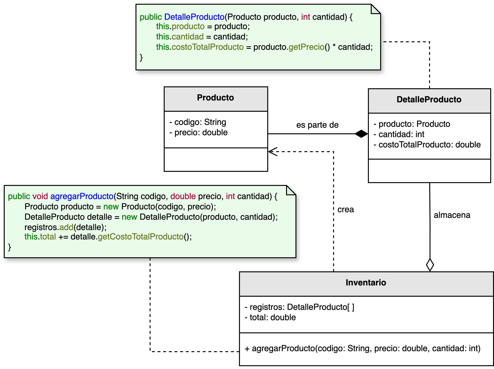

<h1 style="text-align:center;">
  <strong>📦 Ejemplo: Registro de Inventario</strong>
</h1>

<h2><strong>📖 Descripción del problema</strong></h2>

Se ha solicitado a <em>nuestro desarrollador</em> diseñar un sistema que gestione el <b>inventario de productos</b> de una tienda.  
La aplicación debe permitir calcular tanto el <b>costo unitario</b> de cada producto como el <b>costo total</b> del inventario,  
y posibilitar la incorporación de nuevos lotes de productos conforme ingresen al almacén.  
Cada registro en el inventario debe reflejar la cantidad, el precio y el valor acumulado de los productos disponibles.

Para abordar este problema se aplica el principio <b>Experto en Información</b> del conjunto de patrones <b>GRASP</b>.  
Según este principio, las responsabilidades deben asignarse a la clase que posee la información necesaria para ejecutarlas.  
En este contexto, la clase <code>Inventario</code> es la más adecuada para calcular el valor total y administrar los productos,  
pues contiene los registros y datos que permiten realizar estas operaciones de forma consistente y autónoma.

<h2><strong>🗂️ Estructura del ejemplo y accesos directos</strong></h2>

<table style="width:100%; border-collapse:collapse;">
  <thead>
    <tr style="background:#f5f5f5;">
      <th style="border:1px solid #ddd; padding:8px; text-align:center;">Cliente</th>
      <th style="border:1px solid #ddd; padding:8px; text-align:center;">Clases principales</th>
    </tr>
  </thead>
  <tbody>
    <tr>
      <td style="border:1px solid #ddd; padding:8px;">
        ▶️ <a href="./Cliente.java" target="_blank"><b>Cliente.java</b></a>
      </td>
      <td style="border:1px solid #ddd; padding:8px;">
        ▶️ <a href="./Inventario.java" target="_blank"><b>Inventario.java</b></a> 
        ▶️ <a href="./DetalleProducto.java" target="_blank"><b>DetalleProducto.java</b></a> 
        ▶️ <a href="./Producto.java" target="_blank"><b>Producto.java</b></a>
      </td>
    </tr>
  </tbody>
</table>

<h2><strong>🧩 Modelo UML</strong></h2>

El diagrama UML ilustra la relación entre las clases <code>Inventario</code>, <code>DetalleProducto</code> y <code>Producto</code>.  
La clase <code>Inventario</code> actúa como experta en información: conoce los registros de los productos almacenados y dispone de los datos  
necesarios para calcular el costo total de los artículos disponibles.  
Cada <code>DetalleProducto</code> mantiene una relación de composición con <code>Producto</code>, ya que representa una instancia particular  
que almacena su cantidad y el costo total correspondiente.

  

  <b>Figura 1.</b> Aplicación del principio <i>Experto en Información</i> en la gestión del inventario de productos.

<h2><strong>💡 Análisis del diseño</strong></h2>

<ul style="text-align:justify;">
  <li>
    <b>Inventario:</b> Es la clase que centraliza el conocimiento del sistema.  
    Contiene la lista de <code>DetalleProducto</code> y las operaciones necesarias para agregar productos, calcular totales y actualizar el registro general.  
    Dado que posee toda la información requerida, es el <b>experto natural</b> para realizar estos cálculos.
  </li>

  <li>
    <b>DetalleProducto:</b> Representa una unidad de control dentro del inventario.  
    Cada detalle mantiene la referencia a un <code>Producto</code>, junto con la cantidad y el costo total de ese lote.  
    Su relación de composición con <code>Producto</code> refleja que los detalles no existen sin un producto asociado.
  </li>

  <li>
    <b>Producto:</b> Define los atributos básicos de un artículo, como código y precio unitario.  
    Su simplicidad facilita la reutilización en otros contextos del sistema, como catálogos o pedidos.
  </li>
</ul>

<h2><strong>🎯 Aplicación del principio</strong></h2>

La clase <code>Inventario</code> se identifica como el <b>Experto en Información</b> porque es quien tiene acceso directo a los datos  
necesarios para ejecutar las operaciones clave: cálculo del costo total, registro de nuevos productos y consolidación de existencias.  
Delegar esta responsabilidad en otra clase (por ejemplo, en <code>Producto</code> o <code>DetalleProducto</code>) generaría acoplamientos innecesarios  
y rompería la coherencia del modelo de dominio.

De esta manera, el diseño final logra una arquitectura <b>cohesiva y de bajo acoplamiento</b>, donde cada clase cumple una función  
congruente con el conocimiento que posee. Este enfoque facilita la evolución del sistema, mejora la mantenibilidad y refuerza la trazabilidad de los datos.

<h2><strong>📚 Referencias</strong></h2>

<ul style="text-align:justify;">
  <li>Larman, C. (2005). <i>Applying UML and Patterns: An Introduction to Object-Oriented Analysis and Design and Iterative Development.</i> Prentice Hall.</li>
  <li>Stevens, W. P., Myers, G. J., & Constantine, L. L. (1974). <i>Structured Design.</i></li>
  <li>Yourdon, E., & Constantine, L. L. (1979). <i>Structured Design: Fundamentals of a Discipline of Computer Program and System Design.</i></li>
</ul>