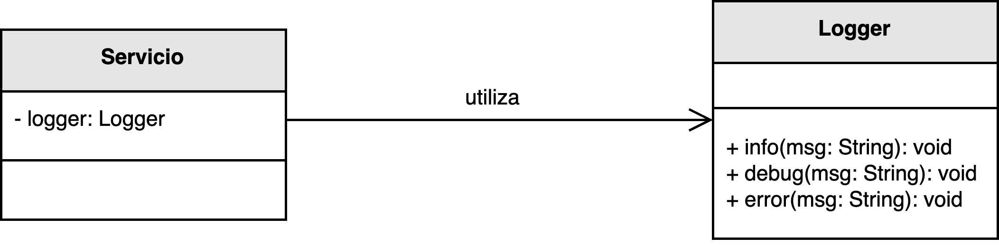

<h1 style="text-align:center;">
  <strong>🧾 Ejemplo: Logs Personalizados</strong>
</h1>

<h2><strong>📖 Descripción del problema</strong></h2>

Se ha solicitado a <em>nuestro desarrollador</em> implementar una utilidad que permita generar <b>logs personalizados</b> para los distintos servicios del sistema.  
El objetivo es crear una librería independiente que proporcione una interfaz común para registrar mensajes informativos, de depuración y errores críticos, 
e integrarse fácilmente en cualquier servicio sin modificar su lógica principal.

Para ello se aplica el patrón <b>Fabricación Pura</b> (<i>Pure Fabrication</i>): se introduce una clase auxiliar —<code>Logger</code>— que <b>no pertenece al dominio</b>, 
pero encapsula y centraliza las operaciones de registro, manteniendo la cohesión del código de negocio y reduciendo el acoplamiento con detalles técnicos.

<h2><strong>🗂️ Estructura del ejemplo y accesos directos</strong></h2>

<table style="width:100%; border-collapse:collapse;">
  <thead>
    <tr style="background:#f5f5f5;">
      <th style="border:1px solid #ddd; padding:8px; text-align:center;">Clases principales</th>
    </tr>
  </thead>
  <tbody>
    <tr>
      <td style="border:1px solid #ddd; padding:8px;">
        ▶️ <a href="./Servicio.java" target="_blank"><b>Servicio.java</b></a> 
        ▶️ <a href="./Logger.java" target="_blank"><b>Logger.java</b></a>
      </td>
    </tr>
  </tbody>
</table>

<h2><strong>🧩 Modelo UML</strong></h2>

La clase <code>Logger</code> se introduce como <b>fabricación pura</b> para ofrecer una API uniforme (<code>info()</code>, <code>debug()</code>, <code>error()</code>) 
y permitir que <code>Servicio</code> delegue la responsabilidad de registrar eventos sin contaminar su lógica de negocio.

  

  <b>Figura 1.</b> Aplicación del principio <i>Fabricación Pura</i> mediante una clase <code>Logger</code> que encapsula la lógica de registro.

<h2><strong>🔍 Análisis del diseño</strong></h2>

<ul style="text-align:justify;">
  <li><b>Logger:</b> Clase técnica y reutilizable que abstrae los mecanismos de logging (consola, archivos, herramientas externas), 
      evitando duplicación y dependencias innecesarias en el dominio.</li>
  <li><b>Servicio:</b> Entidad de negocio que utiliza <code>Logger</code> para registrar eventos relevantes, conservando su foco y <b>alta cohesión</b>.</li>
  <li><b>Cliente:</b> Punto de entrada para demostrar el uso del servicio y la integración del registrador.</li>
</ul>

<h2><strong>🎯 Beneficios</strong></h2>

<ul style="text-align:justify;">
  <li><b>Bajo acoplamiento:</b> el dominio no depende de detalles de infraestructura.</li>
  <li><b>Alta cohesión:</b> el comportamiento de registro vive en una unidad dedicada.</li>
  <li><b>Reutilización y extensión:</b> se pueden añadir nuevos destinos/formateadores sin tocar el código de negocio.</li>
</ul>

<h2><strong>📚 Referencias</strong></h2>

<ul style="text-align:justify;">
  <li>Larman, C. (2005). <i>Applying UML and Patterns: An Introduction to Object-Oriented Analysis and Design and Iterative Development.</i> Prentice Hall.</li>
  <li>Stevens, W. P., Myers, G. J., & Constantine, L. L. (1974). <i>Structured Design.</i></li>
  <li>Yourdon, E., & Constantine, L. L. (1979). <i>Structured Design: Fundamentals of a Discipline of Computer Program and System Design.</i></li>
</ul>