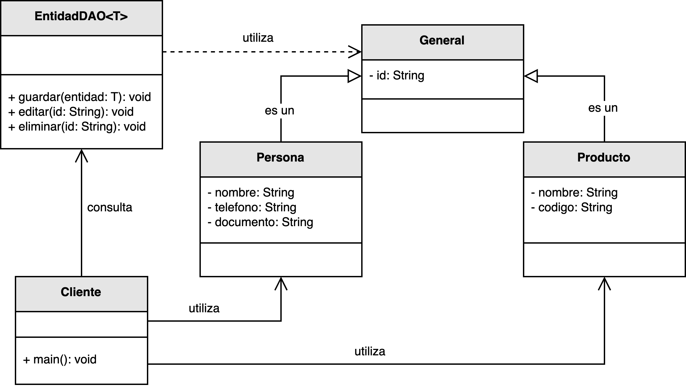

<h1 style="text-align:center;">
  <strong>🧩 Ejemplo: Capa de Control de Acceso a Datos</strong>
</h1>

<h2><strong>📖 Descripción del problema</strong></h2>

Se ha solicitado a <em>nuestro desarrollador</em> implementar un módulo genérico que permita
<b>almacenar, editar y eliminar entidades</b> de cualquier tipo dentro de una base de datos.
Por convención, todas las entidades del sistema deben poseer un identificador único para su gestión unificada.

Para evitar el acoplamiento directo entre las clases del dominio y la lógica de persistencia,
se introduce la clase genérica <code>EntidadDAO&lt;T&gt;</code> como <b>mecanismo de indirección</b> (principio GRASP).
De este modo, las clases de negocio no interactúan con la fuente de datos: delegan en un intermediario especializado
que encapsula las operaciones de acceso.

<h2><strong>🗂️ Estructura del ejemplo y accesos directos</strong></h2>

<table style="width:100%; border-collapse:collapse;">
  <thead>
    <tr style="background:#f5f5f5;">
      <th style="border:1px solid #ddd; padding:8px; text-align:center;">Cliente / Ejecución</th>
    </tr>
  </thead>
  <tbody>
    <tr>
      <td style="border:1px solid #ddd; padding:8px;">
        ▶️ <a href="Cliente.java" target="_blank"><b>Cliente.java</b></a>
      </td>
    </tr>
  </tbody>
</table>

<h2><strong>📘 Modelo UML</strong></h2>

El siguiente diagrama muestra cómo <code>EntidadDAO&lt;T&gt;</code> funciona como capa de <b>indirección</b> entre las entidades
del dominio y las operaciones de persistencia. El cliente invoca métodos genéricos (guardar, editar, eliminar)
sin preocuparse por detalles de implementación ni por diferencias entre entidades.

  

  <b>Figura 1.</b> Aplicación del principio <i>Indirección</i> mediante la clase genérica <code>EntidadDAO&lt;T&gt;</code>.

<h2><strong>🔍 Análisis del diseño</strong></h2>

<ul style="text-align:justify;">
  <li><b>EntidadDAO&lt;T&gt;:</b> Clase genérica que encapsula las operaciones de persistencia (<code>guardar()</code>, <code>editar()</code>, <code>eliminar()</code>), actuando como punto único de acceso y aislando al dominio de la tecnología de almacenamiento.</li>
  <li><b>Entidades del dominio:</b> Permanecen enfocadas en reglas de negocio; delegan la persistencia al DAO para mantener <b>bajo acoplamiento</b> y <b>alta cohesión</b>.</li>
  <li><b>Cliente:</b> Consume el DAO sin conocer detalles de conexión, drivers o mapeos, lo que mejora la testabilidad (mocks/stubs del DAO) y la mantenibilidad.</li>
</ul>

<h2><strong>🎯 Beneficios</strong></h2>

<ul style="text-align:justify;">
  <li>Elimina dependencias directas entre dominio y fuente de datos.</li>
  <li>Incrementa <b>reutilización</b> y <b>extensibilidad</b> (el DAO puede adaptarse a JDBC/JPA/Hibernate, etc.).</li>
  <li>Mejora <b>mantenimiento</b> y <b>pruebas</b> al permitir sustituir el DAO.</li>
  <li>Promueve un diseño modular y abierto a la evolución sin afectar al dominio.</li>
</ul>

<h2><strong>📚 Referencias</strong></h2>

<ul style="text-align:justify;">
  <li>Larman, C. (2005). <i>Applying UML and Patterns: An Introduction to Object-Oriented Analysis and Design and Iterative Development.</i> Prentice Hall.</li>
  <li>Fowler, M. (2002). <i>Patterns of Enterprise Application Architecture.</i> Addison-Wesley.</li>
  <li>Stevens, W. P., Myers, G. J., & Constantine, L. L. (1974). <i>Structured Design.</i></li>
</ul>