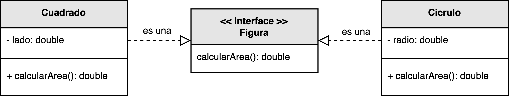

<h1 style="text-align:center;">
  <strong>🧮 Ejemplo: Calcular el área de varias figuras geométricas</strong>
</h1>

<h2><strong>📖 Descripción del problema</strong></h2>

Se ha solicitado a <em>nuestro desarrollador</em> diseñar una aplicación capaz de <b>calcular el área de distintas figuras geométricas</b>.  
El sistema debe ser extensible, de modo que se puedan incorporar nuevas figuras sin necesidad de modificar el código existente.  
Entre las figuras iniciales se incluyen el <b>cuadrado</b> y el <b>círculo</b>.

Para cumplir este requisito, se propone la definición de una <b>interfaz común</b> denominada <code>Figura</code>, 
que declara la operación <code>calcularArea()</code>.  
Cada clase concreta —como <code>Cuadrado</code> y <code>Círculo</code>— implementa esta interfaz, 
proporcionando su propia versión del método de cálculo.  
De esta manera, se aprovecha el <b>principio de Polimorfismo</b> para lograr un comportamiento dinámico y uniforme en tiempo de ejecución.

<h2><strong>🗂️ Estructura del ejemplo y accesos directos</strong></h2>

<table style="width:100%; border-collapse:collapse;">
  <thead>
    <tr style="background:#f5f5f5;">
      <th style="border:1px solid #ddd; padding:8px; text-align:center;">Cliente / Ejecución</th>
    </tr>
  </thead>
  <tbody>
    <tr>
      <td style="border:1px solid #ddd; padding:8px;">
        ▶️ <a href="./Cliente.java" target="_blank"><b>Cliente.java</b></a>
      </td>
    </tr>
  </tbody>
</table>

<h2><strong>📘 Modelo UML</strong></h2>

El siguiente diagrama UML muestra la estructura del modelo propuesto.  
La interfaz <code>Figura</code> define el contrato que deben cumplir todas las figuras geométricas,  
mientras que las clases <code>Cuadrado</code> y <code>Círculo</code> implementan dicho contrato,  
sobrescribiendo el método <code>calcularArea()</code> de acuerdo con su fórmula particular.

  

  <b>Figura 1.</b> Aplicación del principio <i>Polimorfismo</i> mediante la interfaz <code>Figura</code> y sus implementaciones concretas.

<h2><strong>🔍 Análisis del diseño</strong></h2>

<ul style="text-align:justify;">
  <li>
    <b>Figura:</b> Define la operación genérica <code>calcularArea()</code> que todas las figuras deben implementar.  
    Actúa como contrato común que unifica el comportamiento de las distintas clases geométricas.
  </li>
  <li>
    <b>Cuadrado:</b> Implementa la interfaz <code>Figura</code> y sobrescribe el método <code>calcularArea()</code> 
    empleando la fórmula <code>lado * lado</code>.
  </li>
  <li>
    <b>Círculo:</b> Implementa la interfaz <code>Figura</code> y redefine el método <code>calcularArea()</code> 
    utilizando la expresión <code>π * radio²</code>.
  </li>
</ul>

El cliente del sistema puede invocar el método <code>calcularArea()</code> sobre cualquier instancia de <code>Figura</code> 
sin conocer su tipo concreto, logrando así un comportamiento flexible, extensible y completamente polimórfico.

<h2><strong>🎯 Aplicación del principio</strong></h2>

Este diseño aplica el principio <b>GRASP – Polimorfismo</b> al delegar la responsabilidad del comportamiento 
a las clases concretas que implementan la interfaz común.  
En lugar de utilizar estructuras condicionales o comprobaciones de tipo, 
cada clase define su propio comportamiento especializado, 
facilitando la extensión del sistema sin modificar el código existente.

De esta manera, si en el futuro se desea agregar nuevas figuras —como <code>Triángulo</code> o <code>Rectángulo</code>—, 
solo será necesario implementar la interfaz <code>Figura</code> y definir la fórmula de cálculo correspondiente.

<h2><strong>📚 Referencias</strong></h2>

<ul style="text-align:justify;">
  <li>Larman, C. (2005). <i>Applying UML and Patterns: An Introduction to Object-Oriented Analysis and Design and Iterative Development.</i> Prentice Hall.</li>
  <li>Stevens, W. P., Myers, G. J., & Constantine, L. L. (1974). <i>Structured Design.</i></li>
  <li>Yourdon, E., & Constantine, L. L. (1979). <i>Structured Design: Fundamentals of a Discipline of Computer Program and System Design.</i></li>
</ul>