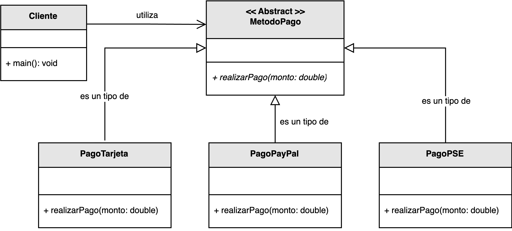

<h1 style="text-align:center;">
  <strong>💳 Ejemplo: Pasarela de pago</strong>
</h1>

<h2><strong>📖 Descripción del problema</strong></h2>

Se ha solicitado a <em>nuestro desarrollador</em> diseñar un sistema que permita realizar pagos 
utilizando distintos métodos, entre ellos: <b>tarjeta de crédito</b>, <b>PayPal</b> y 
<b>pago seguro en línea (PSE)</b>.  
Además, el cliente ha indicado que en el futuro podrían agregarse nuevos medios de pago, 
por lo que la solución debe ser fácilmente extensible sin requerir modificaciones en la lógica existente.

Para resolver este escenario, el diseño propuesto encapsula los diferentes métodos de pago 
tras una <b>abstracción común</b> denominada <code>MetodoPago</code>.  
Cada tipo de pago concreto —<code>PagoTarjeta</code>, <code>PagoPayPal</code> y <code>PagoPSE</code>—
hereda de esta clase abstracta e implementa su propia versión del método 
<code>realizarPago(monto: double)</code>, de acuerdo con su lógica específica.

<h2><strong>🗂️ Estructura del ejemplo y accesos directos</strong></h2>

<table style="width:100%; border-collapse:collapse;">
  <thead>
    <tr style="background:#f5f5f5;">
      <th style="border:1px solid #ddd; padding:8px; text-align:center;">Cliente / Ejecución</th>
    </tr>
  </thead>
  <tbody>
    <tr>
      <td style="border:1px solid #ddd; padding:8px;">
        ▶️ <a href="./Cliente.java" target="_blank"><b>Cliente.java</b></a>
      </td>
    </tr>
  </tbody>
</table>

<h2><strong>📘 Modelo UML</strong></h2>

En el siguiente modelo UML se muestra la estructura de la pasarela de pagos.  
El cliente interactúa exclusivamente con la abstracción <code>MetodoPago</code>, 
sin depender directamente de las implementaciones concretas.  
De esta manera, se protege al sistema de variaciones futuras y se promueve un diseño flexible 
basado en interfaces estables.

  

  <b>Figura 1.</b> Aplicación del principio <i>Variaciones Protegidas</i> mediante una jerarquía de métodos de pago.

<h2><strong>🔍 Análisis del diseño</strong></h2>

<ul style="text-align:justify;">
  <li>
    <b>MetodoPago:</b> Define la operación abstracta <code>realizarPago()</code> 
    que todas las clases concretas deben implementar. 
    Actúa como punto de estabilidad para el sistema, aislando las variaciones en la forma de pago.
  </li>
  <li>
    <b>PagoTarjeta, PagoPayPal, PagoPSE:</b> Cada clase concreta extiende <code>MetodoPago</code> 
    y define su propia lógica de procesamiento de pagos, adaptada a su plataforma o protocolo.
  </li>
  <li>
    <b>Cliente:</b> Interactúa únicamente con la abstracción <code>MetodoPago</code>, 
    lo que le permite ejecutar operaciones de pago sin conocer el tipo específico que las realiza.
  </li>
</ul>

Gracias a esta estructura, agregar un nuevo método de pago (por ejemplo, 
<code>PagoCriptomoneda</code> o <code>PagoTransferencia</code>) solo requiere crear una nueva subclase 
que implemente la operación <code>realizarPago()</code>, 
sin alterar el código del cliente ni el de las demás clases del sistema.

<h2><strong>🎯 Aplicación del principio</strong></h2>

Este diseño ejemplifica el principio <b>GRASP – Variaciones Protegidas</b> al 
<b>encapsular los puntos de cambio</b> detrás de una abstracción estable.  
La clase <code>MetodoPago</code> funciona como barrera de protección ante futuras modificaciones, 
permitiendo agregar o modificar comportamientos sin afectar a las partes que dependen de ella.

De esta manera, el sistema se mantiene <b>abierto a la extensión</b> pero <b>cerrado a la modificación</b>, 
en línea con el principio <i>Open/Closed</i> de la programación orientada a objetos.

<h2><strong>📚 Referencias</strong></h2>

<ul style="text-align:justify;">
  <li>Larman, C. (2005). <i>Applying UML and Patterns: An Introduction to Object-Oriented Analysis and Design and Iterative Development.</i> Prentice Hall.</li>
  <li>Stevens, W. P., Myers, G. J., & Constantine, L. L. (1974). <i>Structured Design.</i></li>
  <li>Yourdon, E., & Constantine, L. L. (1979). <i>Structured Design: Fundamentals of a Discipline of Computer Program and System Design.</i></li>
</ul>