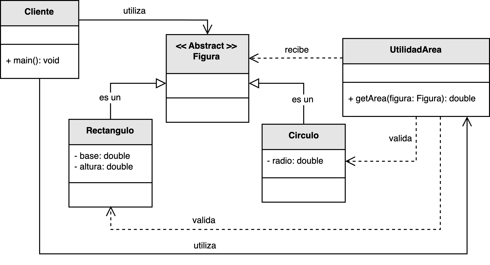
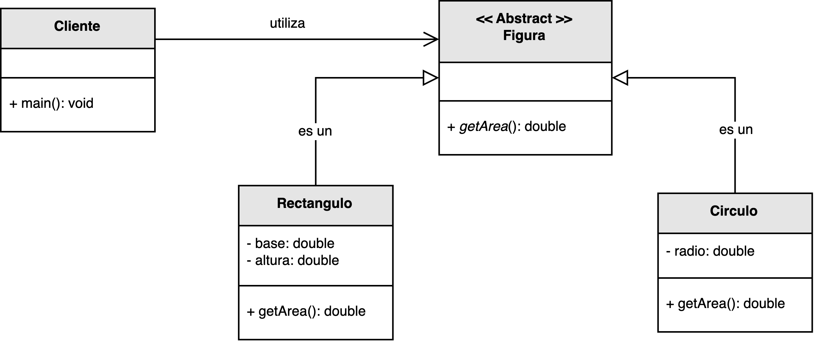

<h1 style="text-align:center;">
  <strong>📐 Ejemplo: Figuras Geométricas</strong>
</h1>

<h2><strong>🧩 Descripción del problema</strong></h2>

Se solicitó a <em>nuestro desarrollador</em> implementar un programa capaz de <b>calcular el área de diferentes figuras geométricas</b>.  
El sistema debe ser capaz de manejar figuras como <b>círculos</b> y <b>rectángulos</b>, y además, debe permitir <b>agregar nuevas figuras</b> en el futuro sin alterar el código existente.

En una primera versión, el desarrollador optó por crear una clase utilitaria encargada de calcular el área de las figuras según su tipo.  
Sin embargo, este diseño generó un problema importante: cada vez que se añadía una nueva figura, era necesario <b>modificar la clase de utilidades</b>, violando así el <b>Principio Abierto/Cerrado (OCP)</b>.  
La meta del ejercicio es <b>refactorizar el diseño</b> para cumplir con el OCP, haciendo que el sistema sea extensible sin modificar el código existente.

<h2><strong>📂 Estructura del ejemplo y accesos directos</strong></h2>

<table style="width:100%; border-collapse:collapse;">
  <thead>
    <tr style="background:#f5f5f5;">
      <th style="border:1px solid #ddd; padding:8px; text-align:center;">❌ Sin aplicar OCP</th>
      <th style="border:1px solid #ddd; padding:8px; text-align:center;">✅ Aplicando OCP</th>
    </tr>
  </thead>
  <tbody>
    <tr>
      <td style="border:1px solid #ddd; padding:8px;">
        

          En esta versión, la clase <code>UtilidadArea</code> centraliza la lógica del cálculo y utiliza estructuras condicionales (<code>if</code>, <code>switch</code>) 
          para determinar el tipo de figura.  
          Cada vez que se agrega una nueva figura (por ejemplo, un triángulo o un polígono), es necesario modificar esta clase, 
          lo que rompe el principio de cerrado a la modificación.
        

        <ul style="margin:0 0 4px 18px;">
          <li>▶️ <a href="./sin_aplicar_principio/figura/Figura.java" target="_blank"><b>Figura.java</b></a></li>
          <li>▶️ <a href="./sin_aplicar_principio/figura/Circulo.java" target="_blank"><b>Circulo.java</b></a></li>
          <li>▶️ <a href="./sin_aplicar_principio/figura/Rectangulo.java" target="_blank"><b>Rectangulo.java</b></a></li>
          <li>▶️ <a href="./sin_aplicar_principio/UtilidadArea.java" target="_blank"><b>UtilidadArea.java</b></a></li>
          <li>▶️ <a href="./sin_aplicar_principio/Cliente.java" target="_blank"><b>Cliente.java</b></a></li>
        </ul>
      </td>
      <td style="border:1px solid #ddd; padding:8px;">
        

          En la versión mejorada, se define una <b>interfaz común</b> <code>Figura</code> con el método <code>calcularArea()</code>.  
          Cada clase concreta (<code>Circulo</code>, <code>Rectangulo</code>, etc.) implementa esta interfaz y define su propia lógica de cálculo.  
          Si se requiere agregar una nueva figura, basta con crear una nueva clase que implemente <code>Figura</code> sin modificar el código existente.
        

        <ul style="margin:0 0 4px 18px;">
          <li>▶️ <a href="./aplicando_principio/figura/Figura.java" target="_blank"><b>Figura.java</b></a></li>
          <li>▶️ <a href="./aplicando_principio/figura/Circulo.java" target="_blank"><b>Circulo.java</b></a></li>
          <li>▶️ <a href="./aplicando_principio/figura/Rectangulo.java" target="_blank"><b>Rectangulo.java</b></a></li>
          <li>▶️ <a href="./aplicando_principio/Cliente.java" target="_blank"><b>Cliente.java</b></a></li>
        </ul>
      </td>
    </tr>
  </tbody>
</table>

<h2 style="text-align:justify;"><strong>❌ Modelo UML sin aplicar el Principio Abierto/Cerrado</strong></h2>

En el diseño original, el cálculo del área de cada figura se realiza dentro de la clase <code>UtilidadArea</code>, 
la cual recibe instancias de diferentes tipos y utiliza condicionales para determinar cómo calcular el área.  
Este enfoque genera un <b>alto acoplamiento</b> entre la lógica de negocio y las clases concretas de las figuras, 
ya que cualquier cambio o nueva figura requiere modificar el código existente.

Por ejemplo, si se agrega una nueva figura como <code>Triangulo</code>, se debe añadir un nuevo caso dentro de la clase <code>UtilidadArea</code>, 
lo que infringe el principio de cerrado a la modificación.  
El mantenimiento se vuelve costoso y el código más propenso a errores.

  

<b>Figura 1.</b> Diseño inicial acoplado con cálculos centralizados en una clase de utilidad.

<h2 style="text-align:justify;"><strong>✅ Modelo UML aplicando el Principio Abierto/Cerrado</strong></h2>

En el diseño refactorizado, el principio OCP se aplica introduciendo la abstracción <code>Figura</code>, 
la cual define el contrato común <code>calcularArea()</code>.  
Cada figura concreta (<code>Circulo</code>, <code>Rectangulo</code>, etc.) implementa su propia versión del método, 
delegando la responsabilidad del cálculo a la clase correspondiente.

Gracias a este cambio, el sistema se vuelve <b>extensible</b>: agregar una nueva figura, como un <code>Triangulo</code>, 
solo implica crear una nueva clase que implemente la interfaz <code>Figura</code>.  
No se modifica el código de las clases existentes, lo que asegura el cumplimiento del principio.

El <code>Cliente</code> del sistema simplemente invoca el método <code>calcularArea()</code> sobre instancias de <code>Figura</code>, 
sin conocer los detalles internos de cada implementación.  
De esta manera, el sistema es <b>abierto para la extensión</b> y <b>cerrado para la modificación</b>.

  

<b>Figura 2.</b> Diseño modular y extensible aplicando el Principio Abierto/Cerrado.

<h2><strong>💡 Conclusión</strong></h2>

Este ejemplo demuestra cómo aplicar el <b>Principio Abierto/Cerrado</b> mejora la arquitectura del sistema, 
permitiendo extender su funcionalidad sin riesgo de romper el comportamiento existente.  
La clave está en depender de <b>abstracciones</b> en lugar de clases concretas, 
y delegar las responsabilidades a las entidades que poseen la información y el comportamiento adecuados.

Gracias a este diseño, el código se vuelve más <b>modular, legible y mantenible</b>.  
Agregar una nueva figura no requiere alterar las clases existentes, sino simplemente extender el sistema con nuevas implementaciones.  
Este enfoque favorece la evolución del software a largo plazo.

