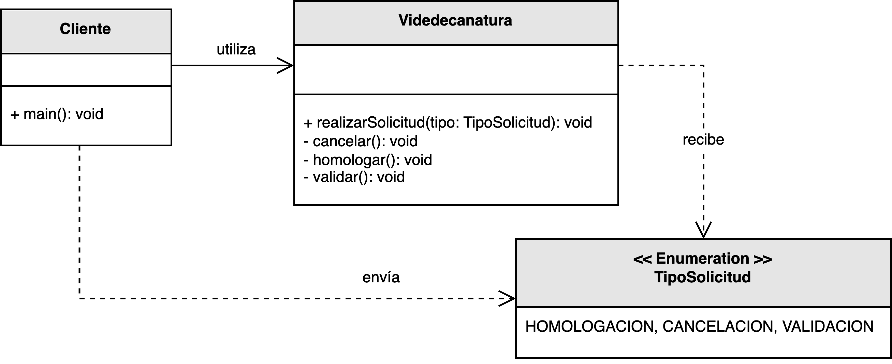
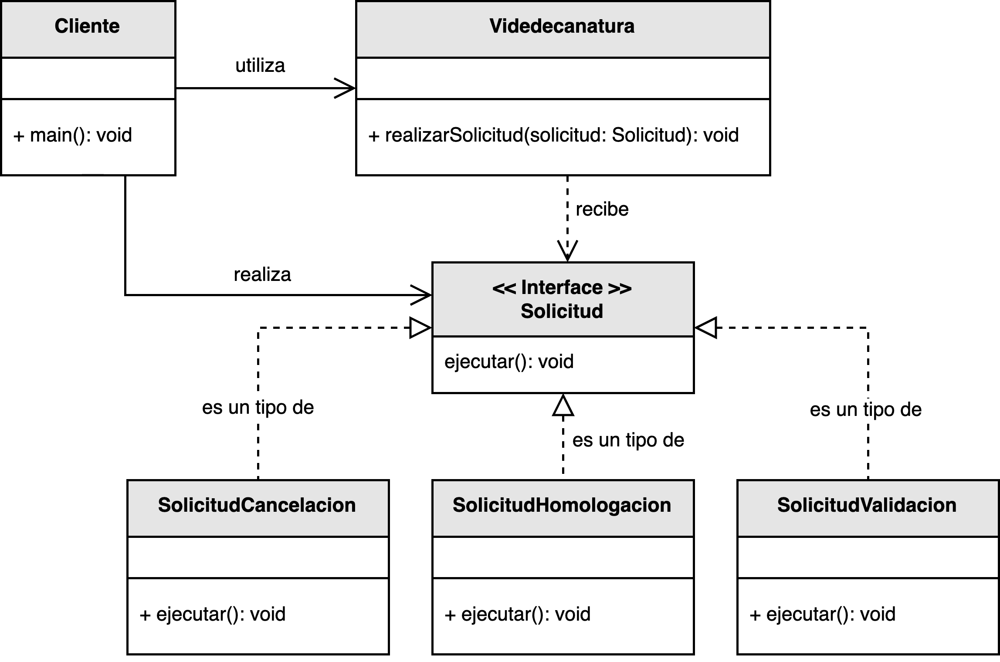

<h1 style="text-align:center;">
  <strong>📨 Ejemplo práctico: Solicitudes Administrativas</strong>
</h1>

<h2><strong>🧩 Descripción del problema</strong></h2>

Se ha solicitado a <em>nuestro desarrollador</em> diseñar un módulo que permita a los estudiantes de una universidad enviar <b>solicitudes académicas</b> a la vicedecanatura.  
El sistema debe procesar tres tipos de solicitudes principales: <b>cancelación</b>, <b>homologación</b> y <b>validación</b> de cursos.  
Cada una de ellas requiere un tratamiento distinto por parte del área administrativa.

En la primera versión del sistema, todas las solicitudes fueron gestionadas dentro de una misma clase, 
utilizando estructuras condicionales (<code>if</code>/<code>switch</code>) para diferenciar su tipo.  
Aunque funcional, este diseño <b>viola el Principio Abierto/Cerrado (OCP)</b>, ya que cada vez que se añade una nueva solicitud 
(por ejemplo, una <em>solicitud de revisión de nota</em> o de <em>transferencia interna</em>), es necesario <b>modificar el código existente</b>.

El reto consiste en rediseñar el sistema de forma que pueda incorporar nuevos tipos de solicitud 
<b>sin alterar las clases existentes</b>, garantizando una arquitectura más estable, extensible y mantenible.

<h2><strong>📂 Estructura del ejemplo y accesos directos</strong></h2>

<table style="width:100%; border-collapse:collapse;">
  <thead>
    <tr style="background:#f5f5f5;">
      <th style="border:1px solid #ddd; padding:8px; text-align:center;">❌ Sin aplicar OCP</th>
      <th style="border:1px solid #ddd; padding:8px; text-align:center;">✅ Aplicando OCP</th>
    </tr>
  </thead>
  <tbody>
    <tr>
      <td style="border:1px solid #ddd; padding:8px;">
        

          En esta versión inicial, la clase <code>Cliente</code> crea las solicitudes y las envía directamente a la <code>Vicedecanatura</code>, 
          que se encarga de procesarlas mediante una estructura condicional que evalúa el <code>TipoSolicitud</code>.
          Esto genera <b>alto acoplamiento</b> y dificulta la incorporación de nuevas solicitudes.
        

        <ul style="margin:0 0 4px 18px;">
          <li>▶️ <a href="./sin_aplicar_principio/Cliente.java" target="_blank"><b>Cliente.java</b></a></li>
          <li>▶️ <a href="./sin_aplicar_principio/TipoSolicitud.java" target="_blank"><b>TipoSolicitud.java</b></a></li>
          <li>▶️ <a href="./sin_aplicar_principio/Vicedecanatura.java" target="_blank"><b>Vicedecanatura.java</b></a></li>
        </ul>
      </td>
      <td style="border:1px solid #ddd; padding:8px;">
        

          En la versión refactorizada, se define una <b>interfaz abstracta</b> <code>Solicitud</code>, 
          de la cual heredan las clases <code>SolicitudCancelacion</code>, <code>SolicitudHomologacion</code> y <code>SolicitudValidacion</code>.  
          Cada tipo de solicitud implementa su propio método <code>procesar()</code>, 
          lo que permite a la <code>Vicedecanatura</code> tratar todas las solicitudes de manera uniforme mediante polimorfismo.
        

        <ul style="margin:0 0 4px 18px;">
          <li>▶️ <a href="./aplicando_principio/solicitud/Solicitud.java" target="_blank"><b>Solicitud.java</b></a></li>
          <li>▶️ <a href="./aplicando_principio/solicitud/SolicitudCancelacion.java" target="_blank"><b>SolicitudCancelacion.java</b></a></li>
          <li>▶️ <a href="./aplicando_principio/solicitud/SolicitudHomologacion.java" target="_blank"><b>SolicitudHomologacion.java</b></a></li>
          <li>▶️ <a href="./aplicando_principio/solicitud/SolicitudValidacion.java" target="_blank"><b>SolicitudValidacion.java</b></a></li>
          <li>▶️ <a href="./aplicando_principio/Vicedecanatura.java" target="_blank"><b>Vicedecanatura.java</b></a></li>
          <li>▶️ <a href="./aplicando_principio/Cliente.java" target="_blank"><b>Cliente.java</b></a></li>
        </ul>
      </td>
    </tr>
  </tbody>
</table>

<h2 style="text-align:justify;"><strong>❌ Modelo UML sin aplicar el Principio Abierto/Cerrado</strong></h2>

En este diseño, la <code>Vicedecanatura</code> recibe diferentes tipos de solicitudes, pero depende directamente del enumerado <code>TipoSolicitud</code> 
para determinar cómo procesar cada una.  
Esto implica una fuerte dependencia entre las clases y un flujo de control rígido.

Si se desea incorporar una nueva solicitud, el desarrollador debe modificar tanto la enumeración <code>TipoSolicitud</code> 
como el método de procesamiento de la <code>Vicedecanatura</code>, 
lo que implica alterar código que ya fue probado y desplegado, violando el OCP.

  

<b>Figura 1.</b> Diseño inicial con condicionales centralizadas y alta dependencia entre clases.

<h2 style="text-align:justify;"><strong>✅ Modelo UML aplicando el Principio Abierto/Cerrado</strong></h2>

En la versión refactorizada, se introduce una <b>jerarquía polimórfica</b> de solicitudes, 
donde cada tipo de solicitud implementa la interfaz <code>Solicitud</code>.  
La clase <code>Vicedecanatura</code> ahora procesa cualquier solicitud a través del método común <code>procesar()</code> 
sin necesitar conocer el tipo específico.

De esta forma, el sistema queda <b>abierto a la extensión</b> —nuevos tipos de solicitud pueden añadirse fácilmente—  
y <b>cerrado a la modificación</b> —las clases existentes no necesitan alterarse.  
Esto reduce el acoplamiento y mejora la mantenibilidad del sistema.

  

<b>Figura 2.</b> Diseño extensible basado en abstracciones y polimorfismo.

<h2><strong>💡 Conclusión</strong></h2>

El rediseño del módulo de solicitudes administrativas demuestra cómo aplicar el <b>Principio Abierto/Cerrado</b> 
permite construir sistemas que crecen de forma orgánica sin comprometer su estabilidad.  
Al delegar la responsabilidad del comportamiento a las clases concretas de solicitud, 
la <code>Vicedecanatura</code> se mantiene desacoplada y puede procesar cualquier tipo de solicitud futura sin modificaciones.

Este patrón de diseño no solo mejora la extensibilidad del software, sino que también lo hace más <b>legible, mantenible y fácil de probar</b>.  
Cada solicitud encapsula su propio comportamiento, promoviendo un diseño limpio y orientado a la responsabilidad única.

