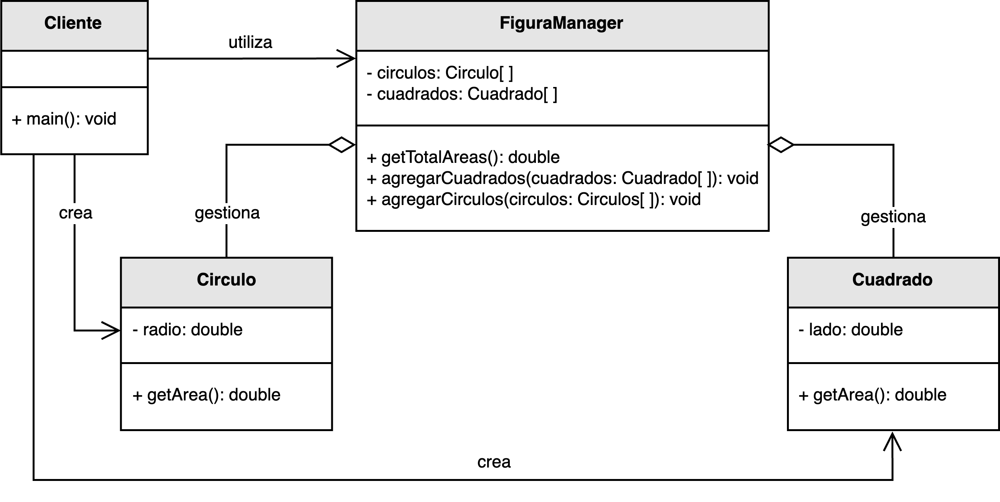
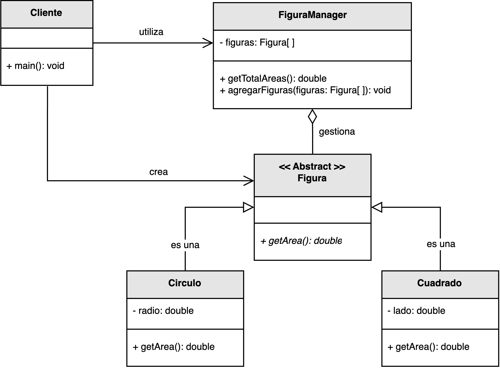

<h1 style="text-align:center;">
  <strong>📐 Ejemplo abstracto: Figuras Geométricas (DIP)</strong>
</h1>

<h2><strong>🧩 Descripción del problema</strong></h2>

Se solicitó a <em>nuestro desarrollador</em> implementar una solución que simule una <b>fábrica de figuras geométricas</b>.  
El propósito de la fábrica es centralizar operaciones comunes sobre las figuras, como por ejemplo calcular el <b>área total</b> de todas las figuras registradas en el sistema.

En la primera versión del diseño, la clase principal —denominada <code>FiguraManager</code>— dependía directamente de las clases concretas (<code>Circulo</code>, <code>Cuadrado</code>), 
lo que generó un <b>alto acoplamiento</b> entre las capas.  
Cada vez que se añadía una nueva figura o se modificaba una existente, el código del administrador debía cambiar, 
violando el <b>Principio de Inversión de Dependencias (DIP)</b>.

El reto consiste en <b>invertir las dependencias</b> de modo que las clases de alto nivel no dependan de implementaciones concretas, 
sino de <b>abstracciones</b>.  
De esta forma, la fábrica podrá manipular cualquier tipo de figura sin conocer su implementación interna.

<h2><strong>📂 Estructura del ejemplo y accesos directos</strong></h2>

<table style="width:100%; border-collapse:collapse;">
  <thead>
    <tr style="background:#f5f5f5;">
      <th style="border:1px solid #ddd; padding:8px; text-align:center;">❌ Sin aplicar DIP</th>
      <th style="border:1px solid #ddd; padding:8px; text-align:center;">✅ Aplicando DIP</th>
    </tr>
  </thead>
  <tbody>
    <tr>
      <td style="border:1px solid #ddd; padding:8px;">
        

          En la versión inicial, la clase <code>FiguraManager</code> instancia directamente los objetos <code>Circulo</code> y <code>Cuadrado</code> 
          y depende de sus implementaciones concretas para calcular el área.  
          Esto genera un acoplamiento rígido: cualquier cambio en una figura o la introducción de una nueva 
          obliga a modificar <code>FiguraManager</code>.
        

        <ul style="margin:0 0 4px 18px;">
          <li>▶️ <a href="./sin_aplicar_principio/figura/Circulo.java" target="_blank"><b>Circulo.java</b></a></li>
          <li>▶️ <a href="./sin_aplicar_principio/figura/Cuadrado.java" target="_blank"><b>Cuadrado.java</b></a></li>
          <li>▶️ <a href="./sin_aplicar_principio/FiguraManager.java" target="_blank"><b>FiguraManager.java</b></a></li>
          <li>▶️ <a href="./sin_aplicar_principio/Cliente.java" target="_blank"><b>Cliente.java</b></a></li>
        </ul>
      </td>
      <td style="border:1px solid #ddd; padding:8px;">
        

          En la versión mejorada, <code>FiguraManager</code> ya no depende de las clases concretas, sino de la <b>abstracción</b> <code>Figura</code>.  
          Cada figura (como <code>Circulo</code> o <code>Cuadrado</code>) implementa la interfaz <code>Figura</code>, 
          y las dependencias se inyectan desde el exterior, cumpliendo el principio DIP.
        

        <ul style="margin:0 0 4px 18px;">
          <li>▶️ <a href="./aplicando_principio/figura/Figura.java" target="_blank"><b>Figura.java</b></a></li>
          <li>▶️ <a href="./aplicando_principio/figura/Circulo.java" target="_blank"><b>Circulo.java</b></a></li>
          <li>▶️ <a href="./aplicando_principio/figura/Cuadrado.java" target="_blank"><b>Cuadrado.java</b></a></li>
          <li>▶️ <a href="./aplicando_principio/FiguraManager.java" target="_blank"><b>FiguraManager.java</b></a></li>
          <li>▶️ <a href="./aplicando_principio/Cliente.java" target="_blank"><b>Cliente.java</b></a></li>
        </ul>
      </td>
    </tr>
  </tbody>
</table>

<h2 style="text-align:justify;"><strong>❌ Modelo UML sin aplicar el Principio de Inversión de Dependencias</strong></h2>

En el diseño original, la clase de alto nivel <code>FiguraManager</code> depende directamente de las clases concretas 
<code>Circulo</code> y <code>Cuadrado</code>.  
Esto significa que la lógica de creación y cálculo de áreas está acoplada a los detalles de implementación, 
violando el principio DIP.

El sistema funciona correctamente, pero carece de flexibilidad: agregar una nueva figura —por ejemplo, un <code>Triangulo</code>— 
obliga a modificar el código de <code>FiguraManager</code> y recompilar todo el módulo.  
Además, las pruebas unitarias son más difíciles, porque el componente central no puede ser probado de forma aislada.

  

<b>Figura 1.</b> Diseño inicial acoplado a las implementaciones concretas de las figuras.

<h2 style="text-align:justify;"><strong>✅ Modelo UML aplicando el Principio de Inversión de Dependencias</strong></h2>

En la versión mejorada, el diseño se refactoriza para que <code>FiguraManager</code> dependa de la <b>abstracción</b> <code>Figura</code> en lugar de las clases concretas.  
De esta forma, la clase de alto nivel no necesita conocer los detalles de implementación de cada figura: 
únicamente invoca el método <code>calcularArea()</code> definido en la interfaz.

Las instancias de las figuras son <b>inyectadas desde el exterior</b> (por ejemplo, por la clase <code>Cliente</code>), 
cumpliendo el principio de inversión de dependencias y favoreciendo la <b>inyección de dependencias (DI)</b> y la <b>inversión de control (IoC)</b>.

  

<b>Figura 2.</b> Diseño desacoplado mediante abstracciones e inyección de dependencias.

<h2><strong>💡 Conclusión</strong></h2>

Este ejemplo muestra cómo aplicar el <b>Principio de Inversión de Dependencias</b> (DIP) permite reducir el acoplamiento 
entre los módulos de alto y bajo nivel, haciendo el sistema más flexible, testeable y mantenible.  
Las clases de alto nivel, como <code>FiguraManager</code>, dejan de depender de implementaciones concretas y se apoyan en <b>interfaces</b> o <b>contratos abstractos</b>.

De esta manera, es posible extender el sistema (por ejemplo, añadiendo nuevas figuras geométricas) sin modificar el código existente.  
El resultado es una arquitectura orientada a <b>abstracciones estables</b>, que facilita la reutilización y el mantenimiento a largo plazo.

