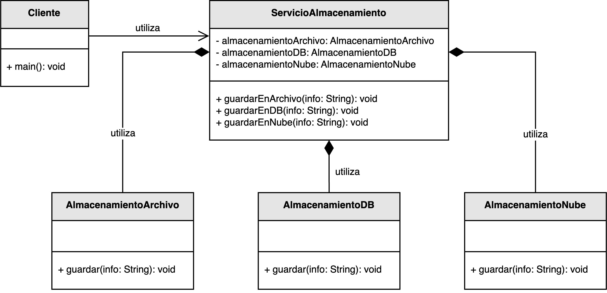
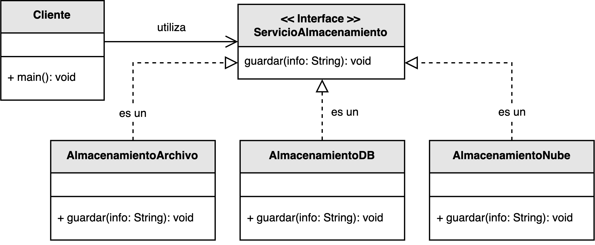

<h1 style="text-align:center;">
  <strong>💾 Ejemplo práctico: Servicio de Almacenamiento</strong>
</h1>

<h2><strong>🧩 Descripción del problema</strong></h2>

Se ha solicitado a <em>nuestro desarrollador</em> diseñar una solución que permita <b>persistir información</b> mediante diferentes mecanismos, 
como el almacenamiento en <b>disco local</b>, en una <b>base de datos</b> o en un <b>sistema de almacenamiento en la nube</b>.  
El sistema debe poder ampliar sus métodos de persistencia sin alterar las clases principales del proyecto.

En su versión inicial, la clase principal encargada de la gestión —<code>ServicioAlmacenamiento</code>— dependía directamente 
de las implementaciones concretas (<code>AlmacenamientoArchivo</code>, <code>AlmacenamientoDB</code> y <code>AlmacenamientoNube</code>).  
Esto provocaba un fuerte acoplamiento, haciendo que cualquier cambio o nueva opción de almacenamiento 
requiriera modificar el código existente.  
Este diseño viola el <b>Principio de Inversión de Dependencias (DIP)</b>.

El reto es refactorizar el sistema para que las clases de alto nivel dependan de <b>abstracciones</b> 
(en lugar de implementaciones concretas), garantizando una arquitectura más flexible, extensible y mantenible.

<h2><strong>📂 Estructura del ejemplo y accesos directos</strong></h2>

<table style="width:100%; border-collapse:collapse;">
  <thead>
    <tr style="background:#f5f5f5;">
      <th style="border:1px solid #ddd; padding:8px; text-align:center;">❌ Sin aplicar DIP</th>
      <th style="border:1px solid #ddd; padding:8px; text-align:center;">✅ Aplicando DIP</th>
    </tr>
  </thead>
  <tbody>
    <tr>
      <td style="border:1px solid #ddd; padding:8px;">
        

          En esta versión, la clase <code>ServicioAlmacenamiento</code> crea e invoca directamente los servicios 
          concretos de almacenamiento (<code>Archivo</code>, <code>Base de datos</code>, <code>Nube</code>).  
          Este diseño impide reutilizar o intercambiar las implementaciones sin modificar la clase principal, 
          generando un <b>acoplamiento fuerte</b> y reduciendo la escalabilidad del sistema.
        

        <ul style="margin:0 0 4px 18px;">
          <li>▶️ <a href="./sin_aplicar_principio/servicios/AlmacenamientoArchivo.java" target="_blank"><b>AlmacenamientoArchivo.java</b></a></li>
          <li>▶️ <a href="./sin_aplicar_principio/servicios/AlmacenamientoDB.java" target="_blank"><b>AlmacenamientoDB.java</b></a></li>
          <li>▶️ <a href="./sin_aplicar_principio/servicios/AlmacenamientoNube.java" target="_blank"><b>AlmacenamientoNube.java</b></a></li>
          <li>▶️ <a href="./sin_aplicar_principio/ServicioAlmacenamiento.java" target="_blank"><b>ServicioAlmacenamiento.java</b></a></li>
          <li>▶️ <a href="./sin_aplicar_principio/Cliente.java" target="_blank"><b>Cliente.java</b></a></li>
        </ul>
      </td>
      <td style="border:1px solid #ddd; padding:8px;">
        

          En la versión mejorada, se introduce la <b>abstracción</b> <code>ServicioAlmacenamiento</code>, 
          la cual define el contrato que deben seguir todas las clases concretas.  
          Los diferentes tipos de almacenamiento implementan esta interfaz y la clase <code>Cliente</code> 
          depende exclusivamente de ella, no de las implementaciones.  
          Esto permite <b>inyectar dependencias</b> de forma dinámica sin modificar el código existente.
        

        <ul style="margin:0 0 4px 18px;">
          <li>▶️ <a href="./aplicando_principio/ServicioAlmacenamiento.java" target="_blank"><b>ServicioAlmacenamiento.java</b></a></li>
          <li>▶️ <a href="./aplicando_principio/servicios/AlmacenamientoArchivo.java" target="_blank"><b>AlmacenamientoArchivo.java</b></a></li>
          <li>▶️ <a href="./aplicando_principio/servicios/AlmacenamientoDB.java" target="_blank"><b>AlmacenamientoDB.java</b></a></li>
          <li>▶️ <a href="./aplicando_principio/servicios/AlmacenamientoNube.java" target="_blank"><b>AlmacenamientoNube.java</b></a></li>
          <li>▶️ <a href="./aplicando_principio/Cliente.java" target="_blank"><b>Cliente.java</b></a></li>
        </ul>
      </td>
    </tr>
  </tbody>
</table>

<h2 style="text-align:justify;"><strong>❌ Modelo UML sin aplicar el Principio de Inversión de Dependencias</strong></h2>

En el diseño original, la clase <code>ServicioAlmacenamiento</code> depende directamente de las clases concretas 
<code>AlmacenamientoArchivo</code>, <code>AlmacenamientoDB</code> y <code>AlmacenamientoNube</code>.  
Cada vez que se desea incorporar un nuevo tipo de persistencia (por ejemplo, <em>almacenamiento distribuido</em>), 
es necesario modificar esta clase, lo que viola el principio DIP.

Además, el <code>Cliente</code> también se ve afectado por este acoplamiento, ya que debe conocer qué implementación concreta utilizar.  
El resultado es un sistema poco flexible, difícil de probar y de mantener.

  

<b>Figura 1.</b> Diseño inicial acoplado a implementaciones concretas de almacenamiento.

<h2 style="text-align:justify;"><strong>✅ Modelo UML aplicando el Principio de Inversión de Dependencias</strong></h2>

En la versión refactorizada, todas las implementaciones concretas dependen de la abstracción <code>ServicioAlmacenamiento</code>.  
De esta forma, el <code>Cliente</code> puede interactuar con cualquier mecanismo de persistencia 
(<code>Archivo</code>, <code>Base de Datos</code>, <code>Nube</code>) sin conocer los detalles de cada uno.

La inversión de dependencias se logra al inyectar el servicio deseado en el cliente.  
Este enfoque permite sustituir o agregar nuevas implementaciones sin tocar el código de las clases principales, 
reduciendo el acoplamiento y favoreciendo la reutilización.  
Además, mejora la capacidad de realizar pruebas unitarias mediante <b>mocks</b> o <b>stubs</b>.

  

<b>Figura 2.</b> Diseño desacoplado mediante abstracciones e inyección de dependencias.

<h2><strong>💡 Conclusión</strong></h2>

El <b>Principio de Inversión de Dependencias</b> (DIP) busca desacoplar las clases de alto nivel de las implementaciones concretas.  
En este ejemplo, el cliente y el gestor de almacenamiento dependen de la abstracción <code>ServicioAlmacenamiento</code>, 
no de las clases concretas, lo que permite una arquitectura flexible y extensible.

Gracias a este enfoque, el sistema puede adaptarse fácilmente a nuevos requerimientos, 
como agregar almacenamiento en <b>nube híbrida</b> o <b>memoria temporal</b>, 
sin necesidad de modificar las clases que ya funcionan.  
Así, se logra una solución <b>modular, escalable y con bajo acoplamiento</b>.

