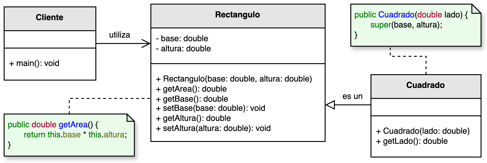
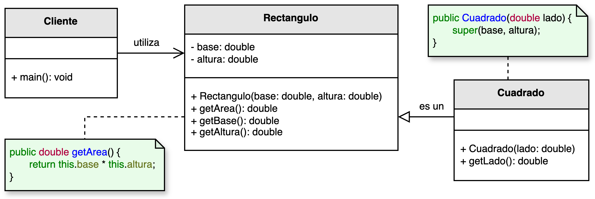

<h1 style="text-align:center;">
  <strong>📐 Ejemplo abstracto: Figuras geométricas (LSP)</strong>
</h1>

<h2><strong>🧩 Descripción del problema</strong></h2>

En el estudio de la geometría se observa un comportamiento interesante: los <b>cuadrados</b> pueden considerarse un caso particular de los <b>rectángulos</b> en el que la base y la altura son iguales.  
Basado en esta idea, <em>nuestro desarrollador</em> decidió implementar un sistema que calcule el área de <b>cuadrados</b> y <b>rectángulos</b> con fines ilustrativos.

En su versión inicial, el desarrollador decidió que la clase <code>Cuadrado</code> heredara de <code>Rectangulo</code>, ya que conceptualmente parece lógico.  
Sin embargo, esta decisión generó un problema: al sobrescribir los métodos <code>setBase()</code> y <code>setAltura()</code> para mantener las longitudes iguales, 
la subclase <code>Cuadrado</code> rompió el comportamiento esperado de la clase base <code>Rectangulo</code>.  
Esto constituye una violación del <b>Principio de Sustitución de Liskov (LSP)</b>.

El reto consiste en garantizar que las subclases puedan reemplazar a sus superclases sin alterar el comportamiento esperado del programa.  
Esto implica diseñar jerarquías que respeten las propiedades y contratos definidos por las clases base.

<h2><strong>📂 Estructura del ejemplo y accesos directos</strong></h2>

<table style="width:100%; border-collapse:collapse;">
  <thead>
    <tr style="background:#f5f5f5;">
      <th style="border:1px solid #ddd; padding:8px; text-align:center;">❌ Sin aplicar LSP</th>
      <th style="border:1px solid #ddd; padding:8px; text-align:center;">✅ Aplicando LSP</th>
    </tr>
  </thead>
  <tbody>
    <tr>
      <td style="border:1px solid #ddd; padding:8px;">
        

          En esta versión, la clase <code>Cuadrado</code> hereda de <code>Rectangulo</code> pero sobrescribe los métodos <code>setBase()</code> y <code>setAltura()</code>.  
          Esto altera el comportamiento esperado al establecer la base y la altura, ya que ambas se actualizan simultáneamente, 
          rompiendo el contrato definido por la clase padre y violando el principio LSP.
        

        <ul style="margin:0 0 4px 18px;">
          <li>▶️ <a href="./sin_aplicar_principio/Rectangulo.java" target="_blank"><b>Rectangulo.java</b></a></li>
          <li>▶️ <a href="./sin_aplicar_principio/Cuadrado.java" target="_blank"><b>Cuadrado.java</b></a></li>
          <li>▶️ <a href="./sin_aplicar_principio/Cliente.java" target="_blank"><b>Cliente.java</b></a></li>
        </ul>
      </td>
      <td style="border:1px solid #ddd; padding:8px;">
        

          En la versión corregida, ambas clases implementan una abstracción común (<code>Figura</code> o <code>Calculable</code>), 
          pero sin establecer una relación de herencia entre <code>Rectangulo</code> y <code>Cuadrado</code>.  
          De esta forma, cada figura respeta su propio comportamiento sin alterar el contrato de otra clase.
        

        <ul style="margin:0 0 4px 18px;">
          <li>▶️ <a href="./aplicando_principio/Rectangulo.java" target="_blank"><b>Rectangulo.java</b></a></li>
          <li>▶️ <a href="./aplicando_principio/Cuadrado.java" target="_blank"><b>Cuadrado.java</b></a></li>
          <li>▶️ <a href="./aplicando_principio/Cliente.java" target="_blank"><b>Cliente.java</b></a></li>
        </ul>
      </td>
    </tr>
  </tbody>
</table>

<h2 style="text-align:justify;"><strong>❌ Modelo UML sin aplicar el Principio de Sustitución de Liskov</strong></h2>

En este diseño, <code>Cuadrado</code> hereda de <code>Rectangulo</code> bajo la idea de que “un cuadrado es un rectángulo especial”.  
Sin embargo, cuando el cliente asigna valores diferentes a la base y a la altura, el comportamiento del sistema se vuelve inconsistente:  
la subclase modifica la lógica del cálculo de área definida por la clase base.

Esta implementación rompe el principio LSP porque <b>la subclase no puede sustituir de manera transparente a la superclase</b> 
sin alterar el resultado esperado del programa.

  

<b>Figura 1.</b> Diseño incorrecto: la subclase altera el comportamiento de la superclase.

<h2 style="text-align:justify;"><strong>✅ Modelo UML aplicando el Principio de Sustitución de Liskov</strong></h2>

En el diseño corregido, se elimina la relación de herencia entre <code>Rectangulo</code> y <code>Cuadrado</code>, 
introduciendo en su lugar una interfaz común (<code>Figura</code>) que define el método <code>calcularArea()</code>.  
De esta manera, ambas clases implementan el mismo contrato, pero cada una mantiene su propio comportamiento independiente.

El resultado es un sistema donde las clases pueden sustituirse entre sí sin afectar el funcionamiento global.  
El cliente puede manipular colecciones de <code>Figura</code> sin preocuparse por los detalles de implementación de cada una.

  

<b>Figura 2.</b> Diseño correcto: ambas clases respetan el contrato común sin depender una de la otra.

<h2><strong>💡 Conclusión</strong></h2>

El <b>Principio de Sustitución de Liskov</b> garantiza que las jerarquías de clases mantengan coherencia semántica y de comportamiento.  
En este ejemplo, al eliminar la herencia incorrecta entre <code>Rectangulo</code> y <code>Cuadrado</code>, 
se logra un diseño más sólido y predecible.

Aplicar este principio implica diseñar clases que puedan sustituirse sin alterar el resultado final del sistema.  
Esto refuerza la integridad de la jerarquía y evita comportamientos inesperados al extender o modificar el código.

