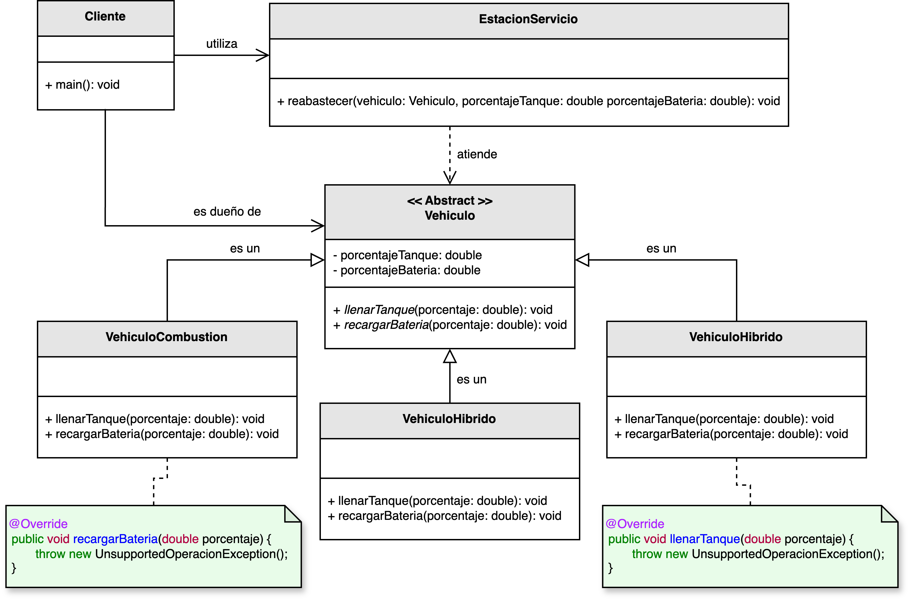
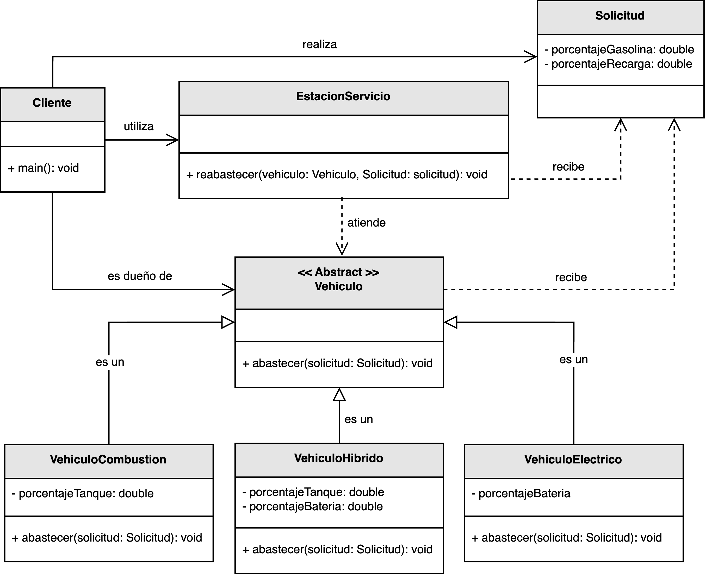

<h1 style="text-align:center;">
  <strong>⛽ Ejemplo práctico: Estación de servicio (LSP)</strong>
</h1>

<h2><strong>🧩 Descripción del problema</strong></h2>

Se pidió a <em>nuestro desarrollador</em> implementar una solución que facilite el <b>abastecimiento de combustible</b> o <b>suministro eléctrico</b> 
a los diferentes tipos de vehículos que atiende una estación de servicio.  
La estación debe poder manejar vehículos de <b>combustión</b> (funcionan con gasolina), <b>eléctricos</b> e <b>híbridos</b>.

En el diseño inicial, la clase base <code>Vehiculo</code> fue implementada con un método <code>recargarCombustible()</code>.  
Las subclases <code>VehiculoCombustion</code> y <code>VehiculoHibrido</code> sobrescriben el método correctamente; 
sin embargo, <code>VehiculoElectrico</code> no requiere combustible, por lo que su implementación termina siendo vacía o lanzando una excepción.  
Esto genera una <b>violación del Principio de Sustitución de Liskov (LSP)</b>.

El reto consiste en rediseñar la jerarquía de clases de forma que <b>todas las subclases puedan reemplazar a la clase base sin alterar el comportamiento esperado</b>.  
Para lograrlo, se debe crear una abstracción que respete los distintos tipos de abastecimiento sin romper el contrato establecido por la clase base.

<h2><strong>📂 Estructura del ejemplo y accesos directos</strong></h2>

<table style="width:100%; border-collapse:collapse;">
  <thead>
    <tr style="background:#f5f5f5;">
      <th style="border:1px solid #ddd; padding:8px; text-align:center;">❌ Sin aplicar LSP</th>
      <th style="border:1px solid #ddd; padding:8px; text-align:center;">✅ Aplicando LSP</th>
    </tr>
  </thead>
  <tbody>
    <tr>
      <td style="border:1px solid #ddd; padding:8px;">
        

          En la versión inicial, la clase <code>Vehiculo</code> define el método <code>recargarCombustible()</code>, 
          lo que obliga a las subclases eléctricas a implementar comportamientos que no aplican a su naturaleza.  
          Esta jerarquía es inconsistente y rompe el principio de sustitución: un <code>VehiculoElectrico</code> no puede sustituir 
          a un <code>VehiculoCombustion</code> sin alterar el funcionamiento de la estación.
        

        <ul style="margin:0 0 4px 18px;">
          <li>▶️ <a href="./sin_aplicar_principio/vehiculo/Vehiculo.java" target="_blank"><b>Vehiculo.java</b></a></li>
          <li>▶️ <a href="./sin_aplicar_principio/vehiculo/VehiculoCombustion.java" target="_blank"><b>VehiculoCombustion.java</b></a></li>
          <li>▶️ <a href="./sin_aplicar_principio/vehiculo/VehiculoElectrico.java" target="_blank"><b>VehiculoElectrico.java</b></a></li>
          <li>▶️ <a href="./sin_aplicar_principio/vehiculo/VehiculoHibrido.java" target="_blank"><b>VehiculoHibrido.java</b></a></li>
          <li>▶️ <a href="./sin_aplicar_principio/EstacionServicio.java" target="_blank"><b>EstacionServicio.java</b></a></li>
          <li>▶️ <a href="./sin_aplicar_principio/Cliente.java" target="_blank"><b>Cliente.java</b></a></li>
        </ul>
      </td>
      <td style="border:1px solid #ddd; padding:8px;">
        

          En la versión mejorada, se redefine la jerarquía introduciendo una abstracción más genérica (<code>Vehiculo</code>) 
          con el método <code>abastecer()</code>, que cada subclase implementa de acuerdo con su tipo de energía.  
          Así, la estación puede procesar cualquier vehículo sin conocer su tipo ni violar el contrato del padre.
        

        <ul style="margin:0 0 4px 18px;">
          <li>▶️ <a href="./aplicando_principio/vehiculo/Vehiculo.java" target="_blank"><b>Vehiculo.java</b></a></li>
          <li>▶️ <a href="./aplicando_principio/vehiculo/VehiculoCombustion.java" target="_blank"><b>VehiculoCombustion.java</b></a></li>
          <li>▶️ <a href="./aplicando_principio/vehiculo/VehiculoElectrico.java" target="_blank"><b>VehiculoElectrico.java</b></a></li>
          <li>▶️ <a href="./aplicando_principio/vehiculo/VehiculoHibrido.java" target="_blank"><b>VehiculoHibrido.java</b></a></li>
          <li>▶️ <a href="./aplicando_principio/EstacionServicio.java" target="_blank"><b>EstacionServicio.java</b></a></li>
          <li>▶️ <a href="./aplicando_principio/Cliente.java" target="_blank"><b>Cliente.java</b></a></li>
        </ul>
      </td>
    </tr>
  </tbody>
</table>

<h2 style="text-align:justify;"><strong>❌ Modelo UML sin aplicar el Principio de Sustitución de Liskov</strong></h2>

En el diseño original, la jerarquía de clases obliga a todos los vehículos a compartir el método <code>recargarCombustible()</code>.  
Este enfoque no respeta las diferencias entre los tipos de vehículos y genera comportamientos no deseados:  
los vehículos eléctricos no usan combustible y los híbridos combinan diferentes métodos de recarga.  
Esto rompe el principio de sustitución, ya que <b>no todas las subclases pueden comportarse como la superclase</b>.

  

<b>Figura 1.</b> Diseño incorrecto: la jerarquía impone métodos inaplicables a algunas subclases.

<h2 style="text-align:justify;"><strong>✅ Modelo UML aplicando el Principio de Sustitución de Liskov</strong></h2>

En la versión refactorizada, todas las clases heredan de una abstracción común <code>Vehiculo</code>, 
pero cada una implementa su propio comportamiento del método <code>abastecer()</code>.  
La <code>EstacionServicio</code> simplemente invoca este método sin preocuparse por el tipo de vehículo.

Este rediseño cumple con el principio LSP porque <b>todas las subclases pueden sustituir a la clase base sin alterar el funcionamiento del sistema</b>.  
La estación de servicio puede operar de forma uniforme con vehículos de combustión, eléctricos o híbridos sin necesidad de condiciones adicionales.

  

<b>Figura 2.</b> Diseño correcto: cada subclase implementa el contrato de forma coherente.

<h2><strong>💡 Conclusión</strong></h2>

El <b>Principio de Sustitución de Liskov</b> asegura que las jerarquías de clases sean consistentes y estables.  
En este ejemplo, separar las responsabilidades de cada tipo de vehículo permitió que la <b>Estación de Servicio</b> 
pudiera tratar a todos los objetos de forma uniforme sin necesidad de conocer sus particularidades internas.

Cumplir el LSP garantiza que las clases hijas mantengan la coherencia del contrato de la clase base, 
evitando comportamientos anómalos y facilitando la extensión del sistema sin introducir errores.  
Así, la jerarquía se mantiene <b>coherente, flexible y predecible</b>.

