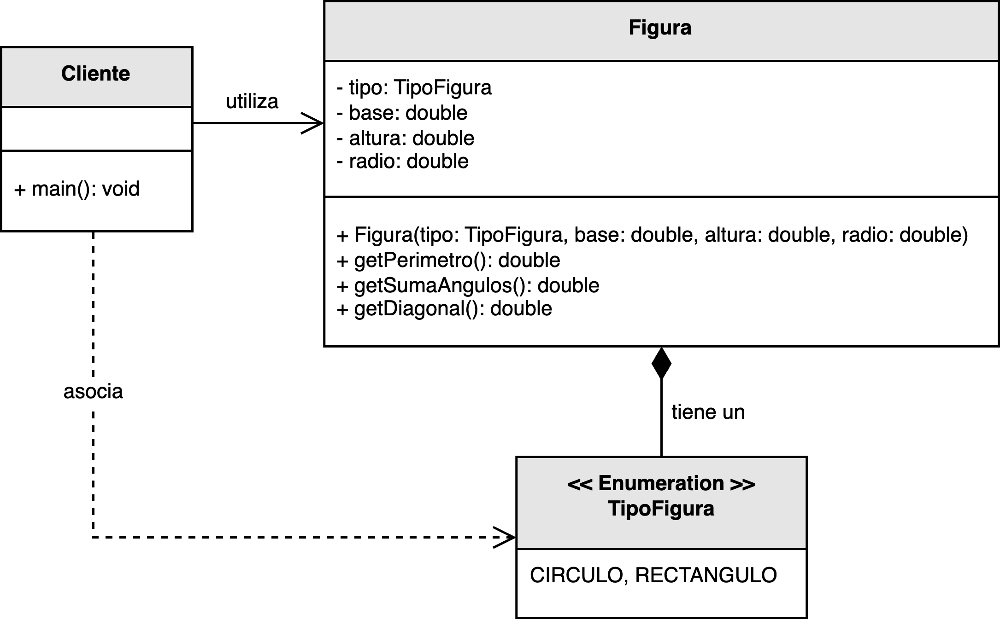
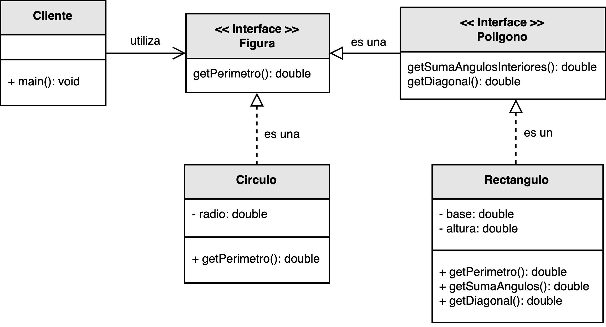

<h1 style="text-align:center;">
  <strong>📐 Ejemplo abstracto: Figuras geométricas (SRP)</strong>
</h1>

<h2><strong>🧩 Descripción del problema</strong></h2>

Se solicitó a <em>nuestro desarrollador</em> crear un sistema que permita <b>calcular las propiedades de diferentes figuras geométricas</b>, 
por ejemplo: su <b>perímetro</b>, la <b>suma de sus ángulos interiores</b>, o la <b>longitud de sus diagonales</b>.  
Inicialmente, el sistema debe soportar operaciones para <b>rectángulos</b> y <b>círculos</b>, 
aunque se espera que en el futuro se amplíe para incluir nuevas figuras y propiedades adicionales.

En la primera implementación, se diseñó una única clase <code>Figura</code> que concentra la lógica para todas las figuras geométricas, 
definiendo métodos que calculan propiedades específicas según el tipo de figura.  
Aunque funcional en un comienzo, este enfoque genera un código difícil de mantener, 
pues cualquier cambio o adición de una nueva figura implica modificar la misma clase central.

El objetivo es aplicar el <b>Principio de Responsabilidad Única (SRP)</b>, separando las responsabilidades de cálculo y modelado, 
para obtener un diseño más <b>modular, extensible y mantenible</b>.

<h2><strong>📂 Estructura del ejemplo y accesos directos</strong></h2>

<table style="width:100%; border-collapse:collapse;">
  <thead>
    <tr style="background:#f5f5f5;">
      <th style="border:1px solid #ddd; padding:8px; text-align:center;">❌ Sin aplicar SRP</th>
      <th style="border:1px solid #ddd; padding:8px; text-align:center;">✅ Aplicando SRP</th>
    </tr>
  </thead>
  <tbody>
    <tr>
      <td style="border:1px solid #ddd; padding:8px;">
        

          En esta versión, la clase <code>Figura</code> se encarga de múltiples tareas: 
          modelar las propiedades de la figura, calcular perímetros, ángulos y diagonales, 
          e incluso determinar el tipo de figura (rectángulo, círculo, etc.).  
          Esto viola el principio SRP, ya que la clase tiene más de una razón para cambiar.
        

        <ul style="margin:0 0 4px 18px;">
          <li>▶️ <a href="./sin_aplicar_principio/Figura.java" target="_blank"><b>Figura.java</b></a></li>
          <li>▶️ <a href="./sin_aplicar_principio/TipoFigura.java" target="_blank"><b>TipoFigura.java</b></a></li>
          <li>▶️ <a href="./sin_aplicar_principio/Cliente.java" target="_blank"><b>Cliente.java</b></a></li>
        </ul>
      </td>
      <td style="border:1px solid #ddd; padding:8px;">
        

          En la versión refactorizada, se divide la lógica en múltiples clases e interfaces.  
          La interfaz <code>Figura</code> define el comportamiento común, mientras que las clases concretas 
          (<code>Rectangulo</code>, <code>Circulo</code>) se encargan de implementar los cálculos específicos.  
          Además, se introducen interfaces especializadas como <code>Poligono</code> para operaciones particulares, 
          cumpliendo con el SRP.
        

        <ul style="margin:0 0 4px 18px;">
          <li>▶️ <a href="./aplicando_principio/figura/Figura.java" target="_blank"><b>Figura.java</b></a></li>
          <li>▶️ <a href="./aplicando_principio/figura/Poligono.java" target="_blank"><b>Poligono.java</b></a></li>
          <li>▶️ <a href="./aplicando_principio/figura/Rectangulo.java" target="_blank"><b>Rectangulo.java</b></a></li>
          <li>▶️ <a href="./aplicando_principio/figura/Circulo.java" target="_blank"><b>Circulo.java</b></a></li>
          <li>▶️ <a href="./aplicando_principio/Cliente.java" target="_blank"><b>Cliente.java</b></a></li>
        </ul>
      </td>
    </tr>
  </tbody>
</table>

<h2 style="text-align:justify;"><strong>❌ Modelo UML sin aplicar el Principio de Responsabilidad Única</strong></h2>

En el diseño inicial, la clase <code>Figura</code> actúa como un contenedor genérico que concentra toda la lógica del sistema.  
Para cada tipo de figura, la clase evalúa una enumeración (<code>TipoFigura</code>) y ejecuta operaciones distintas.  
Este diseño provoca una alta dependencia interna: cada nueva figura o propiedad requiere modificar la clase central, 
aumentando el riesgo de errores y reduciendo la mantenibilidad del código.

  

<b>Figura 1.</b> Diseño monolítico con múltiples responsabilidades dentro de una sola clase.

<h2 style="text-align:justify;"><strong>✅ Modelo UML aplicando el Principio de Responsabilidad Única</strong></h2>

En la versión mejorada, el sistema se refactoriza aplicando el principio SRP.  
Cada clase asume una única responsabilidad:  
<code>Figura</code> define el contrato común, <code>Poligono</code> agrupa figuras con lados, 
y las clases concretas (<code>Rectangulo</code>, <code>Circulo</code>) implementan los cálculos específicos.  
Esto permite añadir nuevas figuras sin modificar las clases existentes.

El diseño se vuelve extensible y fácil de mantener.  
La adición de una nueva figura, como un triángulo o un hexágono, solo requiere crear una nueva clase 
que implemente la interfaz correspondiente, sin alterar las clases ya desarrolladas.

  

<b>Figura 2.</b> Diseño modular que separa responsabilidades entre clases e interfaces especializadas.

<h2><strong>💡 Conclusión</strong></h2>

El <b>Principio de Responsabilidad Única (SRP)</b> establece que una clase debe tener una única razón para cambiar.  
En este ejemplo, aplicar SRP permitió distribuir las responsabilidades del cálculo geométrico en componentes especializados, 
facilitando la extensión del sistema y reduciendo el acoplamiento entre clases.

Gracias a este enfoque, el código se vuelve más <b>cohesivo</b>, <b>modular</b> y <b>mantenible</b>, 
lo que reduce la posibilidad de errores y promueve una evolución controlada del software.

