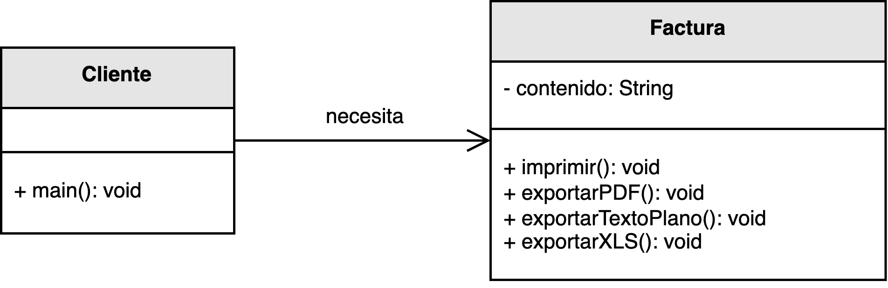
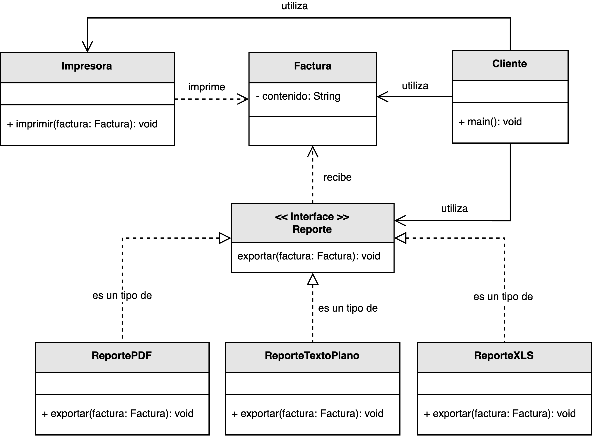

<h1 style="text-align:center;">
  <strong>🧾 Ejemplo práctico: Manipulación de facturas (SRP)</strong>
</h1>

<h2><strong>🧩 Descripción del problema</strong></h2>

Se solicitó a <em>nuestro desarrollador</em> crear un sistema que permita <b>exportar e imprimir facturas</b>.  
Cada factura contiene información sobre el cliente, los productos adquiridos, los precios unitarios, los impuestos y el total a pagar.  
El sistema debe permitir generar reportes en distintos formatos: <b>PDF</b>, <b>texto plano</b> y <b>Excel (XLS)</b>.

En la versión inicial, toda la lógica —desde la creación de la factura hasta la generación del reporte y la impresión— 
fue implementada dentro de una sola clase <code>Factura</code>.  
Si bien el código funcionaba correctamente, este diseño mezclaba múltiples responsabilidades: cálculo, exportación, y presentación.  
Cualquier cambio en un formato de salida obligaba a modificar la misma clase, incrementando el riesgo de errores y 
rompiendo el <b>Principio de Responsabilidad Única (SRP)</b>.

El objetivo es <b>separar las responsabilidades</b> de generación, exportación e impresión en componentes independientes, 
de manera que cada uno cumpla una función clara y pueda evolucionar sin afectar al resto del sistema.

<h2><strong>📂 Estructura del ejemplo y accesos directos</strong></h2>

<table style="width:100%; border-collapse:collapse;">
  <thead>
    <tr style="background:#f5f5f5;">
      <th style="border:1px solid #ddd; padding:8px; text-align:center;">❌ Sin aplicar SRP</th>
      <th style="border:1px solid #ddd; padding:8px; text-align:center;">✅ Aplicando SRP</th>
    </tr>
  </thead>
  <tbody>
    <tr>
      <td style="border:1px solid #ddd; padding:8px;">
        

          En la versión inicial, la clase <code>Factura</code> asume varias responsabilidades: 
          calcular totales, formatear los datos y generar los archivos de salida en distintos formatos.  
          Si se necesita agregar un nuevo formato de exportación (por ejemplo, JSON o XML), 
          se debe modificar directamente esta clase, aumentando el acoplamiento y la posibilidad de errores.
        

        <ul style="margin:0 0 4px 18px;">
          <li>▶️ <a href="./sin_aplicar_principio/Factura.java" target="_blank"><b>Factura.java</b></a></li>
          <li>▶️ <a href="./sin_aplicar_principio/Cliente.java" target="_blank"><b>Cliente.java</b></a></li>
        </ul>
      </td>
      <td style="border:1px solid #ddd; padding:8px;">
        

          En la versión refactorizada, la clase <code>Factura</code> se limita únicamente a representar los datos de la factura.  
          Las tareas de exportación se delegan a una jerarquía de clases dentro del paquete <code>reporte</code>, 
          y la impresión se encapsula en la clase <code>Impresora</code>.  
          De este modo, cada componente tiene una única razón para cambiar, cumpliendo con el principio SRP.
        

        <ul style="margin:0 0 4px 18px;">
          <li>▶️ <a href="./aplicando_principio/reporte/Reporte.java" target="_blank"><b>Reporte.java</b></a></li>
          <li>▶️ <a href="./aplicando_principio/reporte/ReportePDF.java" target="_blank"><b>ReportePDF.java</b></a></li>
          <li>▶️ <a href="./aplicando_principio/reporte/ReporteTextoPlano.java" target="_blank"><b>ReporteTextoPlano.java</b></a></li>
          <li>▶️ <a href="./aplicando_principio/reporte/ReporteXLS.java" target="_blank"><b>ReporteXLS.java</b></a></li>
          <li>▶️ <a href="./aplicando_principio/Factura.java" target="_blank"><b>Factura.java</b></a></li>
          <li>▶️ <a href="./aplicando_principio/Impresora.java" target="_blank"><b>Impresora.java</b></a></li>
          <li>▶️ <a href="./aplicando_principio/Cliente.java" target="_blank"><b>Cliente.java</b></a></li>
        </ul>
      </td>
    </tr>
  </tbody>
</table>

<h2 style="text-align:justify;"><strong>❌ Modelo UML sin aplicar el Principio de Responsabilidad Única</strong></h2>

En el diseño original, la clase <code>Factura</code> combina lógica de negocio y de presentación.  
Se encarga tanto del cálculo de los totales como de la exportación e impresión del reporte.  
Esto genera una dependencia innecesaria entre la estructura interna de la factura y el formato de salida, 
lo que dificulta la evolución del sistema.

  

<b>Figura 1.</b> Diseño incorrecto: múltiples responsabilidades concentradas en una sola clase.

<h2 style="text-align:justify;"><strong>✅ Modelo UML aplicando el Principio de Responsabilidad Única</strong></h2>

En la versión mejorada, la clase <code>Factura</code> solo contiene los datos esenciales del documento, 
mientras que la generación de reportes se gestiona mediante la interfaz <code>Reporte</code> 
y sus implementaciones concretas: <code>ReportePDF</code>, <code>ReporteTextoPlano</code> y <code>ReporteXLS</code>.  
La clase <code>Impresora</code> se encarga exclusivamente de enviar los reportes a impresión.

Gracias a este rediseño, agregar un nuevo formato de exportación no requiere modificar el código existente, 
solo crear una nueva clase que implemente la interfaz <code>Reporte</code>.  
Así, el sistema se vuelve extensible, limpio y mucho más fácil de mantener.

  

<b>Figura 2.</b> Diseño correcto: separación de responsabilidades en clases independientes.

<h2><strong>💡 Conclusión</strong></h2>

El <b>Principio de Responsabilidad Única (SRP)</b> busca reducir el acoplamiento y mejorar la cohesión del sistema, 
asegurando que cada clase tenga una única razón para cambiar.  
En este ejemplo, separar las responsabilidades de generación, exportación e impresión 
permite mantener el código más claro, flexible y preparado para cambios futuros.

La aplicación de SRP resulta esencial en sistemas que deben escalar o soportar múltiples formatos de salida, 
ya que evita el crecimiento descontrolado de clases monolíticas y promueve un diseño orientado a la extensión sin modificación.

