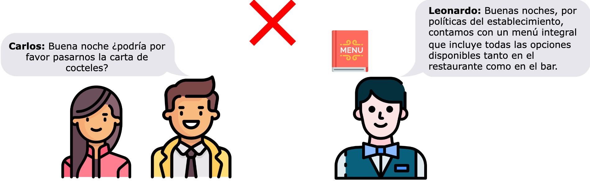
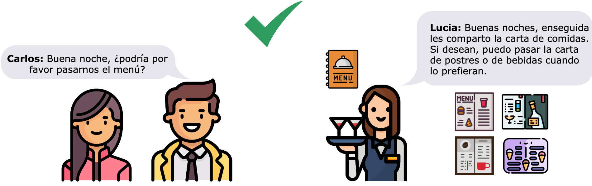

<h1 style="text-align:center;">
  <strong>🧩 I: Interface Segregation Principle (ISP)</strong>
</h1>

<h3 style="text-align:center;">
  <em>"Los clientes no deben estar forzados a depender de métodos que no van a usar."</em>
</h3>

<h2><strong>📘 Descripción general</strong></h2>

El <b>Principio de Segregación de Interfaces (ISP)</b> establece que una clase no debe estar obligada a implementar métodos que no necesita.  
Este principio fomenta la creación de <b>interfaces pequeñas y específicas</b>, en lugar de interfaces grandes y genéricas que obligan a las clases a implementar comportamientos irrelevantes para su propósito.

En esencia, el ISP busca mantener la <b>cohesión</b> y reducir el <b>acoplamiento</b> innecesario.  
Una interfaz debe representar una única abstracción coherente, garantizando que cada clase dependa solo de las operaciones que realmente utiliza.  
De esta forma, el diseño resulta más claro, flexible y menos propenso a errores de mantenimiento.

<h2><strong>🧠 Analogía: la cita en el restaurante</strong></h2>

Imagina que <b>Carlos</b> invitó a <b>Isabel</b> a cenar en un nuevo restaurante/bar.  
Ambos estaban entusiasmados con la cita, pero por compromisos laborales y sociales, decidieron modificar sus planes:  
en lugar de cenar, simplemente tomarían unos cócteles para conversar un rato.

Al llegar, su mesero —<b>Leonardo</b>— les entregó un <b>menú general</b> que incluía absolutamente todo lo que el restaurante ofrecía:  
entradas, platos fuertes, bebidas sin alcohol, cócteles, postres, cafés, etc.  
Aunque ellos solo querían cócteles, tuvieron que revisar toda la carta durante varios minutos para encontrar lo que buscaban.  
Esto es equivalente a una <b>interfaz gigante</b> que obliga a los clientes a conocer y depender de métodos que no necesitan.

  

Un año más tarde, <b>Carlos</b> e <b>Isabel</b> regresaron al mismo restaurante para celebrar su aniversario.  
Esta vez fueron atendidos por <b>Lucía</b>, quien les explicó que el restaurante ahora ofrecía <b>varias cartas específicas</b>:  
una para comidas, otra para postres, y una exclusiva para cócteles.  
Gracias a esta organización, pudieron enfocarse en lo que realmente necesitaban sin distracciones innecesarias.

  

Del mismo modo, en un sistema orientado a objetos, las clases deben poder “pedir de la carta correcta”:  
es decir, implementar únicamente las interfaces que les son útiles.  
Segregar interfaces grandes en varias más pequeñas mejora la modularidad, la flexibilidad y la reutilización del código.

<h2><strong>🔍 Aplicación práctica</strong></h2>

Una interfaz demasiado amplia (también llamada <i>fat interface</i>) genera código frágil y difícil de mantener.  
Las clases que la implementan terminan con métodos vacíos o irrelevantes, violando el principio de cohesión.  
El ISP corrige este problema mediante la <b>división de interfaces grandes en otras más específicas</b>, cada una enfocada en un aspecto concreto del comportamiento.

<ul style="text-align:justify; list-style-type: disc;">
  <li>Una interfaz debe representar una <b>abstracción única y coherente</b>.</li>
  <li>Las clases deben implementar <b>solo las interfaces que realmente utilizan</b>.</li>
  <li>Se deben evitar jerarquías donde una clase herede métodos innecesarios.</li>
  <li>La <b>composición</b> es preferible a la herencia cuando se combinan comportamientos especializados.</li>
</ul>

Por ejemplo, en lugar de definir una interfaz <code>IFigura</code> con métodos como <code>calcularArea()</code>, <code>dibujar()</code> y <code>rotar()</code>,  
es preferible dividirla en <code>IConArea</code>, <code>IDibujable</code> y <code>IRotable</code>, de modo que cada figura implemente solo lo necesario.

<h2><strong>📂 Accesos directos a los ejemplos</strong></h2>

<table style="width:100%; border-collapse:collapse;">
  <thead>
    <tr style="background:#f5f5f5;">
      <th style="border:1px solid #ddd; padding:8px; text-align:center;">Ejemplo</th>
      <th style="border:1px solid #ddd; padding:8px; text-align:center;">Descripción</th>
      <th style="border:1px solid #ddd; padding:8px; text-align:center;">Acceso</th>
    </tr>
  </thead>
  <tbody>
    <tr>
      <td style="border:1px solid #ddd; padding:8px; text-align:center;">
        <b>Ejemplo 1</b> Figuras geométricas
      </td>
      <td style="border:1px solid #ddd; padding:8px; text-align:justify;">
        Presenta una interfaz general <code>IFigura</code> que obliga a todas las clases (cuadrado, círculo, triángulo)
        a implementar operaciones que no siempre tienen sentido.  
        Al aplicar el principio ISP, la interfaz se divide en varias especializadas: <code>IConArea</code>, <code>IConPerimetro</code> y <code>IDibujable</code>,
        permitiendo que cada figura implemente solo los comportamientos que necesita.
      </td>
      <td style="border:1px solid #ddd; padding:8px; text-align:center;">
        📁 <a href="./ejemplo1_figuras_geometricas/README.md" target="_blank"><b>Ir al ejemplo</b></a>
      </td>
    </tr>
    <tr>
      <td style="border:1px solid #ddd; padding:8px; text-align:center;">
        <b>Ejemplo 2</b> Gestión de dispositivos IoT
      </td>
      <td style="border:1px solid #ddd; padding:8px; text-align:justify;">
        Analiza una interfaz monolítica que agrupa todas las operaciones posibles de un dispositivo IoT
        (<code>conectar()</code>, <code>medir()</code>, <code>enviarDatos()</code>, <code>recibirComandos()</code>, <code>actualizarFirmware()</code>).  
        La aplicación del ISP separa estas responsabilidades en interfaces independientes como <code>IConectable</code>,
        <code>ISensor</code>, <code>IActuador</code> e <code>IActualizable</code>, lo que permite a cada tipo de dispositivo
        implementar únicamente las capacidades que realmente soporta.
      </td>
      <td style="border:1px solid #ddd; padding:8px; text-align:center;">
        📁 <a href="./ejemplo2_gestion_iot/README.md" target="_blank"><b>Ir al ejemplo</b></a>
      </td>
    </tr>
  </tbody>
</table>

<h2><strong>💡 Conclusión</strong></h2>

El <b>Principio de Segregación de Interfaces</b> mejora la cohesión del diseño y reduce el acoplamiento innecesario entre clases.  
Aplicarlo permite crear sistemas más modulares, mantenibles y flexibles, donde cada clase implementa solo lo que realmente necesita.  
De esta forma, los cambios o adiciones de funcionalidades no generan efectos colaterales en otras partes del sistema.

En conjunto con el <b>Principio de Responsabilidad Única</b> y el <b>Principio Abierto/Cerrado</b>,  
el ISP contribuye a construir una arquitectura más limpia, desacoplada y adaptable a la evolución del software.

<h2><strong>📚 Referencias</strong></h2>

<ul style="text-align:justify;">
  <li>Martin, R. C. (2003). <i>Agile Software Development: Principles, Patterns, and Practices.</i> Prentice Hall.</li>
  <li>Martin, R. C. (2009). <i>Clean Code: A Handbook of Agile Software Craftsmanship.</i> Prentice Hall.</li>
  <li>Larman, C. (2005). <i>Applying UML and Patterns: An Introduction to Object-Oriented Analysis and Design.</i> Prentice Hall.</li>
</ul>