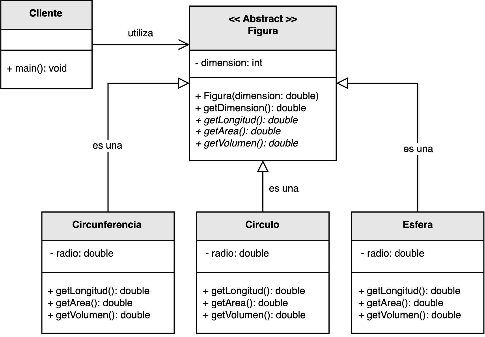
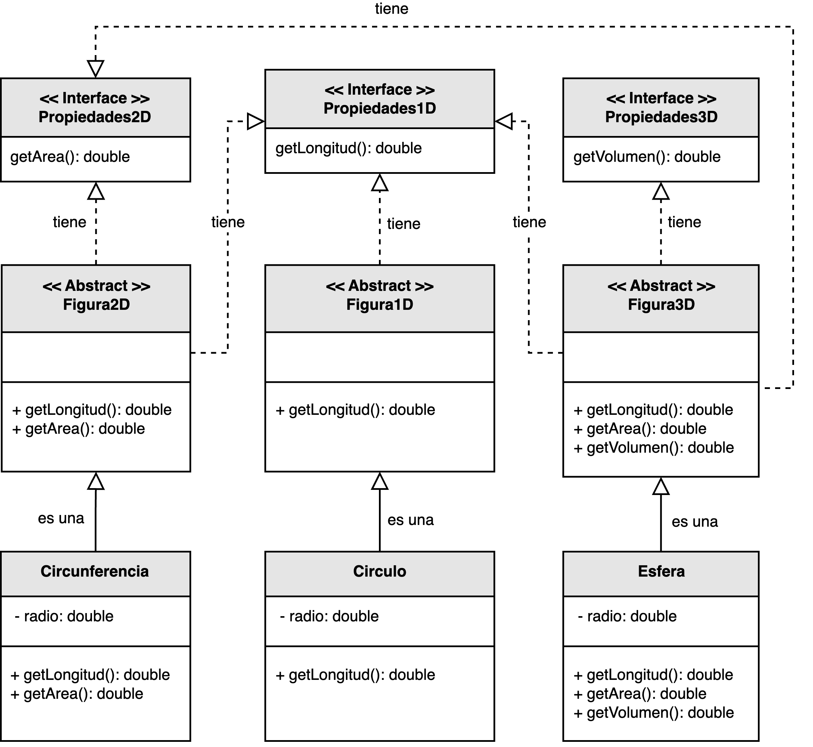

<h1 style="text-align:center;">
  <strong>🧩 Ejemplo abstracto: Figuras geométricas (ISP)</strong>
</h1>

<h2><strong>🧠 Descripción del problema</strong></h2>

Se solicitó a <em>nuestro desarrollador</em> implementar una solución que permita calcular las <b>propiedades geométricas</b> básicas 
de distintas figuras: <b>longitud</b>, <b>área</b> y <b>volumen</b>.  
El sistema debe ser capaz de manejar figuras en una, dos y tres dimensiones, como <code>Circunferencia</code>, <code>Círculo</code> y <code>Esfera</code>.

En el diseño inicial, todas las figuras implementaban una única interfaz <code>Figura</code> que declaraba métodos para las tres propiedades, 
independientemente de si una figura realmente las necesitaba.  
Por ejemplo, una <code>Circunferencia</code> (1D) no requiere calcular área o volumen, 
pero se veía obligada a implementar esos métodos, generando comportamientos vacíos o excepciones.

Este diseño viola el <b>Principio de Segregación de Interfaces (ISP)</b>, que establece que 
<b>ninguna clase debe verse forzada a depender de métodos que no utiliza</b>.  
El reto consiste en separar las responsabilidades en interfaces más pequeñas y específicas para cada tipo de figura, 
respetando sus propiedades reales.

<h2><strong>📂 Estructura del ejemplo y accesos directos</strong></h2>

<table style="width:100%; border-collapse:collapse;">
  <thead>
    <tr style="background:#f5f5f5;">
      <th style="border:1px solid #ddd; padding:8px; text-align:center;">❌ Sin aplicar ISP</th>
      <th style="border:1px solid #ddd; padding:8px; text-align:center;">✅ Aplicando ISP</th>
    </tr>
  </thead>
  <tbody>
    <tr>
      <td style="border:1px solid #ddd; padding:8px;">
        

          En la versión inicial, todas las figuras implementan una interfaz genérica <code>Figura</code> 
          que define métodos para calcular longitud, área y volumen.  
          Este diseño obliga a las figuras 1D (como la <code>Circunferencia</code>) a implementar métodos que no aplican, 
          como <code>calcularArea()</code> o <code>calcularVolumen()</code>, violando el principio de segregación de interfaces.
        

        <ul style="margin:0 0 4px 18px;">
          <li>▶️ <a href="./sin_aplicar_principio/figura/Figura.java" target="_blank"><b>Figura.java</b></a></li>
          <li>▶️ <a href="./sin_aplicar_principio/figura/figuras_concretas/Circunferencia.java" target="_blank"><b>Circunferencia.java</b></a></li>
          <li>▶️ <a href="./sin_aplicar_principio/figura/figuras_concretas/Circulo.java" target="_blank"><b>Circulo.java</b></a></li>
          <li>▶️ <a href="./sin_aplicar_principio/figura/figuras_concretas/Esfera.java" target="_blank"><b>Esfera.java</b></a></li>
          <li>▶️ <a href="./sin_aplicar_principio/Cliente.java" target="_blank"><b>Cliente.java</b></a></li>
        </ul>
      </td>
      <td style="border:1px solid #ddd; padding:8px;">
        

          En la versión refactorizada, se introducen interfaces específicas según el tipo de figura: 
          <code>Propiedades1D</code>, <code>Propiedades2D</code> y <code>Propiedades3D</code>.  
          De este modo, cada clase concreta implementa solo los métodos que realmente necesita, 
          manteniendo la coherencia con su naturaleza geométrica y cumpliendo el principio ISP.
        

        <ul style="margin:0 0 4px 18px;">
          <li>▶️ <a href="./aplicando_principio/figura/propiedades/Propiedades1D.java" target="_blank"><b>Propiedades1D.java</b></a></li>
          <li>▶️ <a href="./aplicando_principio/figura/propiedades/Propiedades2D.java" target="_blank"><b>Propiedades2D.java</b></a></li>
          <li>▶️ <a href="./aplicando_principio/figura/propiedades/Propiedades3D.java" target="_blank"><b>Propiedades3D.java</b></a></li>
          <li>▶️ <a href="./aplicando_principio/figura/figuras_concretas/Circunferencia.java" target="_blank"><b>Circunferencia.java</b></a></li>
          <li>▶️ <a href="./aplicando_principio/figura/figuras_concretas/Circulo.java" target="_blank"><b>Circulo.java</b></a></li>
          <li>▶️ <a href="./aplicando_principio/figura/figuras_concretas/Esfera.java" target="_blank"><b>Esfera.java</b></a></li>
          <li>▶️ <a href="./aplicando_principio/Cliente.java" target="_blank"><b>Cliente.java</b></a></li>
        </ul>
      </td>
    </tr>
  </tbody>
</table>

<h2 style="text-align:justify;"><strong>❌ Modelo UML sin aplicar el Principio de Segregación de Interfaces</strong></h2>

El diseño inicial agrupa todas las operaciones en una única interfaz <code>Figura</code>.  
Este enfoque genera una interfaz demasiado grande (“<em>interface gorda</em>”), que obliga a todas las figuras a conocer métodos 
que no les son relevantes.  
Esto afecta la cohesión y provoca una dependencia innecesaria entre clases.

  

<b>Figura 1.</b> Diseño incorrecto: una interfaz monolítica obliga a implementar métodos no aplicables.

<h2 style="text-align:justify;"><strong>✅ Modelo UML aplicando el Principio de Segregación de Interfaces</strong></h2>

En la versión mejorada, se definen interfaces especializadas que agrupan las propiedades relevantes según la dimensión:  
<code>Propiedades1D</code> para figuras lineales, <code>Propiedades2D</code> para figuras planas y <code>Propiedades3D</code> para figuras volumétricas.  
Cada clase concreta implementa únicamente la interfaz correspondiente, evitando dependencias innecesarias.

Este diseño promueve una <b>alta cohesión</b> y un <b>bajo acoplamiento</b>, 
además de facilitar la extensión del sistema: agregar una nueva figura o propiedad solo requiere definir una nueva interfaz o clase, 
sin modificar las existentes.

  

<b>Figura 2.</b> Diseño correcto: interfaces pequeñas y específicas para cada tipo de figura.

<h2><strong>💡 Conclusión</strong></h2>

El <b>Principio de Segregación de Interfaces (ISP)</b> ayuda a construir sistemas modulares, 
en los que las clases dependen únicamente de las operaciones que realmente necesitan.  
En este ejemplo, separar las propiedades geométricas según su dimensión evita implementar métodos innecesarios y mejora la mantenibilidad.

Gracias a este enfoque, el sistema es más flexible, escalable y coherente con el dominio del problema, 
ya que cada clase se enfoca exclusivamente en las operaciones que le competen, sin cargar responsabilidades ajenas.

