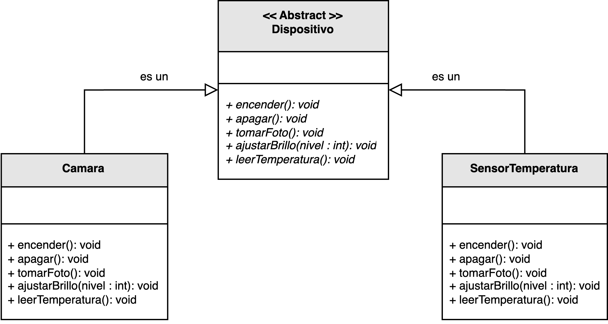
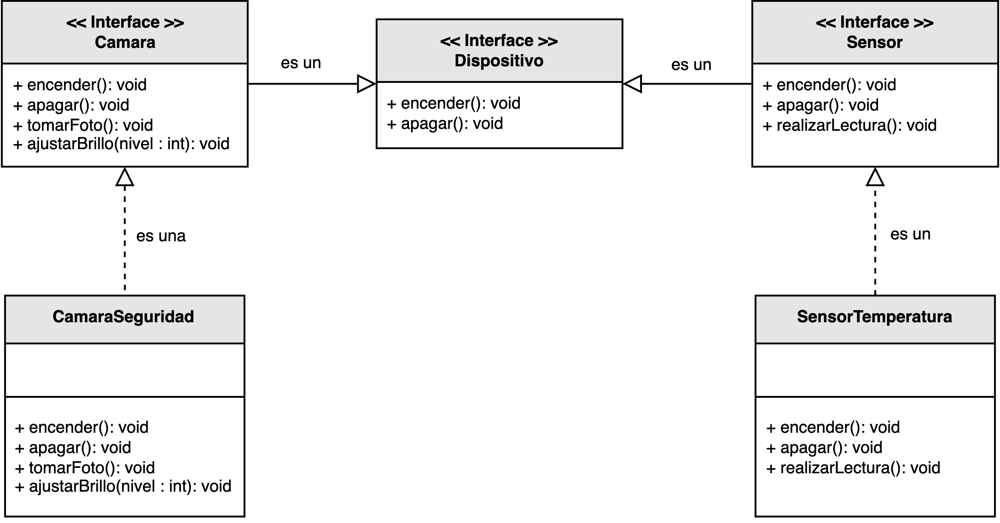

<h1 style="text-align:center;">
  <strong>📡 Ejemplo práctico: Gestión de dispositivos IoT (ISP)</strong>
</h1>

<h2><strong>🧩 Descripción del problema</strong></h2>

Se solicitó a <em>nuestro desarrollador</em> crear un sistema que permita gestionar diferentes <b>dispositivos IoT</b> dentro de una red inteligente, 
como <b>cámaras de seguridad</b> y <b>sensores de temperatura</b>.  
Cada dispositivo posee <b>capacidades específicas</b> (por ejemplo, capturar imágenes o registrar valores ambientales), 
y el sistema debe ofrecer una interfaz común para su administración general (encendido, apagado, reinicio, monitoreo, etc.).

En la primera implementación, se diseñó una única interfaz <code>Dispositivo</code> que incluía métodos para todas las operaciones posibles 
(sensado, grabación, captura de video, transmisión, etc.).  
Este enfoque obligaba a clases como <code>SensorTemperatura</code> a implementar métodos que no aplicaban a su naturaleza, 
como <code>iniciarGrabacion()</code> o <code>detenerTransmision()</code>.  
Esta violación del <b>Principio de Segregación de Interfaces (ISP)</b> hacía el código menos mantenible, 
incrementando el acoplamiento y reduciendo la cohesión.

El objetivo fue refactorizar el diseño dividiendo la interfaz monolítica en varias <b>interfaces más pequeñas y específicas</b>, 
de modo que cada tipo de dispositivo solo implemente las capacidades que realmente necesita.

<h2><strong>📂 Estructura del ejemplo y accesos directos</strong></h2>

<table style="width:100%; border-collapse:collapse;">
  <thead>
    <tr style="background:#f5f5f5;">
      <th style="border:1px solid #ddd; padding:8px; text-align:center;">❌ Sin aplicar ISP</th>
      <th style="border:1px solid #ddd; padding:8px; text-align:center;">✅ Aplicando ISP</th>
    </tr>
  </thead>
  <tbody>
    <tr>
      <td style="border:1px solid #ddd; padding:8px;">
        

          En esta versión, la interfaz <code>Dispositivo</code> define métodos genéricos para cualquier tipo de dispositivo IoT, 
          incluyendo funcionalidades de captura, transmisión y sensado.  
          Esto obliga a las clases <code>CamaraSeguridad</code> y <code>SensorTemperatura</code> 
          a implementar operaciones que no tienen sentido en su contexto, violando el principio ISP.
        

        <ul style="margin:0 0 4px 18px;">
          <li>▶️ <a href="./sin_aplicar_principio/dispositivo/Dispositivo.java" target="_blank"><b>Dispositivo.java</b></a></li>
          <li>▶️ <a href="./sin_aplicar_principio/dispositivo/CamaraSeguridad.java" target="_blank"><b>CamaraSeguridad.java</b></a></li>
          <li>▶️ <a href="./sin_aplicar_principio/dispositivo/SensorTemperatura.java" target="_blank"><b>SensorTemperatura.java</b></a></li>
          <li>▶️ <a href="./sin_aplicar_principio/Cliente.java" target="_blank"><b>Cliente.java</b></a></li>
        </ul>
      </td>
      <td style="border:1px solid #ddd; padding:8px;">
        

          En la versión refactorizada, el diseño se divide en <b>interfaces más específicas</b>: 
          <code>Camara</code>, <code>Sensor</code> y <code>Dispositivo</code>.  
          Cada interfaz define únicamente los métodos relacionados con su propósito funcional, 
          permitiendo que las clases concretas implementen solo las operaciones que realmente utilizan.  
          Así, <code>SensorTemperatura</code> implementa <code>Sensor</code> y <code>Dispositivo</code>, 
          mientras que <code>CamaraSeguridad</code> implementa <code>Camara</code> y <code>Dispositivo</code>.
        

        <ul style="margin:0 0 4px 18px;">
          <li>▶️ <a href="./aplicando_principio/dispositivo/Dispositivo.java" target="_blank"><b>Dispositivo.java</b></a></li>
          <li>▶️ <a href="./aplicando_principio/dispositivo/Camara.java" target="_blank"><b>Camara.java</b></a></li>
          <li>▶️ <a href="./aplicando_principio/dispositivo/Sensor.java" target="_blank"><b>Sensor.java</b></a></li>
          <li>▶️ <a href="./aplicando_principio/dispositivo/dispositivo_concreto/CamaraSeguridad.java" target="_blank"><b>CamaraSeguridad.java</b></a></li>
          <li>▶️ <a href="./aplicando_principio/dispositivo/dispositivo_concreto/SensorTemperatura.java" target="_blank"><b>SensorTemperatura.java</b></a></li>
          <li>▶️ <a href="./aplicando_principio/Cliente.java" target="_blank"><b>Cliente.java</b></a></li>
        </ul>
      </td>
    </tr>
  </tbody>
</table>

<h2 style="text-align:justify;"><strong>❌ Modelo UML sin aplicar el Principio de Segregación de Interfaces</strong></h2>

En el diseño inicial, una sola interfaz <code>Dispositivo</code> agrupaba todas las operaciones posibles, 
desde la captura de video hasta el registro de datos.  
Este enfoque “monolítico” generaba dependencias innecesarias y clases obligadas a implementar métodos vacíos o sin sentido, 
comprometiendo la mantenibilidad del sistema.

  

<b>Figura 1.</b> Diseño incorrecto: una interfaz única fuerza dependencias innecesarias en clases específicas.

<h2 style="text-align:justify;"><strong>✅ Modelo UML aplicando el Principio de Segregación de Interfaces</strong></h2>

En el diseño corregido, las interfaces se dividen según el tipo de dispositivo y sus capacidades reales.  
La interfaz <code>Dispositivo</code> define las operaciones básicas comunes (por ejemplo, encender, apagar, reiniciar),  
mientras que <code>Camara</code> y <code>Sensor</code> definen operaciones especializadas para captura y sensado respectivamente.  
De esta manera, cada clase concreta implementa únicamente las interfaces que necesita.

Este enfoque promueve un diseño <b>cohesivo y flexible</b>, donde cada componente tiene un propósito claro 
y las dependencias entre módulos se reducen al mínimo, cumpliendo con los principios de bajo acoplamiento y alta cohesión.

  

<b>Figura 2.</b> Diseño correcto: las interfaces específicas encapsulan comportamientos particulares.

<h2><strong>💡 Conclusión</strong></h2>

El <b>Principio de Segregación de Interfaces (ISP)</b> permite crear sistemas más adaptables y modulares al evitar interfaces excesivamente grandes o genéricas.  
En este ejemplo, la separación de responsabilidades entre <code>Camara</code>, <code>Sensor</code> y <code>Dispositivo</code> 
permite agregar nuevos tipos de dispositivos sin alterar los existentes, mejorando la extensibilidad y la mantenibilidad del sistema.

Gracias a la correcta aplicación de ISP, el diseño se vuelve más expresivo, 
reduciendo la cantidad de dependencias innecesarias y garantizando que cada clase conozca solo las operaciones que realmente necesita implementar.

