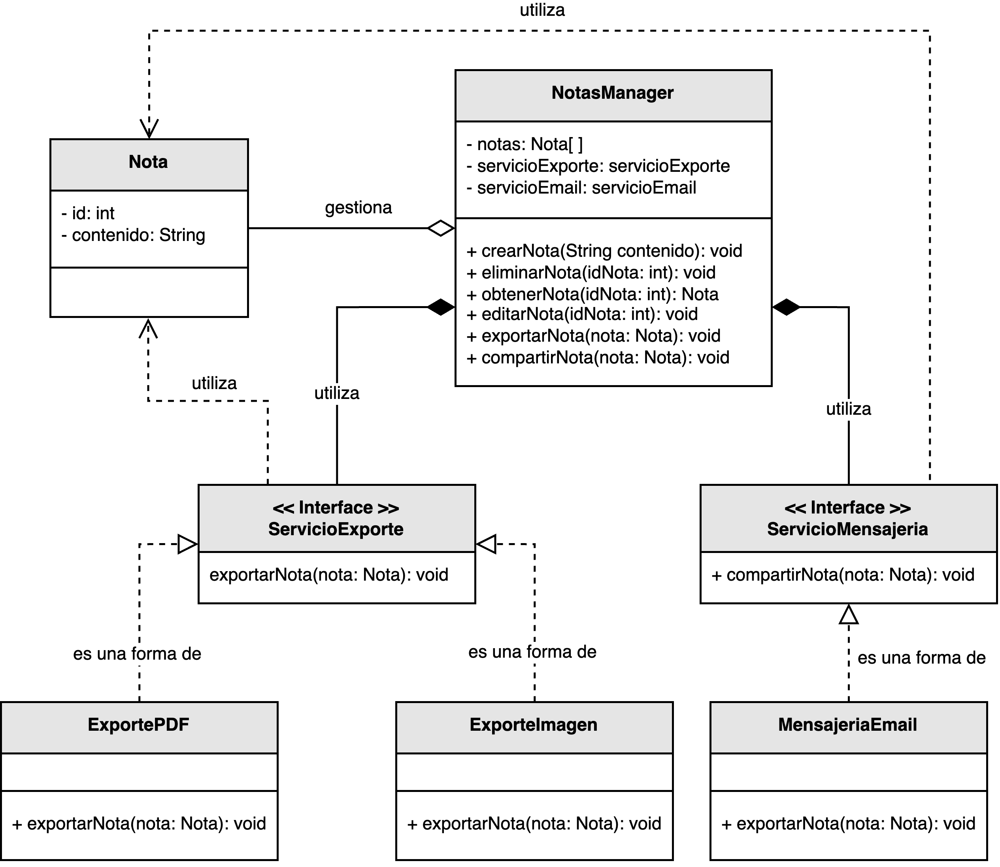
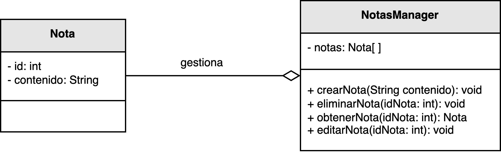

<h1 style="text-align:center;">
  <strong>🗒️ Ejemplo: Sistema de gestión de notas (Principio YAGNI)</strong>
</h1>

<h2><strong>📘 Descripción del problema</strong></h2>

Un cliente contrató a <em>nuestro desarrollador</em> para implementar un módulo que permita realizar operaciones básicas sobre las notas: <b>crear</b>, <b>editar</b> y <b>eliminar</b>.  
Sin embargo, durante el desarrollo, el programador decidió anticiparse a posibles requerimientos futuros, añadiendo funcionalidades que <b>no fueron solicitadas</b> como exportar las notas a PDF o imagen, y enviar notificaciones por correo.

Esta situación sirve para ilustrar el principio <b>YAGNI</b> (<i>You Aren’t Gonna Need It</i>), que establece que <b>no se deben implementar características hasta que sean realmente necesarias</b>.  
Agregar funcionalidad innecesaria aumenta la complejidad del sistema, el acoplamiento entre módulos y el esfuerzo de mantenimiento, sin aportar valor real al producto.

<h2><strong>📂 Estructura del ejemplo y accesos directos</strong></h2>

<table style="width:100%; border-collapse:collapse;">
  <thead>
    <tr style="background:#f5f5f5;">
      <th style="border:1px solid #ddd; padding:8px; text-align:center;">❌ Sin aplicar YAGNI</th>
      <th style="border:1px solid #ddd; padding:8px; text-align:center;">✅ Aplicando YAGNI</th>
    </tr>
  </thead>
  <tbody>
    <tr>
      <td style="border:1px solid #ddd; padding:8px;">
        

          Se implementaron módulos adicionales de exportación y mensajería sin que el cliente los solicitara, generando un código más extenso y difícil de mantener.
        

        <ul style="margin:0 0 4px 18px;">
          <li>▶️ <a href="./sin_aplicar_principio/Nota.java" target="_blank"><b>Nota</b></a></li>
          <li>▶️ <a href="./sin_aplicar_principio/NotasManager.java" target="_blank"><b>NotasManager</b></a></li>
          <li>▶️ <a href="./sin_aplicar_principio/exporte/ServicioExporte.java" target="_blank"><b>ServicioExporte</b></a></li>
          <li>▶️ <a href="./sin_aplicar_principio/exporte/ExportePDF.java" target="_blank"><b>ExportePDF</b></a></li>
          <li>▶️ <a href="./sin_aplicar_principio/exporte/ExporteImagen.java" target="_blank"><b>ExporteImagen</b></a></li>
          <li>▶️ <a href="./sin_aplicar_principio/mensajeria/ServicioMensajeria.java" target="_blank"><b>ServicioMensajeria</b></a></li>
          <li>▶️ <a href="./sin_aplicar_principio/mensajeria/MensajeriaEmail.java" target="_blank"><b>MensajeriaEmail</b></a></li>
        </ul>
      </td>
      <td style="border:1px solid #ddd; padding:8px;">
        

          Se implementan exclusivamente las operaciones necesarias para gestionar las notas, eliminando dependencias innecesarias y manteniendo un diseño simple y funcional.
        

        <ul style="margin:0 0 4px 18px;">
          <li>▶️ <a href="./aplicando_principio/Nota.java" target="_blank"><b>Nota</b></a></li>
          <li>▶️ <a href="./aplicando_principio/NotasManager.java" target="_blank"><b>NotasManager</b></a></li>
        </ul>
      </td>
    </tr>
  </tbody>
</table>

<h2 style="text-align:justify;"><strong>❌ Modelo UML sin aplicar el Principio YAGNI</strong></h2>

En esta versión, el desarrollador añadió módulos para exportar las notas a distintos formatos y enviarlas por correo electrónico.  
Aunque estas características podrían ser útiles en el futuro, actualmente no son necesarias.  
El resultado es un sistema más complejo, con dependencias adicionales y un mantenimiento más costoso.

  

  <b>Figura 1.</b> Modelo sin aplicar el principio YAGNI: funcionalidades innecesarias aumentan la complejidad del sistema.

<h2 style="text-align:justify;"><strong>✅ Modelo UML aplicando el Principio YAGNI</strong></h2>

La versión corregida se centra únicamente en el requerimiento real: la gestión básica de notas.  
Se eliminan los módulos de exportación y mensajería, reduciendo el acoplamiento y simplificando el mantenimiento.  
Si en el futuro el cliente solicita esas características, se podrán agregar sin afectar el código actual.

  

  <b>Figura 2.</b> Modelo aplicando YAGNI: se implementa únicamente lo solicitado, manteniendo un diseño limpio y extensible.

<h2><strong>💡 Conclusión</strong></h2>

El principio <b>YAGNI</b> ayuda a mantener el código simple, enfocado y libre de complejidad innecesaria.  
Evitar implementar funcionalidades no requeridas reduce el riesgo de errores, mejora la mantenibilidad y permite concentrar el esfuerzo en lo que realmente agrega valor al cliente.  
Aplicar YAGNI no significa descuidar la extensibilidad, sino <b>diferir las decisiones de diseño</b> hasta que la necesidad sea real y comprobada.

<h2><strong>📚 Referencias</strong></h2>

<ul style="text-align:justify;">
  <li>Beck, K. (2003). <i>Test Driven Development: By Example.</i> Addison-Wesley.</li>
  <li>Fowler, M. (2004). <i>Refactoring: Improving the Design of Existing Code.</i> Addison-Wesley.</li>
  <li>Martin, R. C. (2009). <i>Clean Code: A Handbook of Agile Software Craftsmanship.</i> Prentice Hall.</li>
</ul>