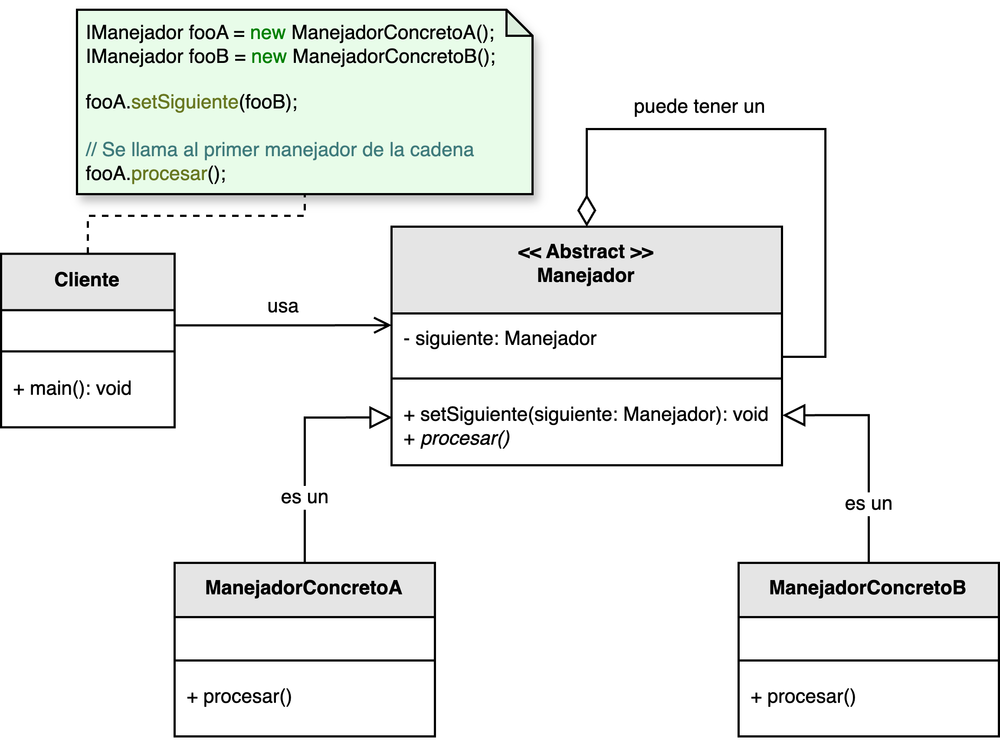

<h1 style="text-align:center;">
  <strong>🔗 Patrón Chain of Responsibility</strong><br>
  <strong>(Cadena de Responsabilidad)</strong>
</h1>

<h4 style="text-align:center;"><em>“Permite que una solicitud recorra una cadena de manejadores hasta que uno de ellos
la procese.”</em></h4>

<p style="text-align:justify;">
El <b>patrón Chain of Responsibility</b> pertenece al grupo de <b>patrones de comportamiento</b> y tiene como propósito <b>desacoplar el emisor de una solicitud del receptor</b>.  
Cada manejador (handler) en la cadena decide si procesa la petición o la reenvía al siguiente manejador.  
De este modo, el flujo de responsabilidad se distribuye de forma flexible y extensible, favoreciendo la cohesión y reduciendo el acoplamiento.
</p>

<hr/>

<h2><strong>🧭 Motivación</strong></h2>
<p style="text-align:justify;">
En muchos sistemas, una petición puede requerir pasar por varias etapas o verificaciones antes de ser procesada.  
Por ejemplo, una solicitud de pago puede necesitar validaciones de autenticación, saldo, límites y auditoría antes de aprobarse.  
En lugar de escribir una secuencia rígida de condiciones, el patrón <b>Chain of Responsibility</b> permite que cada paso sea manejado por un objeto independiente, organizado en una <b>cadena dinámica</b> de responsabilidades.
</p>

<p style="text-align:justify;">
Este patrón sigue el principio de <i>“no acoplar directamente el emisor con el receptor”</i>.  
Cada manejador se enfoca en una sola tarea, y la estructura de la cadena puede modificarse sin alterar la lógica de los demás componentes.
</p>

<hr/>

<h2><strong>🧩 Estructura del patrón</strong></h2>

<p style="text-align:justify;">
La clase <b>Manejador</b> define una interfaz común para procesar solicitudes y mantener una referencia al siguiente manejador en la cadena.  
Cada <b>ManejadorConcreto</b> decide si puede manejar la petición o, en caso contrario, la reenvía al siguiente.
</p>

<p style="text-align:center;">
  
</p>
<p style="text-align:center;"><b>Figura 1.</b> Diagrama UML del patrón <i>Chain of Responsibility</i>.</p>

<hr/>

<h2><strong>👥 Participantes</strong></h2>

<table>
  <thead>
    <tr>
      <th style="text-align:center;">Elemento</th>
      <th style="text-align:justify;">Descripción</th>
    </tr>
  </thead>
  <tbody>
    <tr>
      <td style="text-align:center;"><b>Manejador</b></td>
      <td style="text-align:justify;">Define la interfaz para manejar una solicitud y establece una referencia al siguiente manejador de la cadena.</td>
    </tr>
    <tr>
      <td style="text-align:center;"><b>ManejadorConcreto</b></td>
      <td style="text-align:justify;">Implementa la lógica para procesar una solicitud específica o reenviarla al siguiente manejador si no puede manejarla.</td>
    </tr>
    <tr>
      <td style="text-align:center;"><b>Cliente</b></td>
      <td style="text-align:justify;">Crea la cadena de manejadores y envía las solicitudes iniciales.</td>
    </tr>
  </tbody>
</table>

<hr/>

<h2><strong>⚙️ Implementación básica en Java</strong></h2>

```java
// Clase base del manejador
abstract class Manejador {
    protected Manejador siguiente;

    public void establecerSiguiente(Manejador manejador) {
        this.siguiente = manejador;
    }

    public void manejarPeticion(String tipo) {
        if (siguiente != null) {
            siguiente.manejarPeticion(tipo);
        }
    }
}

// Manejadores concretos
class ManejadorAutenticacion extends Manejador {
    public void manejarPeticion(String tipo) {
        if (tipo.equals("AUTENTICACION")) {
            System.out.println("✔ Autenticación completada");
        } else {
            super.manejarPeticion(tipo);
        }
    }
}

class ManejadorValidacion extends Manejador {
    public void manejarPeticion(String tipo) {
        if (tipo.equals("VALIDACION")) {
            System.out.println("✔ Validación de datos correcta");
        } else {
            super.manejarPeticion(tipo);
        }
    }
}

class ManejadorAutorizacion extends Manejador {
    public void manejarPeticion(String tipo) {
        if (tipo.equals("AUTORIZACION")) {
            System.out.println("✔ Autorización concedida");
        } else {
            super.manejarPeticion(tipo);
        }
    }
}

// Cliente
public class Main {
    public static void main(String[] args) {
        Manejador autenticacion = new ManejadorAutenticacion();
        Manejador validacion = new ManejadorValidacion();
        Manejador autorizacion = new ManejadorAutorizacion();

        autenticacion.establecerSiguiente(validacion);
        validacion.establecerSiguiente(autorizacion);

        autenticacion.manejarPeticion("VALIDACION");
        autenticacion.manejarPeticion("AUTORIZACION");
    }
}
```

<hr/>

<h2><strong>🌟 Ventajas</strong></h2>

<ul style="text-align:justify;">
  <li><b>Desacoplamiento:</b> el emisor de la solicitud no necesita conocer qué objeto la procesará.</li>
  <li><b>Flexibilidad:</b> la cadena puede modificarse en tiempo de ejecución agregando o reordenando manejadores.</li>
  <li><b>Cohesión:</b> cada manejador cumple una única función, mejorando la legibilidad y el mantenimiento.</li>
  <li><b>Extensibilidad:</b> nuevos manejadores pueden incorporarse sin modificar la estructura existente.</li>
</ul>

<hr/>

<h2><strong>⚠️ Desventajas</strong></h2>

<ul style="text-align:justify;">
  <li><b>Solicitud no garantizada:</b> una petición puede quedar sin ser procesada si ningún manejador la reconoce.</li>
  <li><b>Dificultad de trazabilidad:</b> puede ser complicado seguir el flujo de una solicitud en cadenas largas.</li>
  <li><b>Posible impacto en rendimiento:</b> si hay muchos manejadores, la solicitud puede recorrer una cadena extensa antes de resolverse.</li>
</ul>

<hr/>

<h2><strong>🧮 Escenarios de aplicación</strong></h2>

<table>
  <thead>
    <tr>
      <th style="text-align:center;">💼 Contexto</th>
      <th style="text-align:justify;">📘 Aplicación del patrón</th>
    </tr>
  </thead>
  <tbody>
    <tr>
      <td style="text-align:center;"><b>Procesamiento de eventos</b></td>
      <td style="text-align:justify;">Permite manejar eventos de interfaz gráfica (clics, teclas, gestos) asignando un manejador a cada componente visual.</td>
    </tr>
    <tr>
      <td style="text-align:center;"><b>Autenticación y autorización</b></td>
      <td style="text-align:justify;">Define pasos encadenados para autenticar usuarios, verificar roles y validar permisos.</td>
    </tr>
    <tr>
      <td style="text-align:center;"><b>Middleware HTTP</b></td>
      <td style="text-align:justify;">Cada manejador puede procesar encabezados, registrar logs, autenticar o responder solicitudes antes de alcanzar el destino.</td>
    </tr>
    <tr>
      <td style="text-align:center;"><b>Flujos de validación</b></td>
      <td style="text-align:justify;">Ideal para procesos con múltiples validaciones encadenadas (formularios, transacciones, auditorías).</td>
    </tr>
  </tbody>
</table>

<hr/>

<h2><strong>📎 Referencia</strong></h2>

<p style="text-align: justify;">
Este material corresponde al patrón <b>Chain of Responsibility (Cadena de Responsabilidad)</b> descrito en el libro  
<i><b>Notas a mano sobre análisis orientado a objetos y patrones de diseño</b></i> (Orozco, 2025).
</p>