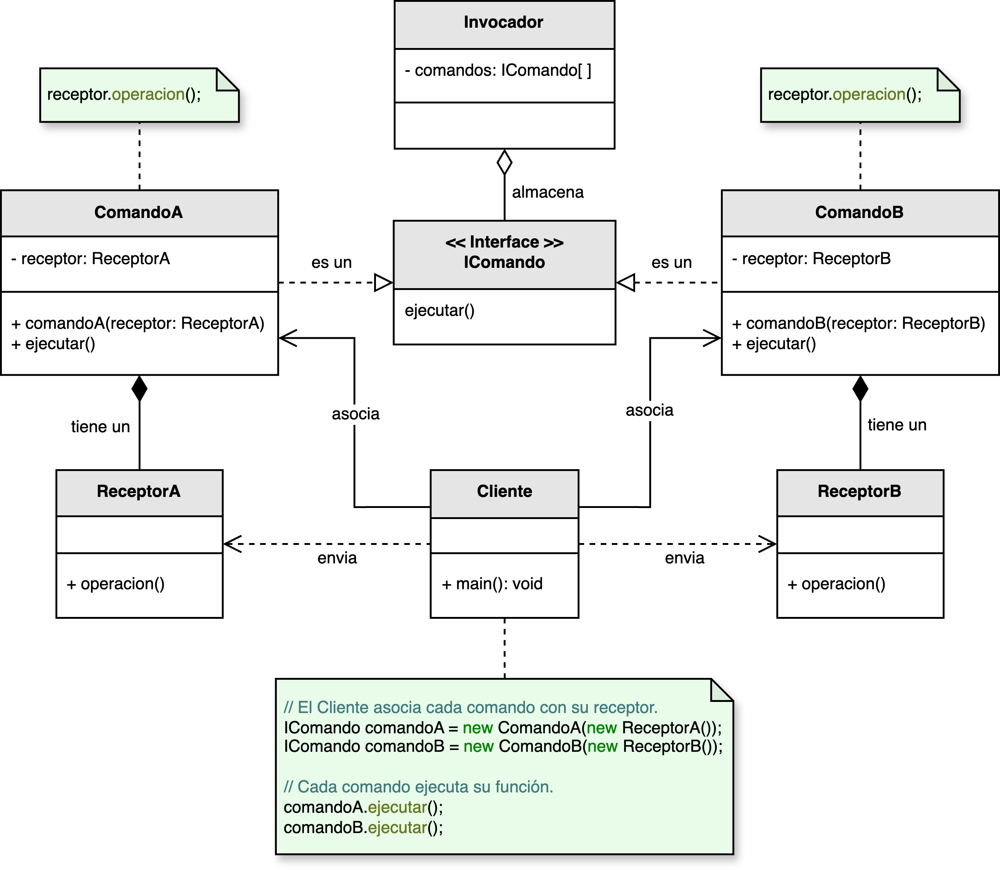
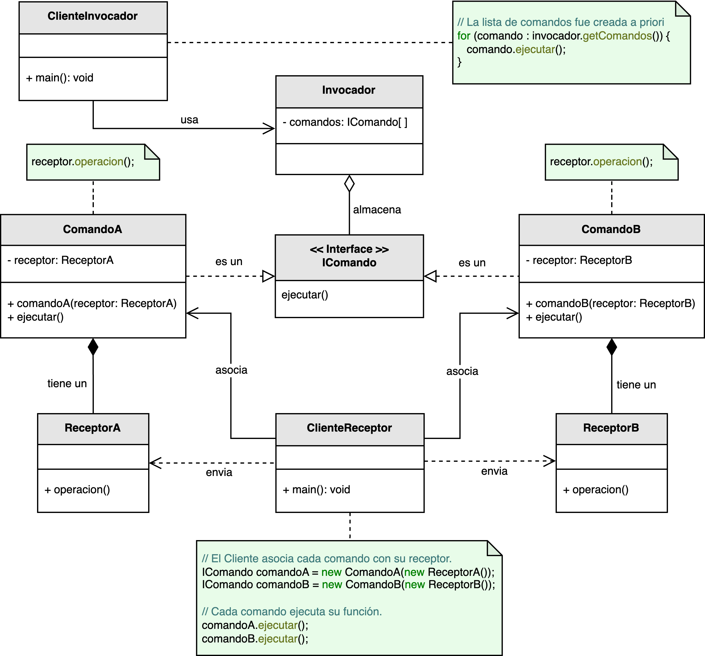

<h1 style="text-align:center;">
  <strong>⚙️ Patrón Command (Comando)</strong>
</h1>

<h4 style="text-align:center;"><em>“Encapsula una solicitud como un objeto, permitiendo parametrizar clientes con diferentes solicitudes, encolar operaciones y soportar deshacer/rehacer.”</em></h4>

<p style="text-align:justify;">
El <b>patrón Command</b> pertenece a los <b>patrones de comportamiento</b> y tiene como objetivo <b>encapsular una acción o solicitud dentro de un objeto comando</b>.  
Esto permite <b>desacoplar el emisor</b> de una solicitud (<i>invocador</i>) del objeto que realmente la ejecuta (<i>receptor</i>), brindando flexibilidad, extensibilidad y control sobre las operaciones que se ejecutan.
</p>

<hr/>

<h2><strong>🧭 Motivación</strong></h2>

<p style="text-align:justify;">
Para entender el patrón, puede imaginarse una universidad que define distintos procedimientos administrativos: homologación de materias, cancelación de cursos, exención de requisitos, etc.  
El estudiante solo emite la solicitud (comando), sin preocuparse por quién la procesará o cómo se llevará a cabo.  
Cada solicitud sigue un protocolo específico gestionado por los departamentos correspondientes, pero el estudiante solo necesita ejecutar el comando: <i>“Cancelar curso X”</i>.  
De este modo, la universidad puede modificar los procesos internos sin que el estudiante lo perciba.
</p>

<p style="text-align:justify;">
El patrón <b>Command</b> sigue exactamente esta filosofía: un <b>invocador</b> ejecuta una solicitud, pero la lógica de la operación (qué se hace y quién lo hace) está oculta dentro del comando y su <b>receptor</b>.  
Además, los comandos pueden <b>almacenarse, deshacerse o ejecutarse secuencialmente</b>, permitiendo mayor control y extensibilidad.
</p>

<hr/>

<h2><strong>🧩 Estructura del patrón</strong></h2>

<p style="text-align:justify;">
El modelo propuesto por el GoF define un <b>Invocador</b> que mantiene una colección de comandos que puede ejecutar, un <b>Cliente</b> que configura los comandos y un <b>Receptor</b> que realiza las operaciones reales.  
En este libro se adopta una versión extendida que diferencia entre el <b>ClienteReceptor</b> (quien asocia el comando con el receptor) y el <b>ClienteInvocador</b> (quien ejecuta los comandos).
</p>

<p style="text-align:center;">
  
</p>

<p style="text-align:justify;">
En la versión ajustada, el <b>ClienteReceptor</b> define qué receptor corresponde a cada comando, el <b>Invocador</b> contiene los comandos disponibles, y el <b>ClienteInvocador</b> los ejecuta bajo demanda.  
Esta separación conceptual mejora la comprensión y reduce el acoplamiento entre las partes.
</p>

<p style="text-align:center;">
  
</p>
<p style="text-align:center;"><b>Figura 1.</b> Diagrama UML del patrón <i>Command</i> con ajuste conceptual.</p>

<hr/>

<h2><strong>👥 Participantes</strong></h2>

<table>
  <thead>
    <tr>
      <th style="text-align:center;">Elemento</th>
      <th style="text-align:justify;">Descripción</th>
    </tr>
  </thead>
  <tbody>
    <tr>
      <td style="text-align:center;"><b>Invocador</b></td>
      <td style="text-align:justify;">Contiene una colección de comandos disponibles y ofrece una interfaz para su ejecución.</td>
    </tr>
    <tr>
      <td style="text-align:center;"><b>IComando</b></td>
      <td style="text-align:justify;">Interfaz que define la operación <code>ejecutar()</code> que todos los comandos concretos deben implementar.</td>
    </tr>
    <tr>
      <td style="text-align:center;"><b>ComandoConcreto</b></td>
      <td style="text-align:justify;">Implementa la acción específica a ejecutar e invoca las operaciones correspondientes en el receptor.</td>
    </tr>
    <tr>
      <td style="text-align:center;"><b>Receptor</b></td>
      <td style="text-align:justify;">Realiza las acciones concretas asociadas al comando. Es el componente que conoce la lógica de negocio.</td>
    </tr>
    <tr>
      <td style="text-align:center;"><b>ClienteReceptor</b></td>
      <td style="text-align:justify;">Configura las asociaciones entre los comandos y sus receptores.</td>
    </tr>
    <tr>
      <td style="text-align:center;"><b>ClienteInvocador</b></td>
      <td style="text-align:justify;">Ejecuta comandos definidos en el invocador, sin conocer su implementación interna.</td>
    </tr>
  </tbody>
</table>

<hr/>

<h2><strong>⚙️ Implementación básica en Java</strong></h2>

```java
// Interfaz de comando
interface Comando {
    void ejecutar();
}

// Receptor
class Receptor {
    public void accion() {
        System.out.println("Ejecutando acción en el receptor...");
    }
}

// Comando concreto
class ComandoConcreto implements Comando {
    private Receptor receptor;

    public ComandoConcreto(Receptor receptor) {
        this.receptor = receptor;
    }

    public void ejecutar() {
        receptor.accion();
    }
}

// Invocador
class Invocador {
    private Comando comando;

    public void establecerComando(Comando comando) {
        this.comando = comando;
    }

    public void ejecutarComando() {
        comando.ejecutar();
    }
}

// Cliente
public class Main {
    public static void main(String[] args) {
        Receptor receptor = new Receptor();
        Comando comando = new ComandoConcreto(receptor);
        Invocador invocador = new Invocador();

        invocador.establecerComando(comando);
        invocador.ejecutarComando();
    }
}
```

<hr/>

<h2><strong>🌟 Ventajas</strong></h2>

<ul style="text-align:justify;">
  <li><b>Desacoplamiento:</b> el invocador no necesita conocer los detalles de cómo se ejecuta una solicitud.</li>
  <li><b>Reutilización:</b> los comandos pueden combinarse, almacenarse o ejecutarse en diferentes contextos.</li>
  <li><b>Soporte para deshacer/rehacer:</b> al mantener un historial de comandos, se pueden revertir o repetir acciones.</li>
  <li><b>Ejecutar comandos diferidos:</b> permite programar tareas o colocarlas en colas para su ejecución posterior.</li>
  <li><b>Composición:</b> facilita crear comandos compuestos que agrupan varias acciones en una sola operación.</li>
</ul>

<hr/>

<h2><strong>⚠️ Desventajas</strong></h2>

<ul style="text-align:justify;">
  <li><b>Complejidad adicional:</b> en sistemas simples puede resultar excesivo usar múltiples clases para cada comando.</li>
  <li><b>Aumento de clases:</b> cada nueva acción requiere un nuevo comando concreto, lo que incrementa el mantenimiento.</li>
  <li><b>Gestión de historial:</b> si se implementa deshacer/rehacer, es necesario administrar un registro de comandos ejecutados.</li>
</ul>

<hr/>

<h2><strong>🧮 Escenarios de aplicación</strong></h2>

<table>
  <thead>
    <tr>
      <th style="text-align:center;">💼 Contexto</th>
      <th style="text-align:justify;">📘 Aplicación del patrón</th>
    </tr>
  </thead>
  <tbody>
    <tr>
      <td style="text-align:center;"><b>Interfaces de usuario (UI)</b></td>
      <td style="text-align:justify;">Cada acción del usuario (clics, atajos, menús) puede mapearse a un comando independiente.</td>
    </tr>
    <tr>
      <td style="text-align:center;"><b>Deshacer / Rehacer</b></td>
      <td style="text-align:justify;">Los comandos almacenan el estado anterior y pueden revertirse fácilmente.</td>
    </tr>
    <tr>
      <td style="text-align:center;"><b>Colas de ejecución</b></td>
      <td style="text-align:justify;">Permite programar tareas para ejecutarse en diferido o en entornos distribuidos.</td>
    </tr>
    <tr>
      <td style="text-align:center;"><b>Transacciones</b></td>
      <td style="text-align:justify;">Facilita agrupar operaciones en comandos que se ejecutan o deshacen en bloque.</td>
    </tr>
  </tbody>
</table>

<hr/>

<h2><strong>📎 Referencia</strong></h2>

<p style="text-align:justify;">
Este material corresponde al patrón <b>Command (Comando)</b> descrito en el libro  
<i><b>Notas a mano sobre análisis orientado a objetos y patrones de diseño</b></i> (Orozco, 2025).
</p>