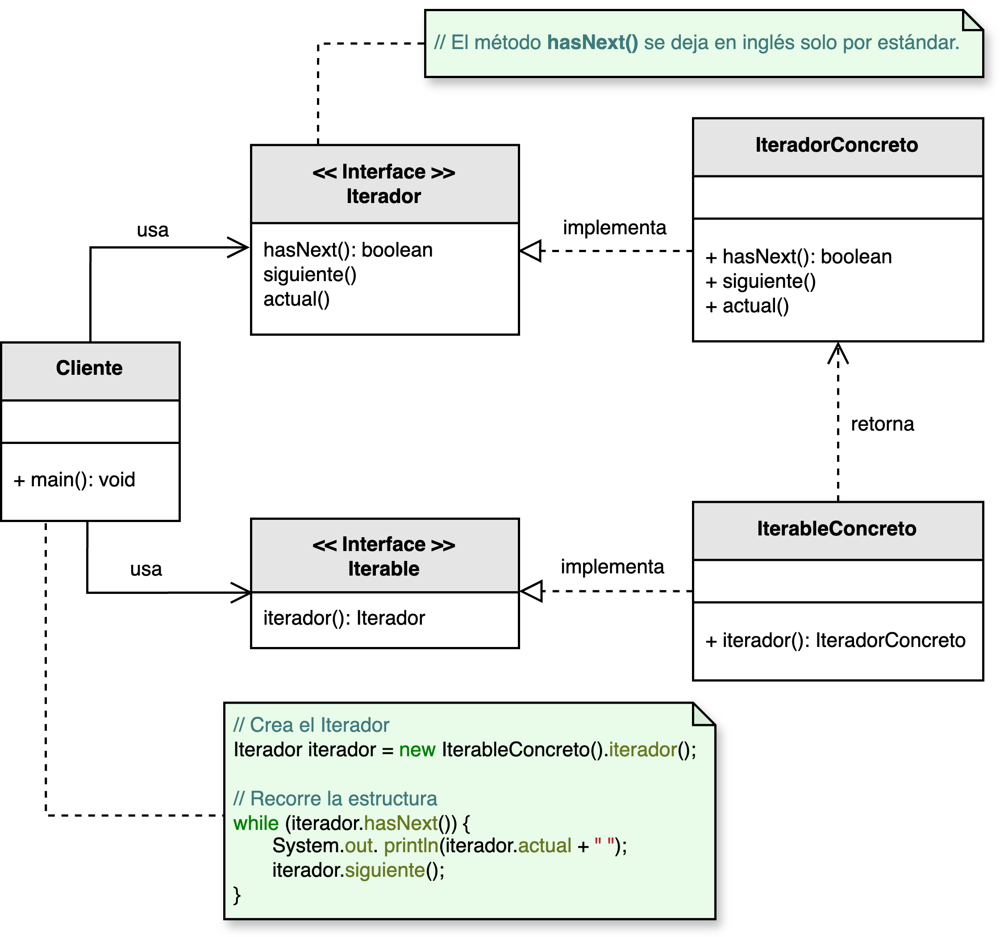

<h1 style="text-align:center;">
  <strong>🔁 Patrón Iterator (Iterador)</strong>
</h1>

<h4 style="text-align:center;"><em>“Proporciona un mecanismo para recorrer secuencialmente los elementos de una
colección sin exponer su estructura interna.”</em></h4>

<p style="text-align:justify;">
El <b>patrón Iterator</b> pertenece al grupo de <b>patrones de comportamiento</b> y su propósito es <b>abstraer el proceso de recorrido</b> de una colección de objetos, permitiendo acceder a sus elementos de forma secuencial sin conocer su estructura interna.  
De este modo, una colección puede cambiar su implementación sin afectar la forma en que los clientes recorren sus elementos.
</p>

<hr/>

<h2><strong>🧭 Motivación</strong></h2>

<p style="text-align:justify;">
El patrón <b>Iterator</b> encapsula la lógica de iteración en un objeto separado, denominado <b>Iterador</b>.  
Esto resulta útil porque existen múltiples tipos de estructuras de datos —listas, colas, árboles, mapas, etc.— y cada una tiene su propia forma de recorrer sus elementos.  
El <b>Iterador</b> permite tratar todas estas colecciones de manera uniforme.
</p>

<p style="text-align:justify;">
Además, el patrón se extiende más allá de las colecciones clásicas: cualquier objeto que pueda ser representado como una secuencia (por ejemplo, un flujo de datos, una colección de archivos o una lista de tareas) puede beneficiarse de este enfoque.
</p>

<p style="text-align:center;">
  
</p>
<p style="text-align:center;"><b>Figura 1.</b> Diagrama UML del patrón <i>Iterator</i>.</p>

<hr/>

<h2><strong>🧩 Estructura del patrón</strong></h2>

<p style="text-align:justify;">
La interfaz <b>Iterable</b> define el contrato para devolver un iterador, mientras que el <b>IteradorConcreto</b> implementa las operaciones necesarias para recorrer los elementos del <b>IterableConcreto</b>.  
Algunos autores usan el término <i>Agregado</i> para referirse al objeto iterable, pero en este libro se prefiere el término <b>Iterable</b> por ser más natural: una colección “es” iterable.
</p>

<hr/>

<h2><strong>👥 Participantes</strong></h2>

<table>
  <thead>
    <tr>
      <th style="text-align:center;">Elemento</th>
      <th style="text-align:justify;">Descripción</th>
    </tr>
  </thead>
  <tbody>
    <tr>
      <td style="text-align:center;"><b>Iterador</b></td>
      <td style="text-align:justify;">Define las operaciones para recorrer secuencialmente una colección, como <code>hasNext()</code> y <code>next()</code>.</td>
    </tr>
    <tr>
      <td style="text-align:center;"><b>IteradorConcreto</b></td>
      <td style="text-align:justify;">Implementa el comportamiento de recorrido sobre una estructura de datos específica.</td>
    </tr>
    <tr>
      <td style="text-align:center;"><b>Iterable</b></td>
      <td style="text-align:justify;">Interfaz que declara el método para obtener un iterador asociado a la colección.</td>
    </tr>
    <tr>
      <td style="text-align:center;"><b>IterableConcreto</b></td>
      <td style="text-align:justify;">Clase que implementa la interfaz <b>Iterable</b> y devuelve un iterador concreto para recorrer sus elementos.</td>
    </tr>
  </tbody>
</table>

<hr/>

<h2><strong>⚙️ Implementación básica en Java</strong></h2>

```java
// Interfaz del iterador
interface Iterador<T> {
    boolean hasNext();

    T next();
}

// Interfaz iterable
interface IterableColeccion<T> {
    Iterador<T> crearIterador();
}

// Implementación concreta del iterador
class IteradorLista<T> implements Iterador<T> {
    private List<T> lista;
    private int indice = 0;

    public IteradorLista(List<T> lista) {
        this.lista = lista;
    }

    public boolean hasNext() {
        return indice < lista.size();
    }

    public T next() {
        return lista.get(indice++);
    }
}

// Colección concreta
class ColeccionLista<T> implements IterableColeccion<T> {
    private List<T> elementos = new ArrayList<>();

    public void agregar(T elemento) {
        elementos.add(elemento);
    }

    public Iterador<T> crearIterador() {
        return new IteradorLista<>(elementos);
    }
}

// Cliente
public class Main {
    public static void main(String[] args) {
        ColeccionLista<String> coleccion = new ColeccionLista<>();
        coleccion.agregar("A");
        coleccion.agregar("B");
        coleccion.agregar("C");

        Iterador<String> iterador = coleccion.crearIterador();
        while (iterador.hasNext()) {
            System.out.println(iterador.next());
        }
    }
}
```

<hr/>

<h2><strong>🌟 Ventajas</strong></h2>

<ul style="text-align:justify;">
  <li><b>Encapsulamiento:</b> permite recorrer una colección sin exponer su estructura interna.</li>
  <li><b>Uniformidad:</b> proporciona una interfaz común para recorrer distintas estructuras de datos.</li>
  <li><b>Extensibilidad:</b> permite definir diferentes estrategias de recorrido (ascendente, descendente, filtrado, etc.) sin modificar la colección.</li>
  <li><b>Seguridad en concurrencia:</b> cada iterador mantiene su propio estado, permitiendo recorridos simultáneos independientes.</li>
</ul>

<hr/>

<h2><strong>⚠️ Desventajas</strong></h2>

<ul style="text-align:justify;">
  <li><b>Complejidad adicional:</b> puede resultar innecesario en colecciones simples o recorridos triviales.</li>
  <li><b>Consumo de memoria:</b> algunos iteradores deben almacenar su propio estado, lo cual puede afectar el rendimiento en grandes colecciones.</li>
  <li><b>Errores por modificación concurrente:</b> alterar la colección durante la iteración puede generar comportamientos impredecibles.</li>
</ul>

<hr/>

<h2><strong>🧮 Escenarios de aplicación</strong></h2>

<table>
  <thead>
    <tr>
      <th style="text-align:center;">💼 Contexto</th>
      <th style="text-align:justify;">📘 Aplicación del patrón</th>
    </tr>
  </thead>
  <tbody>
    <tr>
      <td style="text-align:center;"><b>Navegación en colecciones</b></td>
      <td style="text-align:justify;">Permite recorrer listas, colas, árboles o mapas de forma uniforme, independientemente de su implementación.</td>
    </tr>
    <tr>
      <td style="text-align:center;"><b>Procesamiento de datos</b></td>
      <td style="text-align:justify;">Iteradores especializados pueden filtrar, transformar o procesar elementos dinámicamente durante la iteración.</td>
    </tr>
    <tr>
      <td style="text-align:center;"><b>Interfaces gráficas</b></td>
      <td style="text-align:justify;">Facilita recorrer y mostrar elementos visuales (ítems de menú, mensajes, archivos, etc.).</td>
    </tr>
    <tr>
      <td style="text-align:center;"><b>Integración con Composite</b></td>
      <td style="text-align:justify;">Permite iterar de manera uniforme sobre estructuras jerárquicas, recorriendo tanto objetos compuestos como simples.</td>
    </tr>
  </tbody>
</table>

<hr/>

<h2><strong>📎 Referencia</strong></h2>

<p style="text-align:justify;">
Este material corresponde al patrón <b>Iterator (Iterador)</b> descrito en el libro  
<i><b>Notas a mano sobre análisis orientado a objetos y patrones de diseño</b></i> (Orozco, 2025).
</p>