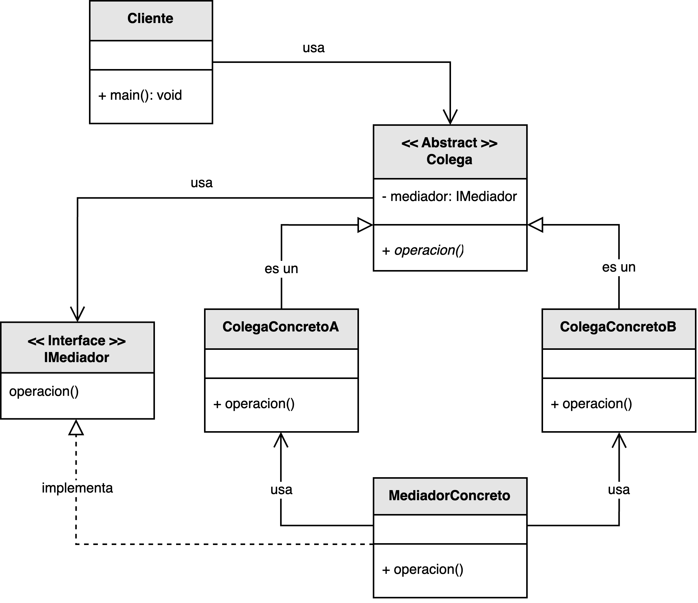

<h1 style="text-align:center;">
  <strong>🕹️ Patrón Mediator (Mediador)</strong>
</h1>

<h4 style="text-align:center;"><em>“Define un objeto que encapsula cómo un conjunto de objetos interactúan entre sí,
promoviendo un acoplamiento débil.”</em></h4>

<p style="text-align:justify;">
El <b>patrón Mediator</b> pertenece al grupo de <b>patrones de comportamiento</b> y su propósito es <b>centralizar la comunicación entre objetos</b> que, de otro modo, estarían fuertemente acoplados.  
A través de un <b>mediador</b>, los objetos llamados <b>colegas</b> dejan de comunicarse directamente entre sí y lo hacen a través de una interfaz común, mejorando la extensibilidad, reutilización y mantenibilidad del sistema.
</p>

<hr/>

<h2><strong>🧭 Motivación</strong></h2>

<p style="text-align:justify;">
En sistemas complejos, múltiples objetos suelen necesitar interactuar entre sí. Sin embargo, estas interacciones pueden derivar en una red de dependencias difícil de mantener.  
Cada cambio en uno de los componentes puede afectar a varios otros, generando una arquitectura frágil y acoplada.  
El patrón <b>Mediator</b> soluciona este problema al introducir un objeto central —el mediador— que coordina y controla las interacciones entre los objetos participantes, eliminando las dependencias directas entre ellos.
</p>

<p style="text-align:justify;">
De esta forma, cada <b>colega</b> solo necesita conocer al mediador, lo que simplifica el mantenimiento del sistema y facilita agregar o modificar componentes sin alterar el resto de la estructura.
</p>

<hr/>

<h2><strong>🧩 Estructura del patrón</strong></h2>

<p style="text-align:justify;">
La interfaz <b>IMediador</b> define las operaciones necesarias para permitir la comunicación entre objetos.  
El <b>MediadorConcreto</b> implementa dicha interfaz y contiene la lógica que coordina a los <b>Colegas</b>.  
Cada <b>ColegaConcreto</b> mantiene una referencia al mediador y delega en él la comunicación con otros colegas.
</p>

<p style="text-align:center;">
  
</p>
<p style="text-align:center;"><b>Figura 1.</b> Diagrama UML del patrón <i>Mediator</i>.</p>

<hr/>

<h2><strong>👥 Participantes</strong></h2>

<table>
  <thead>
    <tr>
      <th style="text-align:center;">Elemento</th>
      <th style="text-align:justify;">Descripción</th>
    </tr>
  </thead>
  <tbody>
    <tr>
      <td style="text-align:center;"><b>IMediador</b></td>
      <td style="text-align:justify;">Interfaz que define el contrato para la comunicación centralizada entre los diferentes colegas.</td>
    </tr>
    <tr>
      <td style="text-align:center;"><b>MediadorConcreto</b></td>
      <td style="text-align:justify;">Implementa las operaciones necesarias para coordinar y redirigir los mensajes entre los colegas.</td>
    </tr>
    <tr>
      <td style="text-align:center;"><b>Colega</b></td>
      <td style="text-align:justify;">Interfaz o clase base que define la comunicación entre los objetos participantes a través del mediador.</td>
    </tr>
    <tr>
      <td style="text-align:center;"><b>ColegaConcreto</b></td>
      <td style="text-align:justify;">Implementa las operaciones específicas y delega la comunicación al mediador.</td>
    </tr>
  </tbody>
</table>

<hr/>

<h2><strong>⚙️ Implementación básica en Java</strong></h2>

```java
// Interfaz del Mediador
interface IMediador {
    void enviar(String mensaje, Colega remitente);
}

// Clase abstracta para los colegas
abstract class Colega {
    protected IMediador mediador;

    public Colega(IMediador mediador) {
        this.mediador = mediador;
    }

    public abstract void recibir(String mensaje);

    public void enviar(String mensaje) {
        mediador.enviar(mensaje, this);
    }
}

// Mediador concreto
class MediadorConcreto implements IMediador {
    private List<Colega> colegas = new ArrayList<>();

    public void registrar(Colega colega) {
        colegas.add(colega);
    }

    public void enviar(String mensaje, Colega remitente) {
        for (Colega c : colegas) {
            if (c != remitente) {
                c.recibir(mensaje);
            }
        }
    }
}

// Colegas concretos
class ColegaUsuario extends Colega {
    private String nombre;

    public ColegaUsuario(IMediador mediador, String nombre) {
        super(mediador);
        this.nombre = nombre;
    }

    public void recibir(String mensaje) {
        System.out.println(nombre + " recibió: " + mensaje);
    }
}

// Cliente
public class Main {
    public static void main(String[] args) {
        MediadorConcreto chat = new MediadorConcreto();

        ColegaUsuario user1 = new ColegaUsuario(chat, "Carlos");
        ColegaUsuario user2 = new ColegaUsuario(chat, "María");
        ColegaUsuario user3 = new ColegaUsuario(chat, "Luis");

        chat.registrar(user1);
        chat.registrar(user2);
        chat.registrar(user3);

        user1.enviar("Hola a todos 👋");
        user2.enviar("¡Hola Carlos!");
    }
}
```

<hr/>

<h2><strong>🌟 Ventajas</strong></h2>

<ul style="text-align:justify;">
  <li><b>Desacoplamiento:</b> los objetos ya no se comunican directamente entre sí, sino a través del mediador.</li>
  <li><b>Simplificación:</b> reduce la complejidad de las interacciones en sistemas con múltiples dependencias.</li>
  <li><b>Reutilización:</b> los colegas se vuelven más reutilizables al depender solo del mediador, no de otros colegas.</li>
  <li><b>Extensibilidad:</b> nuevos tipos de objetos pueden integrarse modificando únicamente el mediador.</li>
</ul>

<hr/>

<h2><strong>⚠️ Desventajas</strong></h2>

<ul style="text-align:justify;">
  <li><b>Complejidad del mediador:</b> si maneja demasiadas responsabilidades, puede convertirse en un punto único de fallo.</li>
  <li><b>Rendimiento:</b> centralizar toda la comunicación puede crear cuellos de botella en sistemas de alta concurrencia.</li>
  <li><b>Dificultad de depuración:</b> rastrear la interacción entre objetos puede ser más complejo, ya que todo pasa por el mediador.</li>
</ul>

<hr/>

<h2><strong>🧮 Escenarios de aplicación</strong></h2>

<table>
  <thead>
    <tr>
      <th style="text-align:center;">💼 Contexto</th>
      <th style="text-align:justify;">📘 Aplicación del patrón</th>
    </tr>
  </thead>
  <tbody>
    <tr>
      <td style="text-align:center;"><b>Sistemas de chat o mensajería</b></td>
      <td style="text-align:justify;">El mediador centraliza el envío de mensajes entre múltiples usuarios o canales.</td>
    </tr>
    <tr>
      <td style="text-align:center;"><b>Interfaces de usuario</b></td>
      <td style="text-align:justify;">Gestiona eventos entre distintos componentes visuales (botones, formularios, paneles, etc.).</td>
    </tr>
    <tr>
      <td style="text-align:center;"><b>Videojuegos</b></td>
      <td style="text-align:justify;">Coordina las interacciones entre actores del juego (jugadores, enemigos, objetos).</td>
    </tr>
    <tr>
      <td style="text-align:center;"><b>Arquitecturas distribuidas</b></td>
      <td style="text-align:justify;">Sirve como capa de orquestación entre microservicios o módulos que deben cooperar sin depender directamente.</td>
    </tr>
  </tbody>
</table>

<hr/>

<h2><strong>📎 Referencia</strong></h2>

<p style="text-align:justify;">
Este material corresponde al patrón <b>Mediator (Mediador)</b> descrito en el libro  
<i><b>Notas a mano sobre análisis orientado a objetos y patrones de diseño</b></i> (Orozco, 2025).
</p>