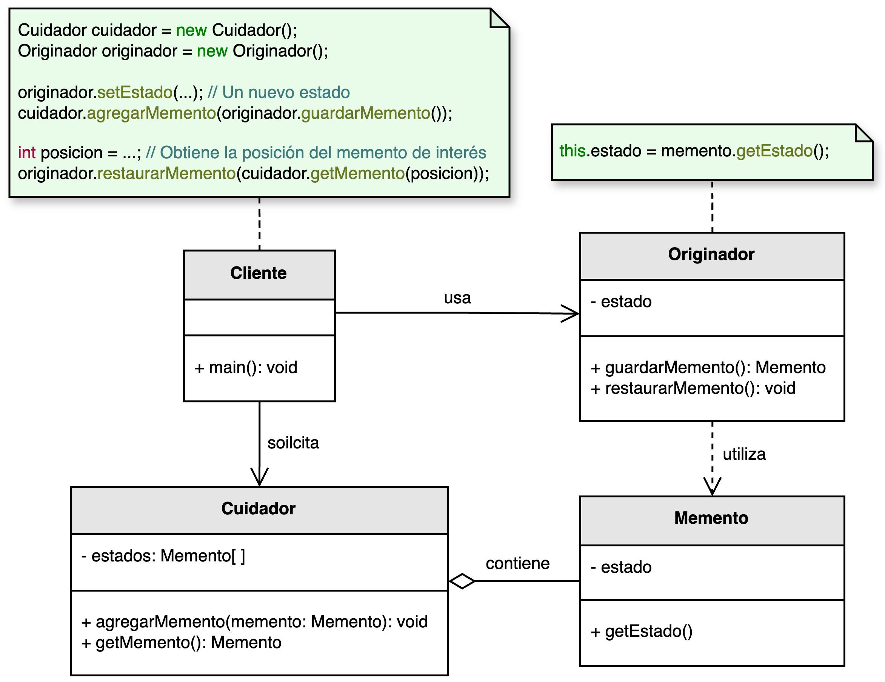

<h1 style="text-align:center;">
  <strong>💾 Patrón Memento (Memoria)</strong>
</h1>

<h4 style="text-align:center;"><em>“Captura y restaura el estado interno de un objeto sin violar su
encapsulamiento.”</em></h4>

<p style="text-align:justify;">
El <b>patrón Memento</b> pertenece al grupo de <b>patrones de comportamiento</b> y su propósito es <b>guardar el estado interno de un objeto</b> en un momento específico para poder <b>restaurarlo más adelante</b>.  
Esto lo convierte en una solución ideal para sistemas que necesitan funcionalidades como <i>deshacer</i> (undo), <i>rehacer</i> (redo) o gestión de versiones.
</p>

<hr/>

<h2><strong>🧭 Motivación</strong></h2>

<p style="text-align:justify;">
En diversas aplicaciones —como editores de texto, sistemas de diseño gráfico o entornos de desarrollo— es necesario que los usuarios puedan revertir acciones previas.  
El patrón <b>Memento</b> resuelve este problema al permitir que un objeto capture su estado actual y lo guarde como una "instantánea" o <b>memento</b>.  
Posteriormente, ese estado puede ser restaurado sin que otras clases necesiten conocer la estructura interna del objeto.
</p>

<p style="text-align:justify;">
En otras palabras, el patrón actúa como el mecanismo conceptual detrás del conocido comando <b>Ctrl + Z</b>: volver atrás en el tiempo a un punto de guardado anterior.
</p>

<hr/>

<h2><strong>🧩 Estructura del patrón</strong></h2>

<p style="text-align:justify;">
El <b>Originador</b> es el objeto cuyo estado se desea guardar o restaurar.  
El <b>Memento</b> almacena una copia de ese estado en un momento dado, mientras que el <b>Cuidador</b> se encarga de almacenar los diferentes mementos creados y de proveer los mecanismos para acceder a ellos.
</p>

<p style="text-align:center;">
  
</p>
<p style="text-align:center;"><b>Figura 1.</b> Diagrama UML del patrón <i>Memento</i>.</p>

<hr/>

<h2><strong>👥 Participantes</strong></h2>

<table>
  <thead>
    <tr>
      <th style="text-align:center;">Elemento</th>
      <th style="text-align:justify;">Descripción</th>
    </tr>
  </thead>
  <tbody>
    <tr>
      <td style="text-align:center;"><b>Originador</b></td>
      <td style="text-align:justify;">Clase que conoce su propio estado y puede crear un <b>Memento</b> para almacenarlo o restaurarlo más adelante.</td>
    </tr>
    <tr>
      <td style="text-align:center;"><b>Memento</b></td>
      <td style="text-align:justify;">Objeto inmutable que almacena el estado del <b>Originador</b> en un instante del tiempo sin exponer su estructura interna.</td>
    </tr>
    <tr>
      <td style="text-align:center;"><b>Cuidador</b></td>
      <td style="text-align:justify;">Administra la colección de mementos y permite recuperar o revertir estados anteriores del <b>Originador</b>.</td>
    </tr>
  </tbody>
</table>

<hr/>

<h2><strong>⚙️ Implementación básica en Java</strong></h2>

```java
// Clase Memento
class Memento {
    private final String estado;

    public Memento(String estado) {
        this.estado = estado;
    }

    public String getEstado() {
        return estado;
    }
}

// Clase Originador
class Originador {
    private String estado;

    public void setEstado(String estado) {
        this.estado = estado;
        System.out.println("Estado actual: " + estado);
    }

    public Memento guardarEstado() {
        return new Memento(estado);
    }

    public void restaurarEstado(Memento memento) {
        estado = memento.getEstado();
        System.out.println("Estado restaurado: " + estado);
    }
}

// Clase Cuidador
class Cuidador {
    private final List<Memento> historial = new ArrayList<>();

    public void agregar(Memento memento) {
        historial.add(memento);
    }

    public Memento obtener(int indice) {
        return historial.get(indice);
    }
}

// Cliente
public class Main {
    public static void main(String[] args) {
        Originador editor = new Originador();
        Cuidador cuidador = new Cuidador();

        editor.setEstado("Versión 1");
        cuidador.agregar(editor.guardarEstado());

        editor.setEstado("Versión 2");
        cuidador.agregar(editor.guardarEstado());

        editor.setEstado("Versión 3");
        editor.restaurarEstado(cuidador.obtener(0)); // Restaurar a versión 1
    }
}
```

<hr/>

<h2><strong>🌟 Ventajas</strong></h2>

<ul style="text-align:justify;">
  <li><b>Encapsulamiento:</b> guarda y restaura el estado sin exponer la implementación interna del objeto.</li>
  <li><b>Soporte para undo/redo:</b> permite revertir acciones de forma segura y estructurada.</li>
  <li><b>Historial de estados:</b> facilita la implementación de versiones o puntos de control en el tiempo.</li>
  <li><b>Separación de responsabilidades:</b> el cuidador administra los estados, mientras el originador se concentra en su lógica principal.</li>
</ul>

<hr/>

<h2><strong>⚠️ Desventajas</strong></h2>

<ul style="text-align:justify;">
  <li><b>Uso intensivo de memoria:</b> guardar múltiples estados de objetos grandes puede consumir recursos significativos.</li>
  <li><b>Complejidad de gestión:</b> se requiere un control adecuado del número de mementos almacenados para evitar saturar el sistema.</li>
  <li><b>Inconsistencias potenciales:</b> restaurar un estado previo puede causar incoherencias si otros objetos relacionados no revierten su propio estado.</li>
</ul>

<hr/>

<h2><strong>🧮 Escenarios de aplicación</strong></h2>

<table>
  <thead>
    <tr>
      <th style="text-align:center;">💼 Contexto</th>
      <th style="text-align:justify;">📘 Aplicación del patrón</th>
    </tr>
  </thead>
  <tbody>
    <tr>
      <td style="text-align:center;"><b>Editores de texto o gráficos</b></td>
      <td style="text-align:justify;">Permite implementar acciones de deshacer/rehacer, guardando versiones intermedias del documento.</td>
    </tr>
    <tr>
      <td style="text-align:center;"><b>Simulaciones o videojuegos</b></td>
      <td style="text-align:justify;">Guarda el estado del juego para permitir reiniciar desde puntos de control.</td>
    </tr>
    <tr>
      <td style="text-align:center;"><b>Sistemas de bases de datos o transacciones</b></td>
      <td style="text-align:justify;">Permite revertir una operación fallida restaurando estados previos coherentes.</td>
    </tr>
    <tr>
      <td style="text-align:center;"><b>Procesamiento de imágenes o modelado 3D</b></td>
      <td style="text-align:justify;">Facilita el control de versiones de modelos o transformaciones aplicadas a objetos.</td>
    </tr>
  </tbody>
</table>

<hr/>

<h2><strong>📎 Referencia</strong></h2>

<p style="text-align:justify;">
Este material corresponde al patrón <b>Memento (Memoria)</b> descrito en el libro  
<i><b>Notas a mano sobre análisis orientado a objetos y patrones de diseño</b></i> (Orozco, 2025).
</p>