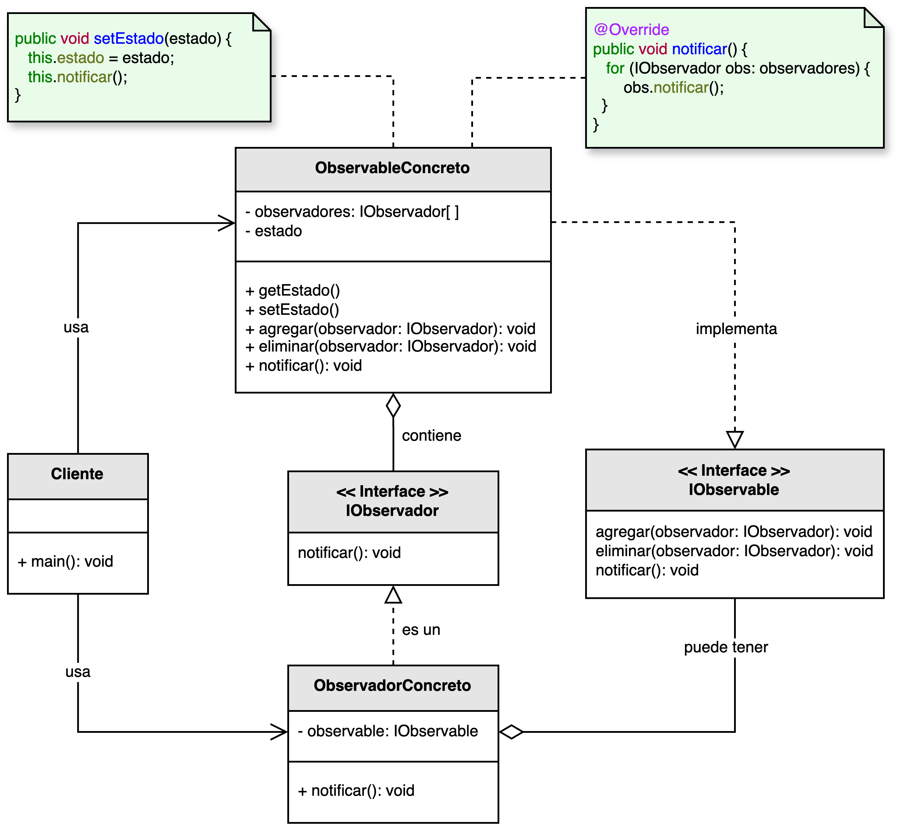

<h1 style="text-align:center;">
  <strong>👁️ Patrón Observer (Observador)</strong>
</h1>

<h4 style="text-align:center;"><em>“Define una dependencia uno-a-muchos entre objetos, de modo que cuando uno cambia su
estado, todos sus dependientes son notificados automáticamente.”</em></h4>

<p style="text-align:justify;">
El <b>patrón Observer</b> pertenece al grupo de <b>patrones de comportamiento</b> y tiene como propósito <b>mantener sincronizados múltiples objetos</b> sin generar acoplamiento fuerte entre ellos.  
Permite que un objeto (denominado <b>Observable</b> o <i>Sujeto</i>) notifique automáticamente a otros objetos (<b>Observadores</b>) sobre cambios en su estado, sin que ninguno conozca los detalles internos del otro.
</p>

<hr/>

<h2><strong>🧭 Motivación</strong></h2>

<p style="text-align:justify;">
Sin el patrón Observer, los objetos dependientes tendrían que consultar continuamente al objeto principal para saber si su estado ha cambiado, generando sobrecarga de procesamiento y alto acoplamiento.  
El patrón <b>Observer</b> soluciona este problema al permitir que los observadores se “suscriban” a un sujeto y sean notificados de manera automática cada vez que ocurre un cambio relevante.
</p>

<p style="text-align:justify;">
Este enfoque es ideal para escenarios donde varios componentes deben reaccionar de forma coordinada ante un mismo evento —por ejemplo, interfaces gráficas, sistemas de notificaciones, o plataformas financieras en tiempo real.
</p>

<hr/>

<h2><strong>🧩 Estructura del patrón</strong></h2>

<p style="text-align:justify;">
La interfaz <b>IObservable</b> declara las operaciones para registrar, eliminar y notificar observadores.  
La clase <b>ObservableConcreto</b> gestiona la lista de observadores y notifica los cambios de estado.  
Por su parte, la interfaz <b>IObservador</b> define el método que cada observador debe implementar para reaccionar ante las actualizaciones.
</p>

<p style="text-align:center;">
  
</p>

<p style="text-align:justify;">
La relación entre el <b>Observable</b> y el <b>Observador</b> puede variar según el contexto: puede tratarse de una asociación simple (existencia independiente), una agregación (dependencia temporal) o una composición (dependencia estructural).  
El modelo mostrado utiliza agregación para enfatizar la flexibilidad de la relación.
</p>

<hr/>

<h2><strong>👥 Participantes</strong></h2>

<table>
  <thead>
    <tr>
      <th style="text-align:center;">Elemento</th>
      <th style="text-align:justify;">Descripción</th>
    </tr>
  </thead>
  <tbody>
    <tr>
      <td style="text-align:center;"><b>IObservador</b></td>
      <td style="text-align:justify;">Interfaz que define el contrato que deben implementar los observadores para recibir notificaciones.</td>
    </tr>
    <tr>
      <td style="text-align:center;"><b>ObservadorConcreto</b></td>
      <td style="text-align:justify;">Implementa la acción a ejecutar cuando el observador recibe una notificación del sujeto observado.</td>
    </tr>
    <tr>
      <td style="text-align:center;"><b>IObservable</b></td>
      <td style="text-align:justify;">Interfaz que define las operaciones necesarias para registrar, eliminar y notificar observadores.</td>
    </tr>
    <tr>
      <td style="text-align:center;"><b>ObservableConcreto</b></td>
      <td style="text-align:justify;">Mantiene una lista de observadores y se encarga de informarles sobre los cambios de estado.</td>
    </tr>
  </tbody>
</table>

<hr/>

<h2><strong>⚙️ Implementación básica en Java</strong></h2>

```java
// Interfaz Observador
interface IObservador {
    void actualizar(String mensaje);
}

// Interfaz Observable
interface IObservable {
    void agregarObservador(IObservador observador);

    void eliminarObservador(IObservador observador);

    void notificarObservadores(String mensaje);
}

// Clase concreta Observable
class ObservableConcreto implements IObservable {
    private List<IObservador> observadores = new ArrayList<>();

    public void agregarObservador(IObservador observador) {
        observadores.add(observador);
    }

    public void eliminarObservador(IObservador observador) {
        observadores.remove(observador);
    }

    public void notificarObservadores(String mensaje) {
        for (IObservador obs : observadores) {
            obs.actualizar(mensaje);
        }
    }

    public void cambioDeEstado(String estado) {
        System.out.println("Nuevo estado del sujeto: " + estado);
        notificarObservadores("Actualización: " + estado);
    }
}

// Clase concreta Observador
class ObservadorConcreto implements IObservador {
    private final String nombre;

    public ObservadorConcreto(String nombre) {
        this.nombre = nombre;
    }

    public void actualizar(String mensaje) {
        System.out.println(nombre + " recibió notificación: " + mensaje);
    }
}

// Cliente
public class Main {
    public static void main(String[] args) {
        ObservableConcreto sujeto = new ObservableConcreto();

        IObservador o1 = new ObservadorConcreto("Cliente A");
        IObservador o2 = new ObservadorConcreto("Cliente B");
        IObservador o3 = new ObservadorConcreto("Cliente C");

        sujeto.agregarObservador(o1);
        sujeto.agregarObservador(o2);
        sujeto.agregarObservador(o3);

        sujeto.cambioDeEstado("Stock disponible del producto X");
        sujeto.cambioDeEstado("Promoción del 20% en curso");
    }
}
```

<hr/>

<h2><strong>🌟 Ventajas</strong></h2>

<ul style="text-align:justify;">
  <li><b>Desacoplamiento:</b> los observadores y el sujeto mantienen una relación flexible, sin dependencia directa.</li>
  <li><b>Reutilización:</b> los observadores pueden reutilizarse con distintos sujetos o en otros contextos.</li>
  <li><b>Reactividad:</b> los cambios se propagan automáticamente a todos los interesados.</li>
  <li><b>Extensibilidad:</b> permite agregar o eliminar observadores sin modificar el sujeto observado.</li>
</ul>

<hr/>

<h2><strong>⚠️ Desventajas</strong></h2>

<ul style="text-align:justify;">
  <li><b>Notificaciones excesivas:</b> puede producir sobrecarga si los cambios son muy frecuentes.</li>
  <li><b>Fugas de memoria:</b> si no se eliminan observadores inactivos, el sistema puede acumular referencias no deseadas.</li>
  <li><b>Dificultad de depuración:</b> rastrear el flujo de eventos puede ser complejo en sistemas con múltiples observadores.</li>
</ul>

<hr/>

<h2><strong>🧮 Escenarios de aplicación</strong></h2>

<table>
  <thead>
    <tr>
      <th style="text-align:center;">💼 Contexto</th>
      <th style="text-align:justify;">📘 Aplicación del patrón</th>
    </tr>
  </thead>
  <tbody>
    <tr>
      <td style="text-align:center;"><b>Interfaces gráficas (UI)</b></td>
      <td style="text-align:justify;">Actualiza automáticamente los elementos visuales cuando cambia el modelo de datos (por ejemplo, en MVC o MVVM).</td>
    </tr>
    <tr>
      <td style="text-align:center;"><b>Aplicaciones web reactivas</b></td>
      <td style="text-align:justify;">Facilita la propagación de eventos del lado del cliente, como actualizaciones dinámicas de la interfaz.</td>
    </tr>
    <tr>
      <td style="text-align:center;"><b>Trading y sistemas financieros</b></td>
      <td style="text-align:justify;">Notifica a múltiples clientes sobre cambios en precios o indicadores de mercado en tiempo real.</td>
    </tr>
    <tr>
      <td style="text-align:center;"><b>Monitoreo y alertas</b></td>
      <td style="text-align:justify;">Notifica automáticamente a los sistemas de control o administradores cuando se detectan fallos o eventos críticos.</td>
    </tr>
  </tbody>
</table>

<hr/>

<h2><strong>📎 Referencia</strong></h2>

<p style="text-align:justify;">
Este material corresponde al patrón <b>Observer (Observador)</b> descrito en el libro  
<i><b>Notas a mano sobre análisis orientado a objetos y patrones de diseño</b></i> (Orozco, 2025).
</p>