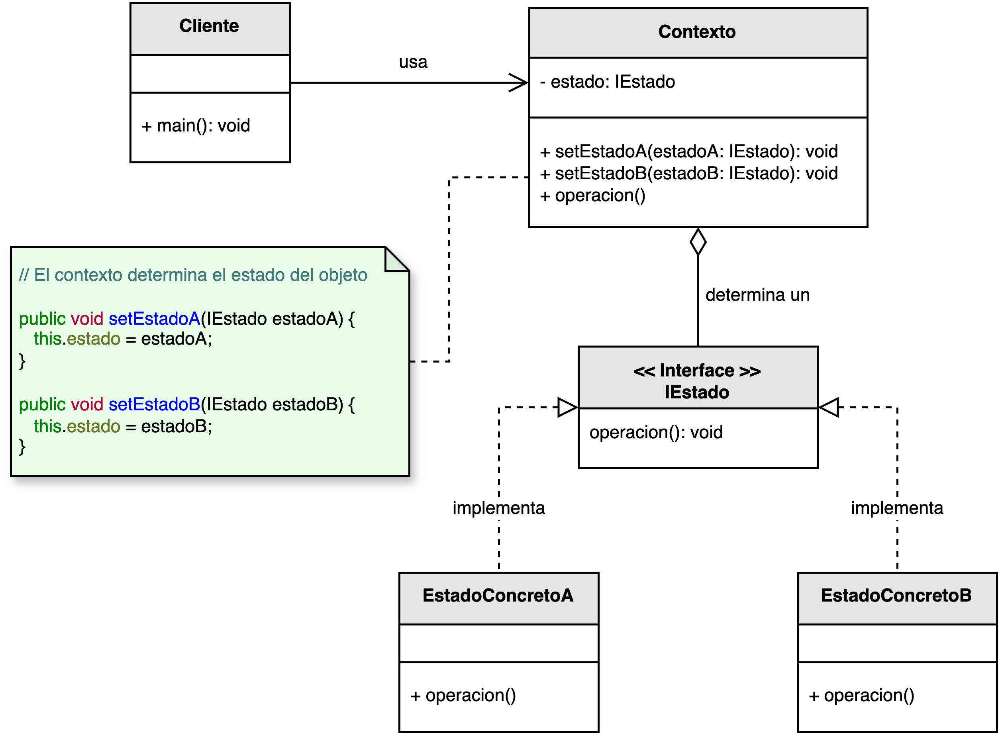

<h1 style="text-align:center;">
  <strong>🔄 Patrón State (Estado)</strong>
</h1>

<h4 style="text-align:center;"><em>“Permite que un objeto altere su comportamiento cuando cambia su estado interno, dando la ilusión de que su clase ha cambiado.”</em></h4>

<p style="text-align:justify;">
El <b>patrón State</b> pertenece al grupo de <b>patrones de comportamiento</b> y se utiliza cuando un objeto debe cambiar su comportamiento dinámicamente en función de su estado interno.  
En lugar de manejar múltiples condicionales o estructuras de control, el patrón encapsula los distintos comportamientos en clases separadas, haciendo que el objeto delegado (el <b>Contexto</b>) cambie su referencia de estado en tiempo de ejecución.
</p>

<hr/>

<h2><strong>🧭 Motivación</strong></h2>

<p style="text-align:justify;">
En un sistema, los objetos pueden tener múltiples comportamientos dependiendo de las condiciones actuales. Por ejemplo, un pedido puede estar en estado <i>Nuevo</i>, <i>Procesado</i> o <i>Entregado</i>; cada uno de estos estados determina las acciones permitidas o restringidas.  
Sin el patrón <b>State</b>, estos cambios suelen implementarse con grandes estructuras <code>if-else</code> o <code>switch</code>, que terminan haciendo el código rígido y difícil de mantener.
</p>

<p style="text-align:justify;">
El patrón <b>State</b> propone encapsular los comportamientos en clases separadas, delegando la lógica específica del estado a dichas clases.  
De este modo, el <b>Contexto</b> delega las operaciones al estado actual, pudiendo cambiar de comportamiento sin alterar su estructura.
</p>

<hr/>

<h2><strong>🧩 Estructura del patrón</strong></h2>

<p style="text-align:justify;">
La interfaz <b>IEstado</b> define las operaciones que representan los posibles comportamientos.  
Cada <b>EstadoConcreto</b> implementa una versión específica de esas operaciones.  
El <b>Contexto</b> mantiene una referencia al estado actual y la cambia dinámicamente conforme el objeto evoluciona.
</p>

<p style="text-align:center;">
  
</p>
<p style="text-align:center;"><b>Figura 1.</b> Diagrama UML del patrón <i>State</i>.</p>

<hr/>

<h2><strong>👥 Participantes</strong></h2>

<table>
  <thead>
    <tr>
      <th style="text-align:center;">Elemento</th>
      <th style="text-align:justify;">Descripción</th>
    </tr>
  </thead>
  <tbody>
    <tr>
      <td style="text-align:center;"><b>IEstado</b></td>
      <td style="text-align:justify;">Interfaz que define las operaciones que todos los estados concretos deben implementar.</td>
    </tr>
    <tr>
      <td style="text-align:center;"><b>EstadoConcreto</b></td>
      <td style="text-align:justify;">Implementa el comportamiento específico asociado a un estado particular del contexto.</td>
    </tr>
    <tr>
      <td style="text-align:center;"><b>Contexto</b></td>
      <td style="text-align:justify;">Mantiene una referencia al estado actual y delega las operaciones a dicho estado.</td>
    </tr>
  </tbody>
</table>

<hr/>

<h2><strong>⚙️ Implementación básica en Java</strong></h2>

```java
// Interfaz de Estado
interface IEstado {
    void manejar(Contexto contexto);
}

// Estados concretos
class EstadoInicio implements IEstado {
    public void manejar(Contexto contexto) {
        System.out.println("Estado: Inicio → Cambiando a Procesando...");
        contexto.setEstado(new EstadoProcesando());
    }
}

class EstadoProcesando implements IEstado {
    public void manejar(Contexto contexto) {
        System.out.println("Estado: Procesando → Cambiando a Completado...");
        contexto.setEstado(new EstadoCompletado());
    }
}

class EstadoCompletado implements IEstado {
    public void manejar(Contexto contexto) {
        System.out.println("Estado: Completado. No hay más transiciones.");
    }
}

// Clase Contexto
class Contexto {
    private IEstado estado;

    public Contexto() {
        this.estado = new EstadoInicio();
    }

    public void setEstado(IEstado estado) {
        this.estado = estado;
    }

    public void solicitarCambio() {
        estado.manejar(this);
    }
}

// Cliente
public class Main {
    public static void main(String[] args) {
        Contexto proceso = new Contexto();

        proceso.solicitarCambio(); // Inicio → Procesando
        proceso.solicitarCambio(); // Procesando → Completado
        proceso.solicitarCambio(); // Completado → No hay más transiciones
    }
}
```

<hr/>

<h2><strong>🌟 Ventajas</strong></h2>

<ul style="text-align:justify;">
  <li><b>Modularidad:</b> separa los comportamientos por estado, eliminando condicionales extensos y mejorando la claridad del código.</li>
  <li><b>Extensibilidad:</b> permite agregar nuevos estados sin modificar las clases existentes, cumpliendo el principio de abierto/cerrado (OCP).</li>
  <li><b>Encapsulación de comportamiento:</b> cada estado maneja su propia lógica interna y las transiciones al siguiente estado.</li>
  <li><b>Flexibilidad:</b> el objeto puede cambiar su comportamiento en tiempo de ejecución simplemente modificando su estado actual.</li>
</ul>

<hr/>

<h2><strong>⚠️ Desventajas</strong></h2>

<ul style="text-align:justify;">
  <li><b>Mayor número de clases:</b> cada estado requiere una implementación concreta, lo que puede aumentar la complejidad estructural del proyecto.</li>
  <li><b>Gestión de transiciones complejas:</b> si los estados dependen de múltiples condiciones, el control de flujo puede volverse complicado.</li>
  <li><b>Sobreuso innecesario:</b> aplicar este patrón en sistemas simples puede introducir una complejidad injustificada.</li>
</ul>

<hr/>

<h2><strong>🧮 Escenarios de aplicación</strong></h2>

<table>
  <thead>
    <tr>
      <th style="text-align:center;">💼 Contexto</th>
      <th style="text-align:justify;">📘 Aplicación del patrón</th>
    </tr>
  </thead>
  <tbody>
    <tr>
      <td style="text-align:center;"><b>Videojuegos</b></td>
      <td style="text-align:justify;">Control del estado de personajes (saltando, atacando, herido, muerto) o del propio juego (inicio, pausa, fin).</td>
    </tr>
    <tr>
      <td style="text-align:center;"><b>Interfaces gráficas</b></td>
      <td style="text-align:justify;">Gestión de componentes como botones o menús que cambian de apariencia o comportamiento según su estado (activo, inactivo, presionado).</td>
    </tr>
    <tr>
      <td style="text-align:center;"><b>Workflows de negocio</b></td>
      <td style="text-align:justify;">Procesos que pasan por distintas etapas como “creado”, “validado”, “aprobado” y “finalizado”, cada uno con sus reglas específicas.</td>
    </tr>
    <tr>
      <td style="text-align:center;"><b>Conexiones de red</b></td>
      <td style="text-align:justify;">Manejo de estados como “conectado”, “desconectado” y “reconectando”, modificando el comportamiento según la disponibilidad del servicio.</td>
    </tr>
  </tbody>
</table>

<hr/>

<h2><strong>📎 Referencia</strong></h2>

<p style="text-align:justify;">
Este material corresponde al patrón <b>State (Estado)</b> descrito en el libro  
<i><b>Notas a mano sobre análisis orientado a objetos y patrones de diseño</b></i> (Orozco, 2025).
</p>