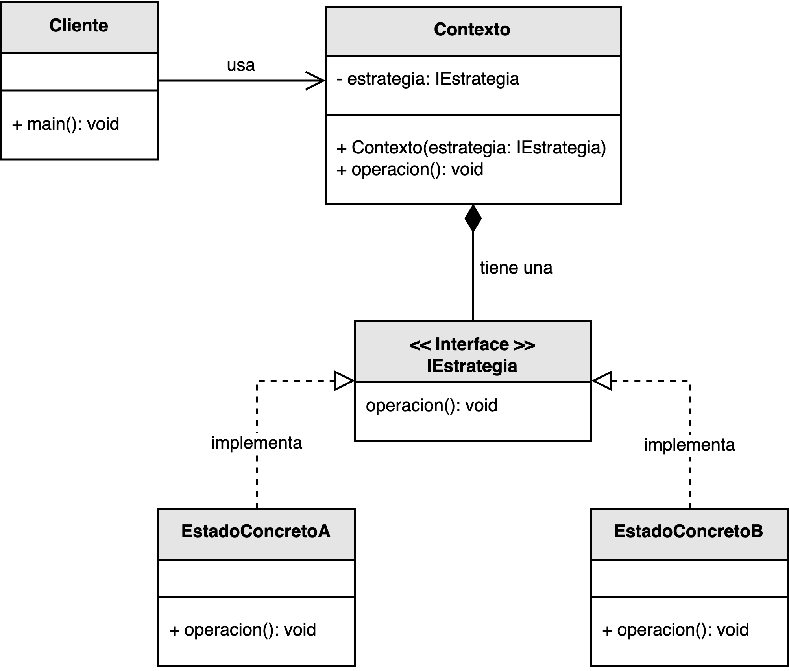

<h1 style="text-align:center;">
  <strong>🧩 Patrón Strategy (Estrategia)</strong>
</h1>

<h4 style="text-align:center;"><em>“Define una familia de algoritmos, encapsula cada uno y los hace intercambiables,
permitiendo que el algoritmo varíe independientemente de los clientes que lo utilizan.”</em></h4>

<p style="text-align:justify;">
El <b>patrón Strategy</b> pertenece al grupo de <b>patrones de comportamiento</b> y permite que un objeto modifique su comportamiento en tiempo de ejecución.  
Este patrón encapsula diferentes algoritmos dentro de clases separadas que comparten una interfaz común, permitiendo intercambiarlas dinámicamente sin afectar la estructura del cliente que las usa.
</p>

<hr/>

<h2><strong>🧭 Motivación</strong></h2>

<p style="text-align:justify;">
En muchos sistemas, un mismo proceso puede tener múltiples formas de ejecución dependiendo de las condiciones o preferencias del usuario.  
Por ejemplo, un sistema de pago puede usar tarjetas de crédito, PayPal o criptomonedas; todos son métodos válidos, pero la lógica de cada uno difiere.  
El <b>patrón Strategy</b> surge para abstraer esas variaciones, permitiendo seleccionar el algoritmo adecuado en tiempo de ejecución.
</p>

<p style="text-align:justify;">
En esencia, el patrón facilita la <b>inyección de comportamientos</b> —cada estrategia representa una variación posible de un algoritmo— logrando que el código del cliente permanezca simple y desacoplado de las implementaciones específicas.
</p>

<hr/>

<h2><strong>🧩 Estructura del patrón</strong></h2>

<p style="text-align:justify;">
El <b>Contexto</b> es responsable de mantener una referencia a la interfaz <b>IEstrategia</b> y delegar en ella la ejecución de una operación.  
Cada <b>EstrategiaConcreta</b> implementa una versión distinta del algoritmo definido por la interfaz, lo que permite cambiar el comportamiento del contexto en tiempo de ejecución sin modificar su código.
</p>

<p style="text-align:center;">
  
</p>
<p style="text-align:center;"><b>Figura 1.</b> Diagrama UML del patrón <i>Strategy</i>.</p>

<hr/>

<h2><strong>👥 Participantes</strong></h2>

<table>
  <thead>
    <tr>
      <th style="text-align:center;">Elemento</th>
      <th style="text-align:justify;">Descripción</th>
    </tr>
  </thead>
  <tbody>
    <tr>
      <td style="text-align:center;"><b>IEstrategia</b></td>
      <td style="text-align:justify;">Interfaz que define el método que todas las estrategias concretas deben implementar.</td>
    </tr>
    <tr>
      <td style="text-align:center;"><b>EstrategiaConcreta</b></td>
      <td style="text-align:justify;">Implementa una variante específica del algoritmo definido por la interfaz <b>IEstrategia</b>.</td>
    </tr>
    <tr>
      <td style="text-align:center;"><b>Contexto</b></td>
      <td style="text-align:justify;">Mantiene una referencia a la estrategia actual y delega en ella la ejecución del comportamiento requerido.</td>
    </tr>
  </tbody>
</table>

<hr/>

<h2><strong>⚙️ Implementación básica en Java</strong></h2>

```java
// Interfaz de estrategia
interface IEstrategia {
    void ejecutar();
}

// Estrategias concretas
class EstrategiaA implements IEstrategia {
    public void ejecutar() {
        System.out.println("Estrategia A: Procesamiento rápido con baja precisión");
    }
}

class EstrategiaB implements IEstrategia {
    public void ejecutar() {
        System.out.println("Estrategia B: Procesamiento equilibrado con precisión media");
    }
}

class EstrategiaC implements IEstrategia {
    public void ejecutar() {
        System.out.println("Estrategia C: Procesamiento intensivo con máxima precisión");
    }
}

// Clase Contexto
class Contexto {
    private IEstrategia estrategia;

    public void setEstrategia(IEstrategia estrategia) {
        this.estrategia = estrategia;
    }

    public void ejecutarEstrategia() {
        if (estrategia != null) {
            estrategia.ejecutar();
        } else {
            System.out.println("No hay estrategia seleccionada");
        }
    }
}

// Cliente
public class Main {
    public static void main(String[] args) {
        Contexto contexto = new Contexto();

        contexto.setEstrategia(new EstrategiaA());
        contexto.ejecutarEstrategia();

        contexto.setEstrategia(new EstrategiaB());
        contexto.ejecutarEstrategia();

        contexto.setEstrategia(new EstrategiaC());
        contexto.ejecutarEstrategia();
    }
}
```

<hr/>

<h2><strong>🌟 Ventajas</strong></h2>

<ul style="text-align:justify;">
  <li><b>Flexibilidad:</b> permite cambiar el comportamiento del sistema dinámicamente en tiempo de ejecución.</li>
  <li><b>Desacoplamiento:</b> elimina las dependencias directas entre el contexto y las implementaciones específicas, siguiendo el principio de inversión de dependencias (DIP).</li>
  <li><b>Extensibilidad:</b> agregar nuevas estrategias no requiere modificar el código existente, favoreciendo el principio abierto/cerrado (OCP).</li>
  <li><b>Claridad estructural:</b> cada algoritmo está encapsulado en su propia clase, mejorando la legibilidad y mantenibilidad.</li>
</ul>

<hr/>

<h2><strong>⚠️ Desventajas</strong></h2>

<ul style="text-align:justify;">
  <li><b>Proliferación de clases:</b> puede generar muchas clases pequeñas si existen numerosas estrategias, lo que incrementa la complejidad estructural.</li>
  <li><b>Responsabilidad del cliente:</b> el cliente debe conocer las diferencias entre estrategias para elegir la adecuada.</li>
  <li><b>Duplicación de código:</b> si las estrategias comparten lógica similar, podría aparecer código repetido.</li>
</ul>

<hr/>

<h2><strong>🧮 Escenarios de aplicación</strong></h2>

<table>
  <thead>
    <tr>
      <th style="text-align:center;">💼 Contexto</th>
      <th style="text-align:justify;">📘 Aplicación del patrón</th>
    </tr>
  </thead>
  <tbody>
    <tr>
      <td style="text-align:center;"><b>Algoritmos de encriptación</b></td>
      <td style="text-align:justify;">Permite seleccionar entre diferentes métodos de encriptación (AES, RSA, SHA) según los requisitos de seguridad o rendimiento.</td>
    </tr>
    <tr>
      <td style="text-align:center;"><b>Compresión de datos</b></td>
      <td style="text-align:justify;">Cambia dinámicamente el algoritmo de compresión (ZIP, RAR, GZIP) según el tipo de archivo o el ancho de banda disponible.</td>
    </tr>
    <tr>
      <td style="text-align:center;"><b>Aplicaciones de navegación</b></td>
      <td style="text-align:justify;">Permite seleccionar estrategias de cálculo de rutas según criterios como “más rápido”, “más corto” o “más económico”.</td>
    </tr>
    <tr>
      <td style="text-align:center;"><b>Renderizado gráfico o juegos</b></td>
      <td style="text-align:justify;">Selecciona diferentes algoritmos de renderizado o físicas en función del hardware o preferencias del usuario.</td>
    </tr>
  </tbody>
</table>

<hr/>

<h2><strong>📎 Referencia</strong></h2>

<p style="text-align:justify;">
Este material corresponde al patrón <b>Strategy (Estrategia)</b> descrito en el libro  
<i><b>Notas a mano sobre análisis orientado a objetos y patrones de diseño</b></i> (Orozco, 2025).
</p>