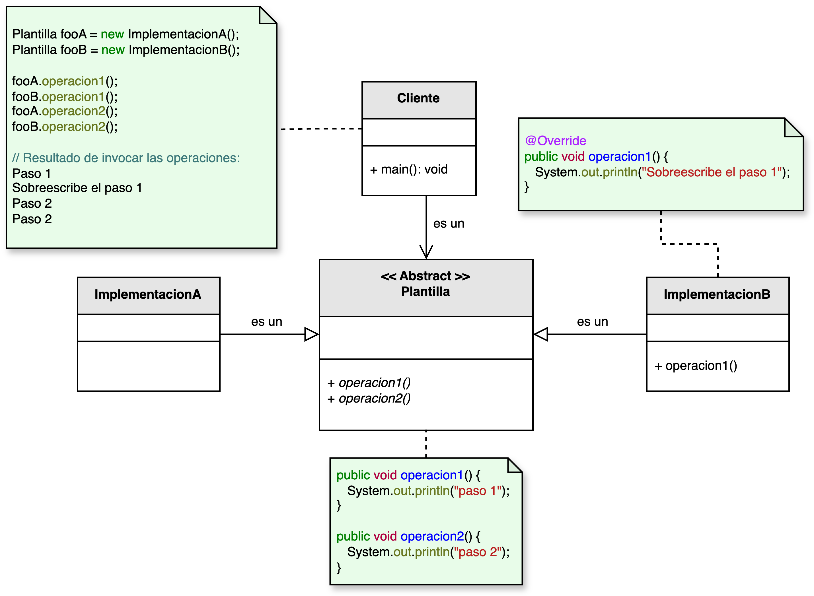

<h1 style="text-align:center;">
  <strong>🧱 Patrón Template Method (Método Plantilla)</strong>
</h1>

<h4 style="text-align:center;"><em>“Define el esqueleto de un algoritmo en una operación, delegando algunos pasos a las subclases.”</em></h4>

<p style="text-align:justify;">
El <b>patrón Template Method</b> pertenece al grupo de <b>patrones de comportamiento</b> y permite definir una estructura general (plantilla) para resolver un problema, dejando que las subclases redefinan pasos específicos sin alterar la secuencia global del algoritmo.  
De esta manera, se garantiza consistencia entre las implementaciones, promoviendo la reutilización de código y la extensión controlada del comportamiento.
</p>

<hr/>

<h2><strong>🧭 Motivación</strong></h2>

<p style="text-align:justify;">
En muchos sistemas, los algoritmos comparten una misma secuencia de pasos, pero algunos detalles varían dependiendo del contexto o la implementación concreta.  
El <b>Template Method</b> proporciona una solución elegante a este escenario al definir una <b>plantilla</b> en una clase base que establece el flujo general del proceso, permitiendo a las subclases sobrescribir las partes específicas que necesitan personalización.
</p>

<p style="text-align:justify;">
Este patrón sigue el principio de <b>Inversión de control</b>: la superclase controla la estructura del algoritmo y las subclases definen los detalles, invirtiendo así el flujo tradicional de ejecución.
</p>

<hr/>

<h2><strong>🧩 Estructura del patrón</strong></h2>

<p style="text-align:justify;">
La clase <b>Plantilla</b> define un método principal (el “método plantilla”) que establece el orden de ejecución de los pasos de un algoritmo.  
Cada subclase concreta (<b>Implementación</b>) puede redefinir uno o más de esos pasos sin modificar la estructura global.
</p>

<p style="text-align:center;">
  
</p>
<p style="text-align:center;"><b>Figura 1.</b> Diagrama UML del patrón <i>Template Method</i>.</p>

<hr/>

<h2><strong>👥 Participantes</strong></h2>

<table>
  <thead>
    <tr>
      <th style="text-align:center;">Elemento</th>
      <th style="text-align:justify;">Descripción</th>
    </tr>
  </thead>
  <tbody>
    <tr>
      <td style="text-align:center;"><b>Plantilla</b></td>
      <td style="text-align:justify;">Define el flujo genérico del algoritmo y declara los pasos que las subclases pueden sobrescribir. Contiene el método plantilla que define la secuencia de pasos.</td>
    </tr>
    <tr>
      <td style="text-align:center;"><b>Implementación</b></td>
      <td style="text-align:justify;">Sobrescribe los pasos definidos como “personalizables” dentro de la plantilla para ajustar la solución a un caso concreto.</td>
    </tr>
  </tbody>
</table>

<hr/>

<h2><strong>⚙️ Implementación básica en Java</strong></h2>

```java
// Clase abstracta (Plantilla)
abstract class ProcesoTemplate {

    // Método plantilla
    public final void ejecutarProceso() {
        inicializar();
        procesar();
        finalizar();
    }

    protected abstract void inicializar();

    protected abstract void procesar();

    // Paso común que puede mantenerse igual en todas las subclases
    protected void finalizar() {
        System.out.println("Finalizando el proceso estándar...");
    }
}

// Subclase concreta 1
class ProcesoArchivo extends ProcesoTemplate {
    protected void inicializar() {
        System.out.println("Inicializando lectura de archivo...");
    }

    protected void procesar() {
        System.out.println("Procesando datos del archivo...");
    }
}

// Subclase concreta 2
class ProcesoRed extends ProcesoTemplate {
    protected void inicializar() {
        System.out.println("Estableciendo conexión de red...");
    }

    protected void procesar() {
        System.out.println("Transmitiendo datos a través de la red...");
    }
}

// Cliente
public class Main {
    public static void main(String[] args) {
        ProcesoTemplate proceso1 = new ProcesoArchivo();
        ProcesoTemplate proceso2 = new ProcesoRed();

        System.out.println("---- Ejecución del proceso de archivo ----");
        proceso1.ejecutarProceso();

        System.out.println("\n---- Ejecución del proceso de red ----");
        proceso2.ejecutarProceso();
    }
}
```

<hr/>

<h2><strong>🌟 Ventajas</strong></h2>

<ul style="text-align:justify;">
  <li><b>Reutilización de código:</b> los pasos comunes se definen en la superclase, evitando duplicación.</li>
  <li><b>Extensibilidad controlada:</b> las subclases pueden redefinir partes del algoritmo sin alterar su estructura general.</li>
  <li><b>Coherencia:</b> el flujo principal del algoritmo permanece uniforme en todas las implementaciones.</li>
  <li><b>Inversión de control:</b> la superclase orquesta la ejecución, delegando pasos específicos a las subclases.</li>
</ul>

<hr/>

<h2><strong>⚠️ Desventajas</strong></h2>

<ul style="text-align:justify;">
  <li><b>Complejidad jerárquica:</b> puede generar jerarquías extensas si se crean muchas variaciones de la plantilla.</li>
  <li><b>Rigidez estructural:</b> cambiar la secuencia del algoritmo implica modificar la superclase, afectando a todas las subclases.</li>
  <li><b>Riesgo de mal uso:</b> si las subclases redefinen pasos críticos sin respetar el contrato de la plantilla, se puede violar el principio de sustitución de Liskov.</li>
</ul>

<hr/>

<h2><strong>🧮 Escenarios de aplicación</strong></h2>

<table>
  <thead>
    <tr>
      <th style="text-align:center;">💼 Contexto</th>
      <th style="text-align:justify;">📘 Aplicación del patrón</th>
    </tr>
  </thead>
  <tbody>
    <tr>
      <td style="text-align:center;"><b>Frameworks web</b></td>
      <td style="text-align:justify;">Define un flujo de procesamiento estándar de solicitudes HTTP, permitiendo personalizar etapas como autenticación, validación o renderizado.</td>
    </tr>
    <tr>
      <td style="text-align:center;"><b>Procesamiento de documentos</b></td>
      <td style="text-align:justify;">Estandariza el flujo de creación de reportes o análisis, permitiendo adaptar la lectura y formato del contenido según el tipo de documento.</td>
    </tr>
    <tr>
      <td style="text-align:center;"><b>Juegos</b></td>
      <td style="text-align:justify;">Modela las fases del ciclo de juego (inicio, ejecución, finalización), permitiendo variaciones por género o reglas específicas.</td>
    </tr>
    <tr>
      <td style="text-align:center;"><b>Algoritmos genéricos</b></td>
      <td style="text-align:justify;">Implementa estructuras fijas como ordenamientos o búsquedas, permitiendo redefinir pasos como comparaciones o condiciones de parada.</td>
    </tr>
  </tbody>
</table>

<hr/>

<h2><strong>📎 Referencia</strong></h2>

<p style="text-align:justify;">
Este material corresponde al patrón <b>Template Method (Método Plantilla)</b> descrito en el libro  
<i><b>Notas a mano sobre análisis orientado a objetos y patrones de diseño</b></i> (Orozco, 2025).
</p>